# HATHOR

> **취향 잠재 표현 기반 종단간 AI 음악 창작 시스템**
> 2026년 빅테크의 시대, 인류 기술의 산물 냄새나는 AI 음악을 출력한다.

| | |
|---|---|
| 프로젝트명 | **Hathor** — 이집트 신화의 음악·춤·기쁨의 여신 |
| 목적 | 취업 포트폴리오 (1인 풀스택) |
| 개발자 | 오창준 |
| 예산 | 0원 (클라우드 GPU 실비 별도) |
| 기간 | 무제한 — 단계 완료 기준으로 진행 |
| 문서 성격 | 단일 진실 공급원. 상시 갱신. 버전 미관리 |

---

## 서브시스템 구성

서브시스템은 **담당 기능 그대로** 명명한다. 별칭을 두면 이름과 기능을 매번 머릿속에서 번역해야 하므로 순수 오버헤드다.

| 서브시스템 | 패키지 | 담당 |
|---|---|---|
| 오케스트레이터 | `hathor.orchestrator` | 생성 파이프라인 총괄, 잡 상태 관리 |
| 인제스트 | `hathor.ingest` | 파일 감시, 지문, 엔티티 해석, 정규화 |
| **코퍼스** | `hathor.corpus` | **범용 음악 지식 상시 구축·캐시**, RAG 인덱스 |
| 취향 | `hathor.taste` | 피처, 임베딩, 군집, 개인 취향 벡터 |
| 작곡 | `hathor.compose` | 구조·화성·멜로디 생성 |
| 작사 | `hathor.lyrics` | 제약 기반 한국어 작사 |
| 편곡 | `hathor.arrange` | 편성, 파트 생성, 렌더링, 믹싱 |
| 가창 | `hathor.vocal` | SVS·SVC, 음색 보간 |
| 악보 | `hathor.score` | MusicXML, 리드시트, 조판 |
| **아트워크** | `hathor.artwork` | **앨범 커버 생성** |
| 품질 | `hathor.quality` | 평가 지표, 게이트, 검증 |

> 프로젝트명 `Hathor`만 이집트 신화에서 가져온다. 이후 프로젝트도 같은 계열로 명명한다 (Horus, Isis, Obelisk …). **서브시스템까지 신화 이름을 붙이지 않는다.**

---

# GROUND RULES

프로젝트 전 기간에 걸쳐 적용되는 강제 규칙이다. 설계·구현·협업이 이 규칙을 위반하면 그 자체로 결함으로 본다.

## GR-0. 협업 규칙

### GR-0.1 문서 우선
설계 변경은 **이 문서를 먼저 고치고 코드를 고친다.** 반대 순서는 금지한다. 대화에서 나온 결정도 문서에 반영되지 않으면 존재하지 않는 것으로 간주한다.

### GR-0.2 결정 기록
되돌리기 어려운 선택(DB, 모델 아키텍처, 외부 의존, 라이선스, 배포 대상)은 결정 기록으로 남긴다. 형식: **배경 / 후보 / 선택 / 근거 / 결과**.

### GR-0.3 자율성 경계

| 묻지 않고 결정 | 반드시 확인 |
|---|---|
| 라이브러리·프레임워크 선택 | 프로젝트 범위 변경 |
| 알고리즘·자료구조 선택 | 비용이 발생하는 결정 |
| 코드 구조·네이밍·패턴 적용 | 되돌리기 어려운 아키텍처 결정 |
| 문서 서술 방식·다이어그램 종류 | 사용자 취향·경험이 판단 근거인 것 |
| 지표·임계값 초안 | 법적·윤리적 판단이 필요한 것 |

### GR-0.4 반대 의무
판단이 틀렸다고 보면 동의하는 척하지 않고 근거를 들어 반대한다. 그럼에도 사용자가 결정하면 따르되, 문서에 **"사용자 판단으로 결정됨"**을 남긴다.

### GR-0.5 불확실성 표시
확실하지 않은 사실을 추측으로 채우지 않는다. 검증하거나 **"P0에서 검증"** 항목으로 이관한다.

### GR-0.6 진행률 정직성
"거의 다 됐다" 같은 표현을 쓰지 않는다. Phase 완료 조건 충족 여부로만 판단한다.

---

## GR-1. 명명 규칙

### GR-1.1 케이스 기본

| 대상 | 케이스 | 예시 |
|---|---|---|
| 변수 · 함수 | **camelCase** (TS/Dart/Java) / **snake_case** (Python) | `getTasteVector` / `get_taste_vector` |
| 클래스 · 타입 | **PascalCase** | `HarmonyStrategy`, `GenerationSpec` |
| 상수 | **UPPER_SNAKE_CASE** | `MAX_REPAIR_ATTEMPTS`, `DEFAULT_LUFS_TARGET` |
| DB 테이블 · 컬럼 | **snake_case** | `taste_cluster`, `created_at` |
| 환경 변수 | **UPPER_SNAKE_CASE** | `SYLLABLE_MATCH_THRESHOLD` |
| 이벤트 라우팅 키 | **dot.case** | `ingest.raw.discovered` |
| 브랜치 | **kebab-case** | `feat/ingest-fingerprint` |

> Python은 PEP 8을 따라 함수·변수에 snake_case를 쓴다. 예전 룰의 camelCase 일괄 적용은 언어 관례와 충돌하므로 **언어별 관례를 우선**한다.

### GR-1.2 파일·폴더 명명 — 언어별 예외

| 언어 | 규칙 | 예시 |
|---|---|---|
| Python | snake_case | `harmony_strategy.py`, `entity_resolver.py` |
| Dart | snake_case | `taste_map_view.dart` |
| **Java** | **PascalCase** (클래스명 = 파일명 강제) | `AuthService.java` |
| **React 컴포넌트** | **PascalCase** | `TasteMap.tsx`, `ScoreViewer.tsx` |
| TS 유틸·훅 | camelCase | `useJobProgress.ts`, `formatDuration.ts` |
| 설정·문서 | kebab-case 또는 UPPER | `docker-compose.yml`, `MASTER.md` |

**언어·프레임워크 관례와 싸우지 않는다.** 일괄 규칙보다 생태계 관례가 우선한다.

### GR-1.3 명명 원칙

1. 이름만으로 역할과 의미가 드러나야 한다.
2. 함수명은 **동사**로 시작한다. (`resolveEntity`, `computeDeficiency`)
3. 불리언은 `is` / `has` / `can` / `should`로 시작한다. (`isDeficient`, `hasLyricTag`)
4. 컬렉션은 **복수형**을 쓴다. (`clusters`, `stems`, `candidates`)
5. 타입명을 변수명에 넣지 않는다. (`trackList` ✗ → `tracks` ✓)
6. **단위·시각을 이름에 포함한다.** (`timeoutMs`, `durationMs`, `f0RmseCent`, `lufsTarget`, `createdAt`)
7. 서브시스템명을 접두사로 쓴다. (`IngestNormalizer`, `HarmonyGenerator`, `QualityGate`)

### GR-1.4 금지어

| 금지어 | 이유 | 재명명 예시 |
|---|---|---|
| `data`, `info`, `value`, `thing` | 의미 없음 | `data` → `featureSet` |
| `temp`, `tmp` | 수명이 불명 | `temp` → `decodedBuffer` |
| `list`, `arr`, `obj` | 타입명 노출 | `list` → `tracks` |
| `flag` | 의미 없음 | `flag` → `isDeficient` |
| **`manager`, `util`, `helper`, `common`, `handler`** | **우연적 응집의 신호** | `AudioUtil` → `LoudnessNormalizer` |
| `process()`, `handle()`, `doWork()` | 동작 불명 | `handle()` → `handleFileDiscovered()` |

**`manager` · `util` · `helper`가 이름에 들어가면 응집도 위반을 의심하고 분해를 검토한다.** (§1.7.2)

---

## GR-2. 계층 구조

### GR-2.1 디렉터리

```
hathor/
├─ docs/
│  └─ MASTER.md                    # 이 문서. 단일 진실 공급원
│
├─ core/                           # Python 모노레포 — ML·워커·오케스트레이션
│  ├─ hathor/
│  │  ├─ domain/                   # 순수 도메인. 외부 import 금지
│  │  │  ├─ entities/              #   엔티티 (Track, GenerationJob …)
│  │  │  ├─ value_objects/         #   값 객체 (Key, ChordProgression …)
│  │  │  ├─ events/                #   도메인 이벤트
│  │  │  └─ ports/                 #   인터페이스 (Protocol)
│  │  │
│  │  ├─ application/              # 유스케이스 조합. 도메인만 의존
│  │  │  ├─ ingest/  corpus/  taste/  generation/  feedback/
│  │  │  └─ orchestrator/          #   파이프라인 총괄
│  │  │
│  │  ├─ engines/                  # 서브시스템 — 기능명 그대로
│  │  │  ├─ ingest/               #   파일 감시·지문·엔티티 해석
│  │  │  ├─ corpus/               #   파운데이션 코퍼스·웜캐시·RAG·표적보강
│  │  │  ├─ taste/                #   피처·임베딩·개인 취향 벡터
│  │  │  ├─ compose/              #   작곡
│  │  │  ├─ lyrics/               #   작사
│  │  │  ├─ arrange/              #   편곡·렌더링·믹싱
│  │  │  ├─ vocal/                #   가창
│  │  │  ├─ score/                #   악보
│  │  │  ├─ artwork/              #   앨범 커버
│  │  │  └─ quality/              #   품질 게이트
│  │  │
│  │  ├─ infrastructure/           # 구현체. ports를 구현
│  │  │  ├─ persistence/  messaging/  storage/  external/
│  │  │
│  │  ├─ interfaces/               # 진입점
│  │  │  ├─ rest/  websocket/  mcp/  cli/  workers/
│  │  │
│  │  ├─ shared/                   # 횡단 관심사
│  │  │  ├─ algorithms/  patterns/  config/  telemetry/
│  │  │
│  │  └─ native/                   # C 확장 (DSP 커널)
│  ├─ tests/                       # unit / property / integration / quality / e2e
│  └─ pyproject.toml
│
├─ api/                            # Spring Boot — 인증·계정·라이브러리 CRUD
│  └─ src/main/java/dev/hathor/
│     ├─ domain/  application/  infrastructure/  presentation/  config/
│
├─ web/                            # Next.js
│  └─ src/
│     ├─ app/  components/  features/  hooks/  lib/  stores/  types/
│
├─ mobile/                         # Flutter
│  └─ lib/
│     ├─ views/  providers/  services/  repositories/  models/
│
├─ bff/                            # Node.js — WebSocket 게이트웨이
├─ infra/                          # Terraform / compose / scripts
├─ notebooks/                      # 탐색 전용. 프로덕션 코드 금지
└─ artifacts/                      # 모델·체크포인트 (Git 제외, DVC 관리)
```

### GR-2.2 계층별 책임과 금지 사항

**Python core**

| 계층 | 담당 | **금지** |
|---|---|---|
| `domain/` | 엔티티·값객체·규칙·포트 정의 | **외부 라이브러리 import 전면 금지.** 표준 라이브러리만 |
| `application/` | 유스케이스 조합, 트랜잭션 경계 | 구체 구현체 직접 참조 금지. 포트만 의존 |
| `engines/` | ML 실행 로직 | **엔진 간 직접 호출 금지.** 오케스트레이터 경유 |
| `infrastructure/` | DB·큐·스토리지·외부 API | 비즈니스 규칙 포함 금지 |
| `interfaces/` | 라우팅·직렬화·입력 검증 | **비즈니스 로직 포함 금지.** DB 직접 접근 금지 |
| `shared/` | 알고리즘·설정·계측 | 도메인 지식 포함 금지 |

**Spring Boot api**

| 계층 | 담당 | 금지 |
|---|---|---|
| `presentation/` | 컨트롤러·DTO 매핑 | **Repository 직접 호출 금지** |
| `application/` | 서비스·트랜잭션 | 엔티티를 그대로 응답 금지 |
| `domain/` | 엔티티·도메인 서비스 | JPA 외 인프라 의존 금지 |
| `infrastructure/` | Repository 구현·외부 연동 | — |

**Next.js web**

| 계층 | 담당 | 금지 |
|---|---|---|
| `app/` | 라우팅·레이아웃 | 비즈니스 로직 금지 |
| `components/` | 프레젠테이션 UI | **직접 fetch 금지** |
| `features/` | 도메인별 조합 | — |
| `hooks/` | 상태·부수효과 | UI 렌더 금지 |
| `lib/` | API 클라이언트·유틸 | 컴포넌트 import 금지 |

**Flutter mobile** — 예전 룰 그대로 유지한다.

| 계층 | 담당 | 금지 |
|---|---|---|
| `views/` | UI·렌더링 | **HTTP 호출 금지** |
| `providers/` | 상태·상태 전이 | 비즈니스 로직 금지 |
| `services/` | 비즈니스 로직 | **외부 통신 직접 수행 금지** |
| `repositories/` | API·SDK·로컬 저장소 | 비즈니스 규칙 금지 |
| `models/` | 데이터 구조·직렬화 | 로직 금지 |

### GR-2.3 의존성 방향 강제

```
interfaces → application → domain ← infrastructure
                ↓
            engines → shared
```

**CI에서 `import-linter`로 강제한다.** 위반 시 빌드 실패.

```toml
[importlinter]
root_package = "hathor"

[[importlinter.contracts]]
name = "도메인은 외부를 모른다"
type = "forbidden"
source_modules = ["hathor.domain"]
forbidden_modules = ["hathor.infrastructure", "hathor.engines",
                     "hathor.interfaces", "sqlalchemy", "fastapi", "torch"]

[[importlinter.contracts]]
name = "엔진 간 직접 참조 금지"
type = "independence"
modules = ["hathor.engines.ingest", "hathor.engines.corpus", "hathor.engines.taste",
           "hathor.engines.compose", "hathor.engines.lyrics", "hathor.engines.arrange",
           "hathor.engines.vocal", "hathor.engines.score", "hathor.engines.artwork",
           "hathor.engines.quality"]

[[importlinter.contracts]]
name = "계층 순서"
type = "layers"
layers = ["hathor.interfaces", "hathor.application", "hathor.domain"]
```

---

## GR-3. 데이터 규칙

### GR-3.1 공통 컬럼

모든 PostgreSQL 테이블은 다음을 포함한다.

| 컬럼 | 타입 | 규칙 |
|---|---|---|
| `{entity}_id` | UUID | PK. `gen_random_uuid()`. **순차 정수 금지** (열거 공격 방지) |
| `created_at` | TIMESTAMPTZ | 생성 시 기록. **변경 금지** |
| `updated_at` | TIMESTAMPTZ | 트리거로 자동 갱신 |
| `deleted_at` | TIMESTAMPTZ | 사용자 데이터는 소프트 삭제 |

**시각은 전부 TIMESTAMPTZ(UTC)로 저장한다.** 표시 시점에만 로컬 변환한다.

### GR-3.2 저장소 역할 분담

| 저장소 | 역할 | **금지** |
|---|---|---|
| **PostgreSQL** | 관계 데이터의 **Source of Truth**. 벡터(pgvector) 포함 | — |
| MongoDB | 원본 태그·트레이스·로그 등 비정형 | **Source of Truth로 사용 금지.** 관계 데이터 대체 금지 |
| Redis | 캐시·락·진행률·블룸필터 | **영속 데이터 저장 금지.** 유실을 전제로 설계 |
| 오브젝트 스토리지 | 오디오·모델·산출물 | 메타데이터 저장 금지 |

### GR-3.3 모델링

1. 기본 설계는 **3NF**에서 시작한다.
2. 반정규화는 **측정된 성능 문제가 있을 때만** 하고, 사유와 일관성 보장 방법을 문서에 남긴다.
3. 모델 구조는 API 응답이 아니라 **저장 기준**으로 설계한다.
4. **ORM 엔티티를 API 응답으로 직접 반환하지 않는다.** 반드시 DTO를 거친다.
5. JSONB는 (1) 스키마가 유동적이고 (2) 검색 조건이 아닌 것에만 쓴다. 검색 조건이 되면 컬럼으로 승격한다.

### GR-3.4 ML 데이터 규칙

| 규칙 | 내용 |
|---|---|
| 피처 버전 | 추출기 변경 시 `feature_set.version` 증가. 기존 버전 보존 |
| 임베딩 버전 | `model_version` 필수 기록. 모델이 다르면 다른 레코드 |
| 취향 프로파일 | 갱신 시 새 version INSERT. **기존 version 불변** |
| **외부 참조** | `license` **NOT NULL**. `audio_retained = false` CHECK 제약 |
| 데이터셋 | DVC로 버저닝. Git에 대용량 바이너리 금지 |

---

## GR-4. 협업·기록 규칙

### GR-4.1 커밋

형식: `type(scope): subject`

| type | 용도 |
|---|---|
| `feat` | 기능 추가 |
| `fix` | 버그 수정 |
| `refactor` | 동작 변경 없는 구조 개선 |
| `perf` | 성능 개선 (**수치 필수**) |
| `docs` | 문서 |
| `test` | 테스트 |
| `chore` | 설정·의존성 |
| `data` | 데이터셋 버전 |
| `exp` | 실험 (MLflow run ID 명시) |

scope는 서브시스템 코드명을 쓴다.

```
feat(ingest): 지문 기반 정규화 폴백 체인 구현
perf(native): 슬라이딩 RMS C 커널로 4.2배 단축
exp(compose): A* 가중치 탐색 20회 (mlflow: a3f9c1)
```

**하나의 커밋은 하나의 변경만 포함한다.**

### GR-4.2 브랜치

```
main ──●──────●──────●────►
      ╱      ╱      ╱
 feat/ingest-ingest  fix/lyrics-loop
```

| 브랜치 | 규칙 |
|---|---|
| `main` | 항상 배포 가능. **직접 push 금지.** CI 전부 통과해야 병합 |
| `feat/{subsystem}-{topic}` | 기능 개발 |
| `fix/{topic}` | 버그 수정 |
| `spike/{topic}` | 실험. **병합하지 않고 폐기 가능.** 결과만 문서에 기록 |
| `hotfix/{topic}` | 긴급. main 분기 → fast-forward |

> **`develop` 브랜치를 쓰지 않는다.** GitFlow의 develop은 릴리즈 묶음 관리가 있을 때 의미가 있는데, 1인 + 지속배포 환경에서는 병합 단계만 늘리는 오버헤드다. GitHub Flow(main + feature)로 간다.

### GR-4.3 이슈·PR

1. 작업 시작 전 Issue를 만든다. 제목은 완료 조건이 드러나게 쓴다.
2. `feat/*` 브랜치에서 개발하고 PR로 병합한다.
3. **1인이라도 PR을 거친다.** CI 게이트를 통과시키기 위해서다.
4. PR 본문에 **변경 내용 / 변경 이유 / 확인 방법** 3항목을 쓴다.
5. 병합 후 브랜치를 삭제한다.

---

## GR-5. 기술 원칙

| # | 원칙 | 내용 | 예외 |
|---|---|---|---|
| 1 | **Async First** | I/O는 비동기 우선 (DB·외부 API·파일) | **CPU/GPU 연산은 강제하지 않음.** Worker(별도 프로세스) 또는 Executor(스레드)로 이벤트 루프 보호 |
| 2 | **Fail Fast** | 입력 검증을 진입점에서 수행. 예외를 삼키지 않음 | 재시도 가능한 오류는 명시적 재시도 |
| 3 | **Idempotency** | 동일 요청 반복 시 상태 동일 | 모든 워커에 `idempotencyKey` 필수 |
| 4 | **Deterministic** | 동일 입력 → 동일 출력. **시드 명시 고정** | 확률적 생성은 시드를 반드시 기록 |
| 5 | **Secrets 분리** | 코드에 비밀정보 금지. `.env` + 환경 변수 | CI는 Environment Secrets |
| 6 | **DRY** | 동일 로직 **3회 반복 시** 공통화 | 2회까지는 중복 허용 (성급한 추상화 방지) |
| 7 | **Single Responsibility** | 함수·클래스·모듈은 하나의 책임 | 계층 간 전달은 DTO로 |
| 8 | **No Hard Coding** | 반복 값은 상수·enum·설정으로 | 임계값은 환경 변수로 주입 |
| 9 | **Immutable State** | 프론트 상태는 새 객체로 교체 | — |
| 10 | **Environment Independence** | 환경 의존 코드 금지. 설정 분리 | — |
| 11 | **Structured Logging** | JSON 구조화 로그. 필드 고정 | 운영은 INFO 이상, DEBUG 미기록 |
| 12 | **Observability** | 모든 잡에 trace ID. 단계별 span | — |
| 13 | **Reproducibility** | 코드·데이터·모델·시드 4개가 전부 버전 관리 | 실험은 MLflow 자동 기록 |
| 14 | **Graceful Degradation** | 실패 시 축소된 결과라도 낸다 | 가창 실패 → 인스트루멘탈 |
| 15 | **Cost Guard** | 클라우드 자원은 반드시 종료 보장 | `finally`에 teardown |

### GR-5.1 로그 필드 고정

```json
{"ts":"…","level":"INFO","service":"hathor.compose","trace_id":"…",
 "job_id":"…","user_id":"…","stage":"HARMONIZING",
 "elapsed_ms":4210,"outcome":"success","msg":"…"}
```

**개인정보·토큰·프롬프트 전문을 로그에 남기지 않는다.** 마스킹 필터를 통과시킨다.

---

## GR-6. 추진 룰

### GR-6.1 MVP 우선
기능은 항상 **최소 실행 가능 상태**부터 구현한다. 동작을 먼저 확인하고 완성도를 올린다.

```
동작하는 최소 → 검증 → 확장 → 최적화
```

**최적화는 측정 후에만 한다.** 측정 없는 최적화는 금지한다. (C 커널도 벤치마크가 먼저다)

### GR-6.2 개발 순서

```
1. 데이터 구조 정의       ← 화면보다 먼저. 이 프로젝트는 데이터가 중심
2. 도메인 엔티티·포트 정의
3. 엔진 최소 구현 (더미 출력 허용)
4. 파이프라인 연결 (종단간 관통)
5. 각 엔진 품질 향상
6. UI 연결
7. 통합 테스트
```

> 예전 룰은 "화면 흐름 → 데이터 구조" 순서였다. **이 프로젝트는 뒤집는다.** 화면이 아니라 데이터·파이프라인이 본체이므로 데이터 구조가 먼저다.

### GR-6.3 작업 단위
한 번에 하나. WIP 제한 2. 단위 기준은 **하나의 엔진 스테이지 / 하나의 API / 하나의 화면**.

### GR-6.4 디버깅 순서

```
[생성 흐름]  UI → BFF → REST → 오케스트레이터 → Engine → Model → 산출물
[인제스트]   Watcher → Queue → Worker → Repository → DB
[취향]       Embedding → Cluster → TasteVector → Conditioner
```

문제 발생 시 **상류에서 하류로 순차 확인**한다. 중간부터 찍지 않는다.

### GR-6.5 실험 규칙

| 규칙 | 내용 |
|---|---|
| 타임박스 | `spike/*` 실험은 사전에 시간 상한을 정하고 초과 시 중단 |
| 기록 | 실패한 실험도 MLflow에 남긴다. **삭제 금지** |
| 시드 | 항상 명시. `None`이면 생성 후 기록 |
| 아티팩트 | 오디오·MIDI·악보를 반드시 첨부. 지표만으로 소리를 판단할 수 없다 |
| 비교 | 단일 변수만 바꾼다. 여러 개를 동시에 바꾸면 원인 규명 불가 |

### GR-6.6 완료 기준

기능이 "완료"로 인정되는 조건 — **전부 충족해야 한다.**

1. 기능이 정상 동작한다
2. 계층 구조 규칙(GR-2)을 위반하지 않는다 — `import-linter` 통과
3. 기술 원칙(GR-5)을 준수한다
4. 테스트가 있고 통과한다
5. 품질 품질 게이트를 통과한다 (해당 시)
6. 오류 로그가 발생하지 않는다
7. Git 기록이 남아 있다 (Issue → PR → 병합)
8. **문서가 갱신되어 있다** (GR-0.1)

---

# PART 0. 프로젝트 개요

## 0.1 한 줄 정의

> 서버가 상시 축적한 **범용 음악 지식** 위에 사용자의 라이브러리에서 추출한 **개인 취향**을 조건으로 얹어, **작곡·작사·편곡·가창·악보·앨범커버**를 수행해 완성 음원 패키지를 산출하는 폐루프 시스템.

## 0.2 배경 — 페인포인트

### PP-1. 기다리는 것 말고는 방법이 없다

사람마다 취향이 있는데, 자기 취향에 정확히 맞는 곡은 **세상에 나올 때까지 기다려야 한다.** 스트리밍 추천은 이미 존재하는 곡 중에서 고를 뿐이다. 존재하지 않는 취향의 교집합은 영원히 채워지지 않는다.

### PP-2. 감성은 있는데 능력이 없다

머릿속에 음악이 있어도 실현하려면 네 가지 능력이 전부 필요하다.

```
작곡 ─┐
작사 ─┤
편곡 ─┼─→ 하나만 막혀도 표현은 전부 좌절된다
가창 ─┘
```

넷 중 하나만 없어도 결과는 0이다. **AND 게이트다.** 그리고 이 넷을 다 갖춘 사람은 극소수다.

### PP-3. 프롬프트는 언어화된 취향만 전달한다

Suno·Udio 계열은 자연어 프롬프트를 입력으로 받는다. 그런데 취향의 상당 부분은 **언어화되지 않는다.** "내가 왜 이 곡을 좋아하는지" 설명할 수 있는 사람은 드물다. 설명할 수 없는 취향은 프롬프트로 전달될 방법이 없다.

### 프로젝트 프레이밍

> **AI는 도구가 아니라 안경이다.**
> 시력이 나쁜 사람에게 세상이 안 보이는 게 아니라 흐리게 보이는 것이듯,
> 능력이 없는 사람에게 음악이 없는 게 아니라 흐리게 있는 것이다.
> Hathor는 그것을 선명하게 만든다.

## 0.3 AS-IS 사용자 여정 지도

취향에 맞는 곡을 직접 만들려 할 때 현재 겪는 과정이다.

| 단계 | 행동 | 생각 | 감정 | 이탈 지점 |
|---|---|---|---|---|
| 1. 착상 | 머릿속에 어렴풋한 곡이 떠오름 | "이런 느낌의 곡이 있으면 좋겠다" | 😊 기대 | — |
| 2. 탐색 | 스트리밍에서 비슷한 곡 검색 | "비슷한데 뭔가 아니다" | 😐 아쉬움 | 대부분 여기서 포기 |
| 3. 시도 | DAW 설치, 튜토리얼 시청 | "코드 진행이 뭐지" | 😰 압도 | **1차 대량 이탈** |
| 4. 작곡 | 멜로디 흥얼거려도 옮기지 못함 | "악보를 못 쓴다" | 😩 좌절 | **2차 대량 이탈** |
| 5. 작사 | 멜로디에 가사가 안 붙음 | "음절이 안 맞는다" | 😫 막힘 | 3차 이탈 |
| 6. 편곡 | 어떤 악기를 넣을지 모름 | "장르 관례를 모른다" | 😵 무지 | 4차 이탈 |
| 7. 가창 | 노래 실력 부족 | "부를 사람이 없다" | 😞 포기 | **최종 이탈** |
| 8. 결과 | — | "역시 나는 안 되는구나" | 💀 체념 | 자기효능감 손상 |

**관찰 1** — 이탈이 한 지점이 아니라 **모든 단계에 분산**되어 있다. 하나만 해결해도 소용없다.
**관찰 2** — 2단계에서 끝나는 사람이 압도적 다수다. 즉 **문제를 인식조차 못 한 채** 기다리는 상태로 남는다.
**관찰 3** — 8단계의 감정 손상이 재시도 확률을 떨어뜨린다. 실패가 누적되는 구조다.

## 0.4 HMW (How Might We)

| ID | 질문 | 대응 기능 |
|---|---|---|
| HMW-1 | 어떻게 하면 **기다리지 않고** 자기 취향의 곡을 얻게 할 수 있을까 | 온디맨드 생성 (FR-6xx~9xx) |
| HMW-2 | 어떻게 하면 **네 능력 중 없는 것을 메워** 표현을 완성시킬 수 있을까 | 4엔진 독립 + 부분 재생성 (FR-1005) |
| HMW-3 | 어떻게 하면 **자기도 모르는 취향**까지 결과물에 반영할 수 있을까 | 잠재 벡터 조건화 (FR-407) |
| HMW-4 | 어떻게 하면 사용자 데이터가 **부족해도** 품질을 유지할 수 있을까 | Active Learning + 외부 코퍼스 (FR-5xx) |
| HMW-5 | 어떻게 하면 결과물을 **더 다듬을 수 있게** 넘겨줄 수 있을까 | MIDI·스템·악보 내보내기 (FR-604, FR-806, FR-11xx) |
| HMW-6 | 어떻게 하면 **왜 이렇게 만들어졌는지** 이해시킬 수 있을까 | RAG 근거 추적 (FR-503) |

## 0.5 핵심 아키텍처 결정 — 3계층 지식 구조

### 문제

**사용자 라이브러리를 학습 데이터의 주력으로 삼으면 실패한다.**

| 항목 | 수치 |
|---|---|
| 개인 라이브러리 규모 | 1,000~3,000곡 (본 프로젝트 1,004곡) |
| 오디오 총 길이 | 약 64시간 |
| 심볼릭 학습에 필요한 최소 규모 | 수만 곡 (Lakh MIDI 176k = 약 60배) |
| 가창 모델 학습 데이터 | 정렬된 가창 수십 시간 |

64시간은 **듣기에는 방대하지만 학습에는 극소량**이다. 1,004곡으로 Transformer를 학습시키면 화성 문법을 배우지 못하고 과적합만 일어난다. 반대로 **개인 취향을 표현하는 데는 수백 곡이면 충분하다.**

### 역할 분리

> **음악 문법은 대량 범용 코퍼스에서 배우고, 개인 취향은 그 위에 조건으로 얹는다.**

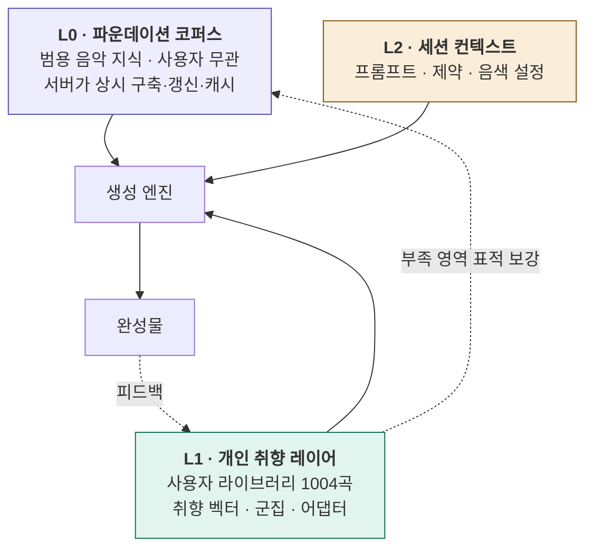
```mermaid
flowchart TB
    L0["<b>L0 · 파운데이션 코퍼스</b><br/>범용 음악 지식 · 사용자 무관<br/>서버가 상시 구축·갱신·캐시"]
    L1["<b>L1 · 개인 취향 레이어</b><br/>사용자 라이브러리 1004곡<br/>취향 벡터 · 군집 · 어댑터"]
    L2["<b>L2 · 세션 컨텍스트</b><br/>프롬프트 · 제약 · 음색 설정"]

    L0 --> G["생성 엔진"]
    L1 --> G
    L2 --> G
    G --> O["완성물"]
    O -.피드백.-> L1
    L1 -.부족 영역 표적 보강.-> L0

    style L0 fill:#EEEDFE,stroke:#534AB7
    style L1 fill:#E1F5EE,stroke:#0F6E56
    style L2 fill:#FAEEDA,stroke:#854F0B
```

| 계층 | 범위 | 갱신 주기 | 담는 것 |
|---|---|---|---|
| **L0 파운데이션 코퍼스** | 전역 (모든 사용자 공유) | **상시 (주기 배치)** | 코드 전이 통계, 형식 통계, 편성 통계, 사전학습 가중치, 임베딩 인덱스, 음악 이론 |
| **L1 개인 취향** | 사용자별 | 신규 곡 인제스트 시 | 취향 벡터, 군집, 상호작용 가중, LoRA 어댑터 |
| **L2 세션** | 요청별 | 매 요청 | 프롬프트, 제약, 음색 파라미터, 시드 |

### L0 상시 학습 — "서버가 계속 음악을 공부한다"

L0는 사용자와 무관하게 **백그라운드에서 계속 확장된다.**

```
스케줄러(주 1회 또는 유휴 시간)
  → 공개 코퍼스 순회 → 라이선스 확인 → 스트리밍 수신
  → 피처·임베딩 추출 → 통계 갱신 → 캐시 재구축 → 오디오 폐기
```

**웜 캐시 산출물** — 생성 요청 시 즉시 조회 가능해야 하므로 미리 계산해 둔다.

| 캐시 | 내용 | 용도 |
|---|---|---|
| 코드 전이 행렬 | 조성·장르별 P(다음코드 \| 문맥) | A* 탐색 사전확률 |
| 형식 통계 | 섹션 시퀀스 빈도, 마디 배분 분포 | 구조 생성 |
| 편성 통계 | 장르·섹션별 악기 조합 확률 | 편곡 결정 |
| 멜로디 모델 | 사전학습 체크포인트 | 멜로디 생성 |
| 임베딩 ANN 인덱스 | 수만~수십만 곡 벡터 | 유사곡 검색, 취향 보완 |
| 음악 이론 인덱스 | 문서 임베딩 | RAG 근거 |

**커버리지 지표** — 코퍼스가 충분히 넓은지 정량 관리한다.

| 지표 | 정의 | 목표 |
|---|---|---|
| 임베딩 공간 점유율 | 벡터 공간의 커버된 영역 비율 | 지속 증가 |
| 장르 다양성 | 장르 확률 분포 엔트로피 | ≥ 임계값 |
| 조성·템포 균일성 | 분포의 편중도 | 편중 완화 |
| 사용자 취향 커버율 | 개인 군집이 L0 밀집 영역에 포함되는 비율 | ≥ 80% |

마지막 지표가 낮으면 **개인 취향이 코퍼스의 사각지대에 있다**는 뜻이고, 표적 보강(§2.4.3)이 발동한다.

### L0와 L1의 결합 — 보간 백오프

두 계층의 확률을 어떻게 섞을 것인가. 개인 데이터가 적을수록 코퍼스에 의존하고, 많을수록 개인 쪽으로 기운다.

```
P(x | 문맥) = λ(n) · P_corpus(x | 문맥) + (1 − λ(n)) · P_taste(x | 문맥)

λ(n) = κ / (κ + n)        n = 해당 문맥의 개인 관측 수, κ = 평활 상수
```

언어모델의 **보간 백오프(interpolated back-off)** 와 같은 발상이다. 개인 데이터가 0이면 순수 코퍼스 분포로, 충분히 쌓이면 개인 분포로 자연스럽게 이동한다. 임계값 하드코딩이 필요 없다.

### 이 결정이 바꾸는 것

| 항목 | 결정 전 | 결정 후 |
|---|---|---|
| 학습 데이터 주력 | 사용자 1004곡 | **범용 코퍼스 수만~수십만** |
| 사용자 라이브러리 역할 | 학습 + 취향 | **취향 조건 전용** |
| 외부 데이터 수집 | 부족할 때만 (수동적) | **상시 (능동적)** + 부족 시 표적 보강 |
| 신규 사용자 콜드스타트 | 사실상 불가 | **L0만으로 기본 생성 가능** |
| 생성 지연 | 매번 검색 | **웜 캐시 조회** |

**부수 효과 — 콜드스타트가 해결된다.** 라이브러리가 0곡인 사용자도 L0만으로 곡을 만들 수 있고, 곡이 쌓일수록 개인화가 진행된다. 서비스로 확장할 때 결정적이다.

## 0.6 목표

| ID | 목표 | 지표 | 목표치 |
|---|---|---|---|
| G-1 | 라이브러리 정규화 자동화 | 정규화 성공률 | ≥ 95% |
| G-2 | 취향 군집 비지도 발견 | 실루엣 계수 | ≥ 0.35, 군집 3~8개 |
| G-3 | **파운데이션 코퍼스 구축** | 임베딩 인덱스 규모 / 사용자 취향 커버율 | ≥ 50,000곡 / ≥ 80% |
| G-3b | 데이터 부족 표적 보강 | 저밀도 군집 보완 후 밀도 증가율 | ≥ 200% |
| G-4 | 취향 조건부 작곡 | 취향 벡터 코사인 (vs 무조건) | +0.15 이상 |
| G-5 | 작사 음절 정합 | 음표 수 = 음절 수 일치율 | ≥ 97% |
| G-6 | 가창 자연성 | MOS (5점) | ≥ 3.5 |
| G-7 | 가창 음정 정확도 | F0 RMSE | ≤ 20 cent |
| G-8 | 악보 산출 | MusicXML 유효성 + MuseScore 열림 | 100% |
| G-8b | **앨범 커버 생성** | 1024px 산출 + 무드 일치도 자체 평가 | 100% / ≥ 3.5 |
| G-9 | **가설 검증** | 취향조건 vs 프롬프트전용 블라인드 선호율 | **≥ 65%** |
| G-10 | 배포 | 공개 URL에서 생성 요청 → 결과 수신 | 동작 |

## 0.7 범위

**In Scope** — 인제스트·정규화 / 피처·EDA / **파운데이션 코퍼스 상시 구축** / 취향 잠재 모델 / RAG 3인덱스 / Active Learning 표적 보강 / 챗봇·MCP / 작곡(심볼릭) / 작사(제약) / 편곡(데이터 주도) / 가창(임베딩 보간) / **악보 생성** / **앨범 커버 생성** / 믹싱·마스터링 / 피드백 폐루프 / **JWT + SSO 인증** / **퍼블릭 배포** / Flutter·Next.js 클라이언트

**Out of Scope**

| 제외 | 사유 |
|---|---|
| 실존 가수 음색 복제 | 퍼블리시티권 + 개인화 목적 불일치 |
| YouTube 등 약관 위반 소스 수집 | 포트폴리오 결격 사유 |
| 실시간(<10초) 생성 | 계층 생성 구조상 불가. **품질 우선이 명시적 결정** |
| 뮤직비디오 생성 | 오디오 품질에 기여하지 않는 확장. 자원 대비 효용 낮음 |
| 안무 생성 | 동일 |
| 자체 파운데이션 모델 사전학습 | 1인·소규모 자원. 사전학습 모델 활용이 정답 |
| 다중 테넌트 SaaS 운영 | 인증·배포는 구현하되 상용 운영은 범위 밖 |

## 0.8 차별점

| 축 | 기존 서비스 | Hathor |
|---|---|---|
| 조건 입력 | 자연어 프롬프트만 | **라이브러리 잠재 벡터 + 프롬프트** |
| 지식 기반 | 모델 내재 (고정) | **상시 확장되는 파운데이션 코퍼스 + 개인 취향 2계층** |
| 데이터 부족 대응 | 없음 | 보간 백오프 + Active Learning 표적 보강 |
| 콜드스타트 | — | **L0만으로 기본 생성 가능** |
| 중간 표현 | 없음 (오디오 직생성) | **MIDI + 스템 + 악보 (전 단계 편집 가능)** |
| 취향 자기인식 | 없음 | **비지도 군집 발견 대시보드** |
| 음색 | 고정 프리셋 | **임베딩 보간 신규 합성 + 발음 정밀도 제어** |
| 피드백 | 없음 | **DPO 폐루프** |
| 설명가능성 | 없음 | **RAG 근거 추적** |
| 산출물 | 오디오만 | **오디오 + MIDI + 스템 + MusicXML + PDF 악보 + 앨범 커버** |

## 0.9 SWOT 분석

| | 도움됨 | 해로움 |
|---|---|---|
| **내부** | **Strength**<br/>• 멀티모달·AWS 프로젝트 경험 다수<br/>• 데이터 파이프라인·EDA 역량 (SQLD·ADsP·빅데이터분석기사)<br/>• 정보처리기사 기반 설계 체계<br/>• 1인 풀스택이라 의사결정 지연 0<br/>• **라이브러리 1004곡 + 가사 태그 전량 보유**<br/>• 기간 무제한 — 품질 우선 선택 가능<br/>• 피아노 7년 등 기초 음악 소양 | **Weakness**<br/>• 실용음악 도메인 지식 부족<br/>• 생성형 AI·음악 프로젝트 경험 없음<br/>• GPU 자원 열위 (1660Ti 6GB)<br/>• 1인이라 코드 리뷰어 부재<br/>• **평가자가 본인 1명 → 확증편향**<br/>• 고정 예산 0원 |
| **외부** | **Opportunity**<br/>• MERT·CLAP·Demucs·RVC 등 SOTA 오픈소스 무료 공개<br/>• 클라우드 GPU 시간당 $0.34로 접근 가능<br/>• Oracle Always Free 등 0원 인프라 성숙<br/>• 생성형 AI 인재 수요 급증<br/>• MCP 등 신규 연동 표준 등장<br/>• 개인화 음악 생성은 아직 빈 시장 | **Threat**<br/>• 빅테크가 동일 기능을 언제든 출시 가능<br/>• AI 음악 저작권 법제 변동<br/>• 외부 API 정책 변경 (Spotify 프리뷰 등)<br/>• 무료 티어 정책 축소 위험<br/>• 오픈소스 모델 라이선스 변경<br/>• 음악 생성 포트폴리오 포화 가능성 |

### 전략 도출 (교차 분석)

| 전략 | 조합 | 내용 |
|---|---|---|
| **SO** 공격 | S(데이터·파이프라인 역량) × O(SOTA 오픈소스) | 모델을 만들지 않고 **조합·개인화로 승부**한다. 1004곡이라는 개인 데이터가 오픈소스로는 대체 불가능한 차별점이 된다 |
| **ST** 방어 | S(기간 무제한) × T(빅테크 경쟁) | 빅테크가 못 하는 것 — **개인 라이브러리 기반 개인화**에 집중한다. 범용 품질 경쟁을 하지 않는다 |
| **WO** 보완 | W(도메인 지식 부족) × O(오픈소스·RAG) | **음악 이론을 RAG로 외부화**한다. 지식 부재를 시스템 설계로 전환 (§2.4.1) |
| **WO** 보완 | W(GPU 열위) × O(클라우드 시간당 과금) | 3계층 컴퓨팅. 학습만 클라우드 잡 단위로 (§0.9) |
| **WT** 회피 | W(단일 평가자) × T(법제 변동) | **한계를 숨기지 않고 명시 보고**한다. 약관 준수 소스만 사용하고 `license` 컬럼을 NOT NULL로 강제한다 |

> **핵심 전략 한 줄** — 생성 모델을 만들어 경쟁하지 않는다. **개인 데이터를 조건으로 번역하는 파이프라인**을 만든다. 이건 데이터를 가진 사람만 할 수 있고, 빅테크는 남의 라이브러리에 접근할 수 없다.

## 0.10 자원 및 비용

기간 무제한 · 예산 0원 전제이므로 **고정비 0, 변동비 최소** 구조로 간다.

### 컴퓨팅 3계층

| 계층 | 하드웨어 | 역할 | 비용 |
|---|---|---|---|
| **인프라 노드** | 13코어 무GPU 노트북 | Docker 전부(PostgreSQL·Redis·RabbitMQ·MongoDB·MLflow·Prefect·MinIO), CPU 워커, 프론트 개발 | 0 |
| **개발 노드** | GTX 1660Ti 6GB 노트북 | 로컬 추론, 코드 검증, 소규모 실험 | 0 |
| **학습 노드** | RunPod RTX 4090 / A6000 | 실학습, 대량 배치, 하이퍼파라미터 탐색 | 종량 |

### 클라우드 GPU 실비 추정

| 작업 | GPU | 시간 | 비용(원) |
|---|---|---|---|
| 라이브러리 1004곡 일괄 처리 (Demucs+MERT+CLAP) | 4090 | 3h | 1,400 |
| 외부 코퍼스 5만곡 임베딩 (30초 프리뷰) | 4090 | 8h | 3,800 |
| RVC 학습 1회 | 4090 | 5h | 2,400 |
| MIDI Transformer 학습 1회 | 4090 | 8h | 3,800 |
| DiffSinger 파인튜닝 | A6000 48GB | 12h | 8,200 |
| 작사 LLM QLoRA | 4090 | 6h | 2,900 |
| 하이퍼파라미터 탐색 20회 (4대 병렬) | 4090×4 | 15h | 28,000 |
| **재실험 여유분 (×3회)** | | | 150,000 |
| **합계** | | | **약 200,000** |

**절대 규칙**
1. 잡 종료 시 파드 즉시 종료. Prefect 플로우 마지막 태스크로 강제한다.
2. 네트워크 볼륨은 잡 종료 시 삭제. 체크포인트는 즉시 로컬/R2로 회수.
3. 24시간 가동 금지. 상시 서비스는 인프라 노드가 담당한다.

### 배포 인프라 — 고정비 0원

| 계층 | 서비스 | 무료 한도 |
|---|---|---|
| 프론트엔드 | **Cloudflare Pages** | 무제한 대역폭 |
| API 서버 | **Oracle Cloud Always Free** | ARM 4 OCPU / 24GB RAM **영구 무료** |
| RDB | **Neon** (Postgres + pgvector) | 무료 티어 |
| 오브젝트 스토리지 | **Cloudflare R2** | 10GB + **이그레스 무료** |
| Redis | **Upstash** | 무료 티어 |
| 컨테이너 레지스트리 | **GHCR** | 무료 |
| CI/CD | **GitHub Actions** | public repo 무제한 |
| **GPU 추론 서빙** | **로컬 GPU + Cloudflare Tunnel** | 무료 |
| 모니터링 | **Grafana Cloud** | 무료 티어 |
| 도메인 | 선택 | 연 1~2만원 |

마지막 GPU 항목이 핵심이다. Cloudflare Tunnel은 공인 IP·포트개방·인증서 없이 로컬 서비스를 HTTPS로 노출한다. **GPU 추론을 0원으로 서빙하는 유일한 현실적 방법**이다.

> AWS 계열(ECS/ECR/OIDC)은 **CI/CD 학습 및 포트폴리오 증빙용**으로 프리티어 기간 내에 한 번 구축해 두고, 상시 운영은 위 스택으로 한다. §5.7 참조.

## 0.11 단계 계획

기간이 무제한이므로 날짜가 아닌 **완료 조건**으로 관리한다.

| Phase | 명칭 | 완료 조건 | 산출물 |
|---|---|---|---|
| **P0** | 기반 | Docker Compose 전체 기동, CI 통과, 저장소 골격 | 개발 환경 |
| **P1** | 인제스트 | 1004곡 정규화율 ≥ 95%, 이벤트 기반 업서트 동작 | 인제스트 파이프라인 |
| **P2** | 취향 | 피처 47속성 전량 추출, 군집 실루엣 ≥ 0.35, 대시보드 실시간 | 취향 엔진 + EDA |
| **P3** | **코퍼스** | **임베딩 인덱스 5만곡, 웜 캐시 생성**, 3인덱스 검색, 표적 보강 동작 | 파운데이션 코퍼스 + RAG |
| **P4** | 작곡 | 96마디 MIDI 생성, 취향 코사인 +0.15 | 작곡 엔진 |
| **P5** | 편곡 + 악보 | 렌더링 음원 산출, MusicXML/PDF 악보 산출 | 편곡 + 악보 |
| **P6** | 작사 | 음절 정합률 ≥ 97% | 작사 엔진 |
| **P7** | 가창 | MOS ≥ 3.5, F0 RMSE ≤ 20 cent | 가창 엔진 |
| **P8** | 오케스트레이터 | 종단간 생성 성공, 부분 재생성 동작 | 통합 오케스트레이터 |
| **P9a** | 아트워크 | 앨범 커버 1024px 산출, 무드 일치 확인 | 커버 생성 |
| **P9** | 품질 | 자동 지표 전량 산출, DPO 폐루프 동작 | 품질 게이트 |
| **P10** | 배포 | 공개 URL 동작, JWT+SSO 로그인 | 프로덕션 |
| **P11** | 포트폴리오 | 케이스 스터디 문서 + 데모 영상 | 취업 산출물 |

**병렬 규칙** — **P3(코퍼스)은 구축에 가장 오래 걸리므로 P1과 동시에 착수한다.** P7(가창)도 데이터 수집 때문에 조기 착수. P9a(아트워크)는 독립적이라 언제든 병렬 가능.

## 0.12 리스크

| ID | 리스크 | 영향 | 완화 |
|---|---|---|---|
| R-1 | Spotify 프리뷰 URL 미제공 | 외부 코퍼스 커버리지 급감 | P0에서 즉시 검증. 실패 시 Jamendo·FMA 풀트랙으로 대체 |
| R-2 | 한국어 SVS 음소 정렬 실패 | 가창 품질 붕괴 | SVC 단독 경로로 축소 (가이드 보컬 직접 녹음) |
| R-2b | **코퍼스 구축 장기화** | P3 지연으로 전체 일정 밀림 | 인덱스 1만곡 시점에 조기 개통 후 점진 확장. 규모는 품질 지표로만 관리 |
| R-2c | 커버 생성 VRAM 부족 | 아트워크 불가 | SDXL fp16 + attention slicing (6GB 가능). 실패 시 RunPod 배치 |
| R-3 | 작사 LLM 품질 부족 | 결과물 체감 품질 직결 | 무료 티어 상용 API 우선, 로컬 LoRA는 폴백 |
| R-4 | 1660Ti 실험 속도 저하 | 반복 실험 불가 | RunPod 병렬 탐색으로 상쇄 |
| R-5 | Oracle Always Free 정책 변경 | 배포 중단 | Fly.io·Railway 이중화. IaC로 이전 자동화 |
| R-6 | 클라우드 비용 초과 | 개인 지출 확대 | 파드 자동 종료 강제 + 지출 상한 설정 |
| R-7 | 재현 불가 | 실험 전체 무효 | MLflow 전량 로깅 + 시드 고정 + DVC |
| R-8 | 단일 평가자 확증편향 | 검증 신뢰도 저하 | 조건 은닉·순서 무작위화·재평가 일관성 검사. **한계 명시** |

---

# PART 1. 소프트웨어 설계

> 정보처리기사 1과목 체계: 요구사항 확인 → 화면 설계 → 애플리케이션 설계 → 인터페이스 설계

## 1.1 요구공학 프로세스

| 단계 | 활동 | 본 프로젝트 적용 |
|---|---|---|
| **도출** (Elicitation) | 이해관계자 식별, 자기 관찰, 경쟁 분석 | AS-IS 여정 지도(§0.3), 페인포인트 3건, 경쟁 서비스 차이 분석 |
| **분석** (Analysis) | 분류, 우선순위, 충돌 해소 | MoSCoW 등급, HMW 매핑, 상충 요구 조정 |
| **명세** (Specification) | 정형·비정형 명세 작성 | FR/NFR 명세표, 유스케이스 명세, 상태 전이표 |
| **확인** (Validation) | 검토, 프로토타이핑, 추적성 | 요구사항 추적 매트릭스, 각 FR별 검증 방법 명시 |

### 요구사항 충돌과 해소

| 충돌 | 상충 요구 | 해소 결정 |
|---|---|---|
| C-1 | 생성 속도 ↔ 음악 품질 | **품질 우선.** 실시간 생성을 범위에서 제외 (§0.6) |
| C-2 | 취향 자유도 ↔ 생성 제어 | **이중 트랙.** 분석은 무제약, 제어는 사용자 명시 시에만 (§2.3) |
| C-3 | 데이터 확보 ↔ 저작권 준수 | **약관 준수 소스만.** 프리뷰·CC 라이선스 활용 (§부록 B) |
| C-4 | 최신 기술 채택 ↔ 안정성 | **핵심 경로는 안정 버전, 실험 경로는 최신.** 의존성 이원화 (§4.2) |
| C-5 | 비용 0원 ↔ 성능 | **고정비만 0원.** 학습 변동비는 허용 (§0.8) |

## 1.2 유스케이스

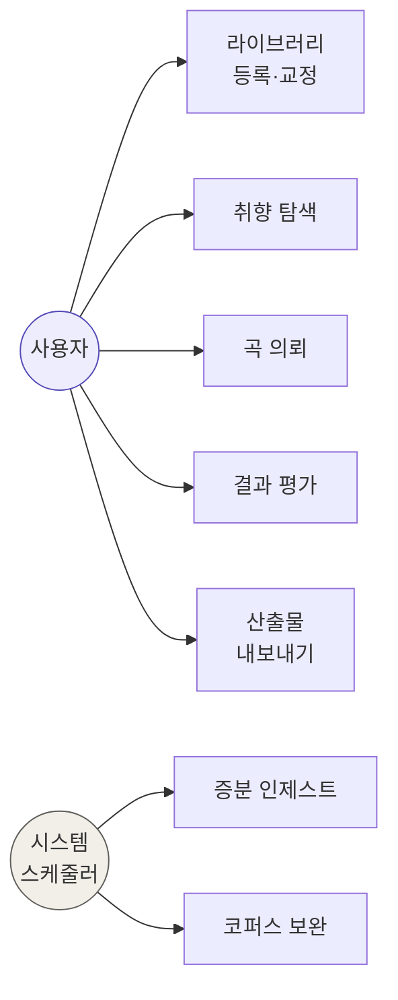
```mermaid
flowchart LR
    U(("사용자")) --> A["라이브러리<br/>등록·교정"]
    U --> B["취향 탐색"]
    U --> C["곡 의뢰"]
    U --> D["결과 평가"]
    U --> E["산출물<br/>내보내기"]
    S(("시스템<br/>스케줄러")) --> F["증분 인제스트"]
    S --> G["코퍼스 보완"]

    style U fill:#EEEDFE,stroke:#534AB7
    style S fill:#F1EFE8,stroke:#5F5E5A
```

| ID | 유스케이스 | 액터 | 우선순위 |
|---|---|---|---|
| UC-01 | 라이브러리 등록 | 사용자 | Must |
| UC-02 | 증분 인제스트 | 스케줄러 | Must |
| UC-03 | 메타데이터 수동 교정 | 사용자 | Should |
| UC-04 | EDA 대시보드 조회 | 사용자 | Must |
| UC-05 | 취향 군집 탐색 | 사용자 | Must |
| UC-06 | **파운데이션 코퍼스 상시 구축** | 스케줄러 | Must |
| UC-06b | 취향 사각지대 표적 보강 | 시스템 | Must |
| UC-07 | 대화로 곡 의뢰 | 사용자 | Must |
| UC-08 | 곡 생성 실행 | 사용자 | Must |
| UC-09 | 부분 재생성 | 사용자 | Must |
| UC-10 | 결과 평가·피드백 | 사용자 | Must |
| UC-11 | 산출물 내보내기 (오디오·MIDI·스템·악보·커버) | 사용자 | Must |
| UC-12 | 음색 프로파일 관리 | 사용자 | Should |
| UC-13 | 소셜 로그인 | 사용자 | Must |

### UC-06b 상세: 취향 사각지대 표적 보강

파운데이션 코퍼스(UC-06)가 개인 취향 영역을 충분히 덮지 못할 때 발동하는 표적 보완이다. UC-06이 광역·상시라면 이쪽은 표적·이벤트 기반이다.

| 항목 | 내용 |
|---|---|
| **목적** | 파운데이션 코퍼스의 사각지대에 있는 개인 취향 영역을 표적 보완한다 |
| **사전조건** | 취향 군집이 산출되어 있고, 파운데이션 임베딩 인덱스가 구축되어 있다 |
| **사후조건** | 저밀도 군집의 밀도가 상승하고, 취향 벡터가 갱신되며, **외부 오디오 원본은 저장되지 않는다** |
| **트리거** | 군집 sufficiency < 0.55 (커버율 가중 0.4 포함). 프로파일 갱신 후 자동 평가 |

**주 흐름**

| # | 처리 |
|---|---|
| 1 | 각 취향 군집의 sufficiency 계산 — 규모·밀도·확실성·**코퍼스 커버율** 4지표 |
| 2 | 밀도 < 임계값인 군집을 **불확실 영역**으로 표시 (Active Learning의 uncertainty sampling) |
| 3 | 해당 군집 중심 벡터를 쿼리로 **파운데이션 임베딩 인덱스** 검색 (벡터끼리 비교) |
| 4 | 상위 K곡의 스트리밍 URL 획득 (Spotify 30초 프리뷰 / Jamendo 풀트랙) |
| 5 | **스트리밍으로 수신 → 메모리에서 피처·임베딩 추출 → 오디오 폐기** |
| 6 | 추출된 벡터를 `external_reference` 테이블에 저장 (출처·라이선스 기록) |
| 7 | 취향 벡터 갱신. 외부 참조는 사용자 곡 대비 가중치 0.3. 보간 백오프 λ(n) 재계산 |
| 8 | 군집 재계산. 커버율 개선 여부를 품질 로그에 기록 |

**대체 흐름**

| ID | 조건 | 처리 |
|---|---|---|
| A1 | 외부 인덱스에 유사곡 없음 | 검색 반경 확대 후 재시도. 실패 시 해당 군집을 "고유 취향"으로 표시 |
| A2 | 스트리밍 실패 (404, 지역 제한) | 다음 후보로 이동. 3회 실패 시 해당 곡 스킵 |
| A3 | 라이선스 불명 | **투입하지 않는다.** 스킵하고 로그 기록 |
| A4 | 보완 후 밀도 개선 없음 | 롤백. 외부 참조 가중치를 0으로 |

**핵심 설계 결정** — 3단계에서 비교하는 것은 **사용자 벡터 ↔ 외부 벡터**다. 양쪽 모두 벡터로 존재하므로 "비교하려면 양쪽 정보가 필요하다"는 순환 문제가 발생하지 않는다. 외부 측은 오디오를 소유하지 않고 **임베딩만 보유**한다.

### UC-08 상세: 곡 생성 실행

| 항목 | 내용 |
|---|---|
| **사전조건** | 취향 벡터 존재, 워커 가동, 인증된 세션 |
| **사후조건** | 오디오·MIDI·스템·악보·커버·평가리포트 저장, 잡 `COMPLETED` |

**주 흐름 (10단계)**

| # | 담당 | 처리 | 진행률 |
|---|---|---|---|
| 1 | 오케스트레이터 | 프롬프트 파싱 → `GenerationSpec` | 5% |
| 2 | 취향 + 코퍼스 | 취향 벡터 조회 + RAG 3인덱스 검색 | 12% |
| 3 | 작곡 | 곡 구조 생성 (섹션 시퀀스) | 20% |
| 4 | 작곡 | 코드 진행 생성 (A* 탐색) | 32% |
| 5 | 작곡 | 멜로디 생성 (제약 빔서치) | 45% |
| 6 | 편곡 | 편성 결정 + 파트 MIDI 생성 | 57% |
| 7 | 작사 | 가사 생성 + 음절 정합 수리 | 70% |
| 8 | 가창 | SVS 합성 → SVC 음색 변환 | 82% |
| 9 | 편곡 | 사운드폰트 렌더링 → 믹싱 → 마스터링 | 92% |
| 10 | 악보 | MusicXML·PDF 악보 생성 | 94% |
| 11 | 아트워크 | 앨범 커버 생성 (병렬, 실패해도 무방) | 97% |
| 12 | 품질 | 평가 지표 산출, 게이트 판정 | 100% |

**대체 흐름**

| ID | 조건 | 처리 |
|---|---|---|
| A1 | 취향 벡터 없음 | 전역 평균 벡터로 대체 + 경고 배너 |
| A2 | 음절 수리 5회 초과 | 제약 ±1음절 완화 → 재시도 → 해당 행만 사용자 편집 요청 |
| A3 | 가창 실패 | 인스트루멘탈로 산출, `vocal_status = FAILED` |
| A3b | 커버 생성 실패 | 기본 커버로 대체. 음원 산출은 정상 진행 |
| A4 | GPU OOM | `RETRY_PENDING`, 배치 절반으로 3회 재시도 |
| A5 | 사용자 취소 | `CANCELLED`, **중간 산출물 전량 보존** (부분 재생성 재활용) |
| A6 | 품질 게이트 실패 | `QUARANTINED`. 사용자에게 문제 단계 표시 + 재생성 유도 |

## 1.3 기능 요구사항

### FR-100 인제스트

| ID | 요구사항 | 등급 | 검증 |
|---|---|---|---|
| FR-101 | 로컬 디렉토리 파일 변경을 폴링 없이 감지한다 | Must | inotify 이벤트 로그 |
| FR-102 | 파일 쓰기 완료를 디바운스로 판별한다 | Must | 대용량 FLAC 복사 중 미처리 확인 |
| FR-103 | 콘텐츠 해시 기반 멱등 처리 | Must | 동일 파일 3회 투입 → 1건 |
| FR-104 | MP3·FLAC·WAV·M4A·OGG·AAC 지원 | Must | 포맷별 샘플 성공 |
| FR-105 | 오브젝트 스토리지 이벤트 경로 지원 | Should | 업로드 → 레코드 생성 |
| FR-106 | 파일 삭제 시 소프트 삭제, 파생 데이터 보존 | Should | 삭제 후 임베딩 조회 가능 |
| FR-107 | 인제스트 진행률을 실시간 노출 | Should | WebSocket 수신 |

### FR-200 정규화

| ID | 요구사항 | 등급 | 검증 |
|---|---|---|---|
| FR-201 | Chromaprint 지문 추출 후 AcoustID 조회 | Must | 지문 매칭률 |
| FR-202 | AcoustID → MusicBrainz MBID 해석 | Must | MBID 부여율 ≥ 85% |
| FR-203 | 6단계 폴백 체인 (§1.6.4) | Must | 단계별 단위 테스트 |
| FR-204 | 아티스트 별칭을 트라이 사전으로 통합 | Must | "아이유"="IU" 동일 ID |
| FR-205 | Union-Find로 동일 녹음 클러스터 병합 | Must | 리마스터·라이브 병합 |
| FR-206 | 정규화 신뢰도(0~1) 산출·저장 | Must | 분포 히스토그램 |
| FR-207 | 신뢰도 < 0.6 항목을 검토 큐로 이관 | Should | Label Studio 태스크 생성 |
| FR-208 | 수동 교정을 우선 규칙으로 학습 | Should | 동일 패턴 자동 처리 |
| FR-209 | 모든 병합을 근거와 함께 기록·되돌리기 가능 | Must | 병합 로그 조회·롤백 |

### FR-300 피처·EDA

| ID | 요구사항 | 등급 | 검증 |
|---|---|---|---|
| FR-301 | 저수준 피처 추출 (MFCC·chroma·spectral·LUFS) | Must | 1004곡 완료 |
| FR-302 | 리듬 피처 (BPM·다운비트·박자표), 배속 오류 보정 | Must | 수동 대조 ±2 BPM |
| FR-303 | 조성 추정 (키·모드·신뢰도) | Must | 알려진 곡 20개 ≥ 75% |
| FR-304 | 의미 피처를 **확률 분포로** 저장 (라벨 축소 금지) | Must | 스키마 검토 |
| FR-305 | Demucs 4스템 분리 + 스템 통계 | Must | 편성 통계 테이블 |
| FR-306 | 코드 진행 추출 (Viterbi) | Should | 알려진 곡 대조 |
| FR-307 | **가사 태그(USLT/SYLT) 우선 파싱**, 없으면 STT | Must | 태그 보유곡 100% 파싱 |
| FR-308 | 태그 가사를 보컬 스템에 강제 정렬 | Must | 정렬 오류율 ≤ 10% |
| FR-309 | 집계는 증분 갱신 (전체 재계산 금지) | Must | 1곡 추가 시 < 3초 |
| FR-310 | 대시보드 폴링 없는 실시간 갱신 | Must | WebSocket 메시지 |
| FR-311 | 최소 10종 시각화 제공 | Should | 대시보드 검수 |

### FR-400 취향 엔진

| ID | 요구사항 | 등급 | 검증 |
|---|---|---|---|
| FR-401 | MERT 임베딩 곡 단위 추출·저장 | Must | 레코드 수 = 곡 수 |
| FR-402 | CLAP 임베딩으로 자연어-오디오 검색 | Must | 질의 → 관련곡 반환 |
| FR-403 | **사전 정의 카테고리 강제 금지** | Must | 코드 리뷰: 하드코딩 장르 부재 |
| FR-404 | UMAP + HDBSCAN 비지도 군집 | Must | 실루엣 ≥ 0.35 |
| FR-405 | 군집 특성 LLM 자연어 서술 | Should | 서술문 생성 |
| FR-406 | 군집 유사도 MST를 취향 지도로 시각화 | Could | 지도 렌더링 |
| FR-407 | 취향 벡터를 **축 변환 없이** 조건 주입 | Must | prefix embedding 코드 검증 |
| FR-408 | 상호작용 로그(재생·스킵·반복) 가중 반영 | Should | 가중치 계산 검증 |

### FR-500 코퍼스 (파운데이션 지식)

| ID | 요구사항 | 등급 | 검증 |
|---|---|---|---|
| FR-501 | **범용 코퍼스를 주기 배치로 상시 구축한다** | Must | 배치 실행 이력, 인덱스 증가 |
| FR-502 | 소스별 커서로 중단·재개가 가능하다 | Must | 중단 후 재실행 시 이어받음 |
| FR-503 | **웜 캐시(코드전이·형식·편성·인덱스)를 미리 계산한다** | Must | 캐시 조회 지연 ≤ 50ms |
| FR-504 | 캐시는 버전을 갖고 원자적으로 교체된다 | Must | 갱신 중 잡이 영향받지 않음 |
| FR-505 | 심볼릭 코퍼스(MIDI)를 통계·사전학습 주력으로 쓴다 | Must | Lakh MIDI 적재 확인 |
| FR-506 | 커버리지 지표 4종을 산출·추적한다 | Must | 지표 대시보드 |
| FR-507 | **사용자 취향 커버율이 낮은 군집을 표적 보강한다** | Must | 보강 전후 커버율 비교 |
| FR-508 | **스트리밍 처리 후 오디오를 폐기한다** | Must | 디스크에 외부 오디오 0건 |
| FR-509 | 라이선스 불명 데이터 투입을 차단한다 | Must | `license` NOT NULL, 스킵 로그 |
| FR-510 | 외부 참조 가중치를 사용자 곡보다 낮게 유지한다 | Must | 가중치 파라미터 검증 |
| FR-511 | **코퍼스와 개인 분포를 보간 백오프로 결합한다** | Must | λ(n) 계산 단위 테스트 |
| FR-512 | 갱신 시 망각 방지(Replay·EWC)를 적용한다 | Should | 홀드아웃 지표 비교 |
| FR-513 | 지표 악화 시 자동 롤백한다 | Should | 롤백 동작 |
| FR-514 | 오디오·텍스트·음악이론 3인덱스를 운영한다 | Must | 각 인덱스 검색 응답 |
| FR-515 | 하이브리드 검색(BM25 + 벡터, RRF)을 지원한다 | Should | 랭킹 비교 |
| FR-516 | RAG는 질의 시점 검색이며 근거 ID를 반환한다 | Must | 근거 기록 |
| FR-517 | **라이브러리 0곡 사용자도 L0만으로 생성 가능하다** | Should | 콜드스타트 테스트 |
| FR-518 | 챗봇이 대화에서 `GenerationSpec`을 구성한다 | Must | 대화 → JSON 변환 |
| FR-519 | MCP 서버로 6종 툴을 노출한다 | Should | 클라이언트 연결 |

### FR-600 작곡

| ID | 요구사항 | 등급 | 검증 |
|---|---|---|---|
| FR-601 | 곡 구조를 먼저 생성 (섹션 시퀀스) | Must | 구조 JSON |
| FR-602 | 코드 진행을 그래프 탐색으로 생성 | Must | 진행 유효성 |
| FR-603 | 코드 조건부 멜로디 생성 | Must | 비화성음 10~25% |
| FR-604 | 산출물은 편집 가능한 MIDI | Must | DAW 열람 가능 |
| FR-605 | 동일 시드·조건 재실행 시 동일 결과 | Must | 재현성 테스트 |
| FR-606 | 섹션 간 자연스러운 접합 | Should | 경계 청취 검수 |

### FR-700 작사

| ID | 요구사항 | 등급 | 검증 |
|---|---|---|---|
| FR-701 | 멜로디에서 마디별 음절 예산 산출 | Must | 단위 테스트 |
| FR-702 | 음절 제약 만족 한국어 가사 생성 | Must | 정합률 ≥ 97% |
| FR-703 | 위반 행만 국소 재생성하는 수리 루프 | Must | 루프 로그 |
| FR-704 | 각운을 소프트 제약으로 반영 | Should | 각운 일치율 |
| FR-705 | 긴 노트에 개모음·장모음 우선 배치 | Should | 배치 규칙 적용률 |
| FR-706 | 라이브러리 가사와 n-gram 중복 검사 | Must | 4-gram 중복률 리포트 |
| FR-707 | 섹션(verse/chorus/bridge)별 톤 차별화 | Should | 어휘 분포 비교 |

### FR-800 편곡·믹싱

| ID | 요구사항 | 등급 | 검증 |
|---|---|---|---|
| FR-801 | 군집별 스템 통계로 편성 결정 | Must | 편성 결정 로그 |
| FR-802 | 베이스·드럼·패드 파트 코드 조건부 생성 | Must | 파트 MIDI |
| FR-803 | 사운드폰트 오디오 렌더링 | Must | WAV 산출 |
| FR-804 | 파트별 이펙트 체인 적용 | Should | 스펙트럼 비교 |
| FR-805 | -14 LUFS 라우드니스 정규화 | Must | 오차 ±0.5 LUFS |
| FR-806 | 스템 개별 보존·내보내기 | Must | 스템 다운로드 |
| FR-807 | 트루피크 -1.0 dBTP 이하 | Must | 측정값 |

### FR-900 가창

| ID | 요구사항 | 등급 | 검증 |
|---|---|---|---|
| FR-901 | 다화자 임베딩 공간 구축 (화자 ≥ 8) | Must | 화자 수 |
| FR-902 | 임베딩 보간으로 신규 음색 합성 | Must | 보간 결과 재생 |
| FR-903 | **음정 정확도 F0 RMSE ≤ 20 cent** | Must | F0 대조 |
| FR-904 | **표현적 미세 변동 제어** (비브라토·스쿱·릴리즈) | Must | 파라미터 A/B |
| FR-905 | **발음 정밀도 연속 제어** (뭉갬 ↔ 또렷) | Should | 슬라이더 A/B |
| FR-906 | 창법 스타일을 음색과 분리 제어 | Should | 스타일 토큰 A/B |
| FR-907 | 실존 화자 음색 복제 기능 미제공 | Must | 단일화자 복제 경로 부재 |
| FR-908 | 가창 실패 시 인스트루멘탈 폴백 | Must | 폴백 테스트 |

### FR-1000 악보

| ID | 요구사항 | 등급 | 검증 |
|---|---|---|---|
| FR-1001 | MIDI → MusicXML 변환 | Must | 스키마 유효성 |
| FR-1002 | 리드시트 생성 (멜로디 + 코드심볼 + 가사) | Must | PDF 산출 |
| FR-1003 | 파트보 생성 (악기별 개별 악보) | Should | 파트별 PDF |
| FR-1004 | 피아노 편곡보 생성 (대보표 축약) | Could | PDF 산출 |
| FR-1005 | 가사를 음절 단위로 음표에 정렬 배치 | Must | 시각 검수 |
| FR-1006 | 브라우저 인라인 악보 렌더링 (SVG) | Should | 재생 위치 동기 |
| FR-1007 | MuseScore·Sibelius 호환성 확인 | Must | 실제 열람 |

### FR-1050 아트워크

| ID | 요구사항 | 등급 | 검증 |
|---|---|---|---|
| FR-1051 | 곡의 무드·장르·가사·취향에서 시각 프롬프트를 구성한다 | Must | 프롬프트 로그 |
| FR-1052 | 확산 모델로 1024px 이상 아트워크를 생성한다 | Must | 이미지 산출 |
| FR-1053 | **텍스트는 이미지 모델이 아닌 합성 레이어로 렌더한다** | Must | 한글 깨짐 0건 |
| FR-1054 | 배경 밝기 분석으로 텍스트 대비 4.5:1 이상 확보 | Should | 대비 측정 |
| FR-1055 | 3000·1400·300px 3종 규격을 산출한다 | Must | 파일 3종 |
| FR-1056 | 텍스트 미포함 원본을 별도 보존한다 | Should | 파일 존재 |
| FR-1057 | 프롬프트·시드를 기록해 재현 가능하게 한다 | Must | 동일 시드 동일 결과 |
| FR-1058 | 실존 인물·특정 아티스트 스타일 프롬프트를 차단한다 | Must | 금지어 필터 테스트 |
| FR-1059 | 커버 생성 실패가 음원 산출을 막지 않는다 | Must | 폴백 테스트 |

### FR-1100 피드백·평가

| ID | 요구사항 | 등급 | 검증 |
|---|---|---|---|
| FR-1101 | 파이프라인 각 단계 자동 지표 산출 | Must | 단계별 지표 로깅 |
| FR-1102 | 지표 미달 시 배포·산출 차단 | Must | 게이트 동작 |
| FR-1103 | 생성 결과 5점 평가 + A/B 선택 수집 | Must | 피드백 레코드 |
| FR-1104 | 섹션별 평가 수집 | Should | 구간 태그 저장 |
| FR-1105 | 선호쌍으로 조건 최적화 (DPO) | Should | 학습 전후 비교 |
| FR-1106 | 단계별 부분 재생성 | Must | 멜로디만 재생성 |
| FR-1107 | 생성 근거(RAG·참조곡·군집) 노출 | Must | 설명 패널 |

### FR-1200 인증·계정

| ID | 요구사항 | 등급 | 검증 |
|---|---|---|---|
| FR-1201 | 이메일 회원가입 + JWT 발급 | Must | 토큰 검증 |
| FR-1202 | **SSO 소셜 로그인** (Google·Kakao·Naver·GitHub) | Must | 각 provider 로그인 |
| FR-1203 | Refresh Token Rotation | Must | 재사용 감지 차단 |
| FR-1204 | Access Token 15분, Refresh 14일 | Must | 만료 동작 |
| FR-1205 | Refresh Token은 httpOnly·Secure 쿠키 | Must | 브라우저 확인 |
| FR-1206 | 역할 기반 접근 제어 (RBAC) | Should | 권한 테스트 |
| FR-1207 | 계정 삭제 시 개인 데이터 완전 삭제 | Must | 삭제 검증 |

## 1.4 비기능 요구사항 — ISO/IEC 25010 8특성

| 특성 | ID | 요구사항 | 목표치 |
|---|---|---|---|
| **기능적합성** | NFR-F1 | 명세된 FR의 구현 완성도 | Must 항목 100% |
| | NFR-F2 | 생성 결과의 음악적 유효성 | 품질 게이트 통과율 ≥ 90% |
| **성능효율성** | NFR-P1 | 종단간 곡 생성 시간 | ≤ 20분 (품질 우선, 실시간 미추구) |
| | NFR-P2 | 1곡 인제스트 (임베딩 포함) | ≤ 90초 (4090 기준) |
| | NFR-P3 | 대시보드 초기 로드 | ≤ 2초 p95 |
| | NFR-P4 | 벡터 검색 (10만 건) | ≤ 200ms p95 |
| | NFR-P5 | 챗봇 첫 토큰 | ≤ 3초 |
| | NFR-P6 | 진행률 갱신 지연 | ≤ 2초 |
| **호환성** | NFR-C1 | MusicXML 표준 준수 | MuseScore·Sibelius 열람 |
| | NFR-C2 | MIDI 표준 준수 | 주요 DAW 열람 |
| | NFR-C3 | 브라우저 지원 | 최신 2개 버전 |
| **사용성** | NFR-U1 | 생성 진행 단계 인지 가능 | 10단계 표시 |
| | NFR-U2 | 모바일 전 기능 접근 | Flutter 앱 검수 |
| | NFR-U3 | 오류 메시지에 다음 행동 제시 | 100% |
| | NFR-U4 | 생성 근거 설명 제공 | 전 잡 |
| **신뢰성** | NFR-R1 | 워커 멱등성 | 동일 입력 N회 → 1건 |
| | NFR-R2 | 잡 실패 자동 재시도 | 3회 지수 백오프 |
| | NFR-R3 | 워커 비정상 종료 시 메시지 무손실 | 손실 0 |
| | NFR-R4 | 중간 산출물 보존 | 100% |
| | NFR-R5 | 데이터 백업 | RPO 24h |
| **보안성** | NFR-S1 | 비밀정보 코드 미포함 | gitleaks 0건 |
| | NFR-S2 | OWASP Top 10 대응 | 항목별 대응표 (§5.5) |
| | NFR-S3 | 저장 데이터 암호화 | 개인정보 필드 암호화 |
| | NFR-S4 | 전송 구간 TLS 1.3 | SSL Labs A 등급 |
| | NFR-S5 | 원본 음원 외부 노출 차단 | 프리사인 URL 5분 만료 |
| | NFR-S6 | 의존성 취약점 스캔 | CI 게이트 |
| **유지보수성** | NFR-M1 | 테스트 커버리지 | 핵심 모듈 ≥ 75% |
| | NFR-M2 | 정적 분석 위반 | 0건 (Ruff·mypy strict) |
| | NFR-M3 | 결합도 | 자료 결합도 목표 |
| | NFR-M4 | 응집도 | 기능적 응집도 목표 |
| | NFR-M5 | 아키텍처 경계 위반 | import-linter 0건 |
| | NFR-M6 | 실험 재현성 | 동일 시드 결과 일치 |
| **이식성** | NFR-T1 | 컨테이너 기반 배포 | 단일 compose 기동 |
| | NFR-T2 | 클라우드 종속 최소화 | IaC로 3시간 내 이전 |
| | NFR-T3 | x86·ARM 양쪽 이미지 | 멀티아키 빌드 |

## 1.5 요구사항 추적 매트릭스

| 페인포인트 | HMW | 목표 | 주요 FR | 설계 | 검증 |
|---|---|---|---|---|---|
| PP-1 기다림 | HMW-1 | G-4 | FR-6xx~9xx | §2.2 | 종단간 생성 |
| PP-2 능력 부족 | HMW-2 | G-5~G-8 | FR-700·800·900·1000 | §2.2 | 엔진별 지표 |
| PP-3 언어화 한계 | HMW-3 | G-2, G-4 | FR-403·407 | §2.3 | G-9 블라인드 실험 |
| 데이터 부족 | HMW-4 | G-3, G-3b | FR-501~517 | §0.5, §2.4 | 커버율·밀도 개선 |
| 완성도 부족 | HMW-5 | G-8b | FR-1051~1059 | §2.10 | 커버 산출·무드 일치 |
| 편집 불가 | HMW-5 | G-8 | FR-604·806·1001~1007 | §2.9 | 산출물 호환성 |
| 불투명성 | HMW-6 | — | FR-503·1107 | §2.4 | 근거 패널 |
---

## 1.6 아키텍처 설계

### 1.6.1 아키텍처 패턴 선정

정보처리기사 아키텍처 패턴 분류 기준으로 세 가지를 조합한다.

| 패턴 | 적용 영역 | 선정 사유 |
|---|---|---|
| **파이프-필터** | 인제스트 파이프라인, 생성 파이프라인 | **본 시스템의 본질.** 각 단계가 독립 필터이며 데이터가 파이프로 흐른다. 필터 교체·재배열이 자유롭고 병렬화가 쉽다 |
| **레이어드** | 전체 계층 구조 | 프레젠테이션 / 애플리케이션 / 도메인 / 인프라 분리. 의존성 방향 강제 |
| **이벤트 기반** | 워커 간 통신 | 폴링 배제 요구(FR-101) 충족. 발행-구독으로 결합도 최소화 |

**파이프-필터가 왜 정확한가**

```
[원본 파일] → 지문추출 → 엔티티해석 → 피처추출 → 임베딩 → 집계 → [취향 벡터]
[취향 벡터] → 구조 → 화성 → 멜로디 → 편곡 → 작사 → 가창 → 믹싱 → 악보 → [완성물]
```

- 각 필터는 **입력 스키마와 출력 스키마만 알면 된다** (자료 결합도)
- 필터 하나를 교체해도 나머지가 영향받지 않는다 (Strategy 패턴과 결합)
- 중간 산출물이 항상 존재하므로 **부분 재생성**(FR-1106)이 공짜로 나온다
- 각 필터에 품질 게이트를 삽입할 수 있다

### 1.6.2 논리 아키텍처

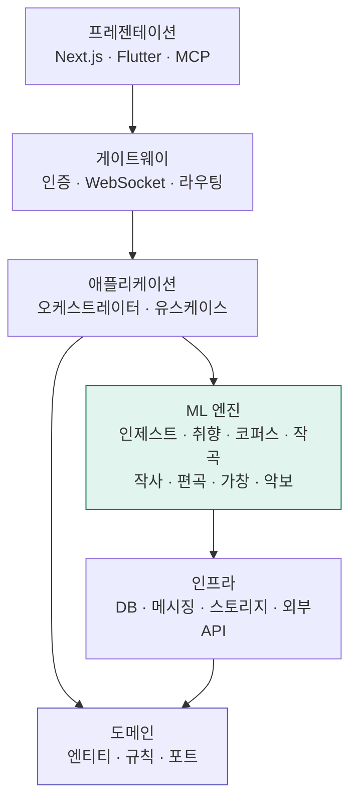
```mermaid
flowchart TB
    P["프레젠테이션<br/>Next.js · Flutter · MCP"]
    G["게이트웨이<br/>인증 · WebSocket · 라우팅"]
    A["애플리케이션<br/>오케스트레이터 · 유스케이스"]
    D["도메인<br/>엔티티 · 규칙 · 포트"]
    M["ML 엔진<br/>인제스트 · 취향 · 코퍼스 · 작곡<br/>작사 · 편곡 · 가창 · 악보"]
    I["인프라<br/>DB · 메시징 · 스토리지 · 외부API"]

    P --> G --> A --> D
    A --> M
    I --> D
    M --> I

    style D fill:#EEEDFE,stroke:#534AB7
    style M fill:#E1F5EE,stroke:#0F6E56
```

**의존성 규칙 (클린 아키텍처)**
- 화살표는 안쪽(도메인)을 향한다
- `domain`은 어떤 외부 패키지도 import하지 않는다 — 순수 Python
- `infrastructure`가 `domain`의 포트(인터페이스)를 구현한다 (의존성 역전)
- **CI에서 `import-linter`로 강제** (NFR-M5)

### 1.6.3 물리 배치

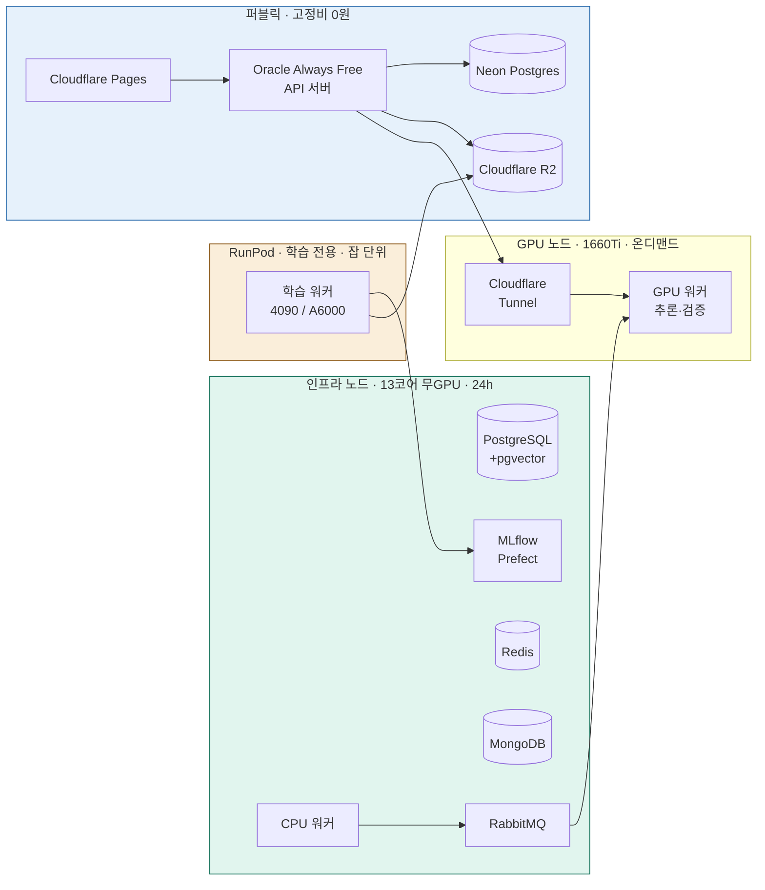
```mermaid
flowchart LR
    subgraph N1["인프라 노드 · 13코어 무GPU · 24h"]
        DB[("PostgreSQL<br/>+pgvector")]
        MQ["RabbitMQ"]
        RD[("Redis")]
        MO[("MongoDB")]
        ML["MLflow<br/>Prefect"]
        CW["CPU 워커"]
    end

    subgraph N2["GPU 노드 · 1660Ti · 온디맨드"]
        GW["GPU 워커<br/>추론·검증"]
        TN["Cloudflare<br/>Tunnel"]
    end

    subgraph N3["RunPod · 학습 전용 · 잡 단위"]
        TR["학습 워커<br/>4090 / A6000"]
    end

    subgraph N4["퍼블릭 · 고정비 0원"]
        CF["Cloudflare Pages"]
        OC["Oracle Always Free<br/>API 서버"]
        NE[("Neon Postgres")]
        R2[("Cloudflare R2")]
    end

    CW --> MQ
    MQ --> GW
    TR --> ML
    TR --> R2
    OC --> NE
    OC --> R2
    CF --> OC
    OC --> TN
    TN --> GW

    style N1 fill:#E1F5EE,stroke:#0F6E56
    style N3 fill:#FAEEDA,stroke:#854F0B
    style N4 fill:#E6F1FB,stroke:#185FA5
```

**핵심 결정**
1. **학습은 절대 상시 인스턴스에서 하지 않는다.** RunPod 잡 단위로만.
2. **GPU 추론은 로컬 + Cloudflare Tunnel.** 퍼블릭 API가 터널을 통해 로컬 GPU를 호출한다. 고정비 0원으로 GPU 서빙이 가능한 유일한 구조.
3. 인프라 노드는 24시간 가동하되 GPU가 없으므로 전력·발열 부담이 낮다.

### 1.6.4 정규화 폴백 체인 — 책임 연쇄 패턴

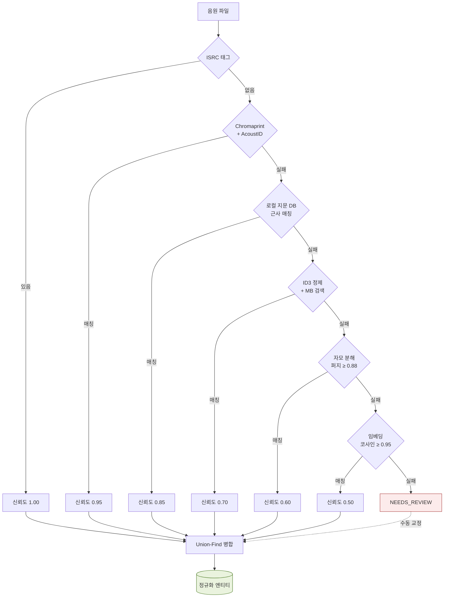
```mermaid
flowchart TD
    S["음원 파일"] --> L0{"ISRC 태그"}
    L0 -->|있음| C10["신뢰도 1.00"]
    L0 -->|없음| L1{"Chromaprint<br/>+ AcoustID"}
    L1 -->|매칭| C95["신뢰도 0.95"]
    L1 -->|실패| L2{"로컬 지문 DB<br/>근사 매칭"}
    L2 -->|매칭| C85["신뢰도 0.85"]
    L2 -->|실패| L3{"ID3 정제<br/>+ MB 검색"}
    L3 -->|매칭| C70["신뢰도 0.70"]
    L3 -->|실패| L4{"자모 분해<br/>퍼지 ≥ 0.88"}
    L4 -->|매칭| C60["신뢰도 0.60"]
    L4 -->|실패| L5{"임베딩<br/>코사인 ≥ 0.95"}
    L5 -->|매칭| C50["신뢰도 0.50"]
    L5 -->|실패| RV["NEEDS_REVIEW"]

    C10 & C95 & C85 & C70 & C60 & C50 --> UF["Union-Find 병합"]
    RV -.수동 교정.-> UF
    UF --> OK[("정규화 엔티티")]

    style RV fill:#FCEBEB,stroke:#A32D2D
    style OK fill:#EAF3DE,stroke:#3B6D11
```

각 레벨은 `NormalizationHandler` 인터페이스를 구현하고 `setNext()`로 연결된다. 새 레벨 추가 시 기존 코드를 수정하지 않는다 (OCP).

## 1.7 모듈 설계 — 결합도·응집도·SOLID

### 1.7.1 결합도 목표

정보처리기사 결합도 6단계: **자료 < 스탬프 < 제어 < 외부 < 공통 < 내용** (낮을수록 좋음)

| 모듈 간 | 현행 설계 결합도 | 근거 |
|---|---|---|
| 워커 ↔ 워커 | **자료 결합** | 메시지 큐 페이로드(JSON)만 주고받음. 직접 호출 없음 |
| 엔진 ↔ 오케스트레이터 | **자료 결합** | `GenerationContext` 값 객체만 전달. 엔진은 서로를 모름 |
| 애플리케이션 ↔ 인프라 | **스탬프 결합** | 포트 인터페이스로 DTO 전달. 구현체 미인지 |
| 엔진 ↔ 모델 | **스탬프 결합** | Strategy 인터페이스 경유 |

**금지 사항**
- 제어 결합 금지 — 플래그 인자로 동작을 분기시키지 않는다. 분기가 필요하면 Strategy를 나눈다
- 공통 결합 금지 — 전역 가변 상태 금지. 설정은 불변 객체로 주입
- 내용 결합 금지 — 다른 모듈 내부 접근 금지. `_private` 접근 시 CI 실패

### 1.7.2 응집도 목표

정보처리기사 응집도 7단계: **기능 > 순차 > 교환 > 절차 > 시간 > 논리 > 우연** (높을수록 좋음)

| 모듈 | 응집도 | 근거 |
|---|---|---|
| `HarmonyStrategy` | **기능적** | 코드 진행 생성이라는 단일 기능만 수행 |
| `SyllableVerifier` | **기능적** | 음절 정합 검증만 수행 |
| `IngestPipeline` | **순차적** | 앞 단계 출력이 뒤 단계 입력. 파이프-필터 특성상 최선 |
| `FeatureExtractor` | **교환적** | 동일 오디오 데이터를 여러 추출기가 공유 |

**응집도 위반 감지 규칙** — 클래스 이름에 "Manager", "Util", "Helper", "Common"이 들어가면 우연적 응집 의심. 코드 리뷰에서 분해 검토한다.

### 1.7.3 SOLID 적용

| 원칙 | 적용 지점 | 구체 사례 |
|---|---|---|
| **SRP** 단일 책임 | 9개 서브시스템 분리 | `작곡`는 작곡만, `작사`는 작사만. 변경 이유가 하나씩 |
| **OCP** 개방-폐쇄 | 폴백 체인, 생성 전략 | 새 정규화 레벨 추가 시 `NormalizationHandler` 구현체만 추가. 기존 코드 무수정 |
| **LSP** 리스코프 치환 | `IGenerationEngine` 구현체 | `AStarHarmony` ↔ `MarkovHarmony` 교체 시 계약(입출력 스키마·예외) 동일 |
| **ISP** 인터페이스 분리 | 포트 세분화 | `ITrackReader` / `ITrackWriter` 분리. 읽기만 필요한 모듈이 쓰기 메서드에 의존하지 않음 |
| **DIP** 의존 역전 | 도메인 포트 | `domain.ports.IObjectStorage` 선언 → `infrastructure.s3.R2Storage` 구현. 도메인이 R2를 모름 |

```python
# DIP + ISP 적용 예
# hathor/domain/ports.py — 도메인은 인터페이스만 선언
from typing import Protocol
from hathor.domain.entities import Track

class ITrackReader(Protocol):
    def find_by_hash(self, content_hash: str) -> Track | None: ...
    def find_ready(self, limit: int, cursor: str | None) -> list[Track]: ...

class ITrackWriter(Protocol):
    def upsert(self, track: Track) -> None: ...
    def soft_delete(self, track_id: str) -> None: ...

# hathor/infrastructure/persistence/track_repo.py — 인프라가 구현
class PostgresTrackRepository(ITrackReader, ITrackWriter):
    def __init__(self, session_factory): ...
```

### 1.7.4 GoF 디자인 패턴 적용

| 분류 | 패턴 | 적용 지점 |
|---|---|---|
| **생성** | Abstract Factory | 포맷별 디코더·추출기 계열 생성 |
| | Factory Method | `EngineFactory.create(stage)` |
| | Builder | `SongBuilder` — 구조→화성→멜로디→편곡 단계 조립 |
| | Prototype | `SongTemplate.clone()` — 기존 구조 복제 후 변형 |
| **구조** | Adapter | `AcoustIdAdapter`, `MusicBrainzAdapter`, `SpotifyAdapter` |
| | Bridge | `RenderEngine` ↔ `SoundfontBackend` 분리 |
| | **Composite** | `Song → Section → Bar → Note` 재귀 트리 |
| | **Decorator** | `EffectChain` — EQ→Comp→Reverb 동적 조합 |
| | Facade | `오케스트레이터` — 8개 엔진 복잡성 은닉 |
| | Flyweight | 사운드폰트 샘플 공유 |
| | Proxy | `LazyModelProxy` — VRAM 절약 지연 로딩 |
| **행위** | **Chain of Responsibility** | 정규화 폴백 6단계 (§1.6.4) |
| | Command | `GenerationCommand` — 실행·취소·재실행 |
| | Interpreter | 프롬프트 DSL 파싱 |
| | Iterator | 스트리밍 오디오 청크 순회 |
| | Mediator | 이벤트 버스 — 워커 간 직접 결합 제거 |
| | Memento | `StageSnapshot` — 부분 재생성 기반 |
| | **Observer** | 파일 이벤트 → 다중 구독자 |
| | **State** | 잡 상태 전이 강제 (§1.9) |
| | **Strategy** | 화성·멜로디·보코더 알고리즘 교체 |
| | **Template Method** | `AbstractEngine.run()` — 검증-실행-계측 골격 |
| | Visitor | MIDI 트리 순회 — 전조·양자화·음절예산 |

## 1.8 인터페이스 설계

### 1.8.1 REST API

| 메서드 | 경로 | 설명 | 인증 |
|---|---|---|---|
| POST | `/api/v1/auth/signup` | 이메일 가입 | — |
| POST | `/api/v1/auth/login` | 로그인 → Access + Refresh | — |
| GET | `/api/v1/auth/oauth/{provider}` | SSO 시작 (google·kakao·naver·github) | — |
| GET | `/api/v1/auth/oauth/{provider}/callback` | SSO 콜백 | — |
| POST | `/api/v1/auth/refresh` | 토큰 갱신 (rotation) | Refresh 쿠키 |
| POST | `/api/v1/auth/logout` | 세션 종료 | JWT |
| DELETE | `/api/v1/auth/me` | 계정 삭제 | JWT |
| GET | `/api/v1/tracks` | 트랙 목록 (커서 페이징) | JWT |
| GET | `/api/v1/tracks/{id}` | 트랙 상세 + 피처 | JWT |
| PATCH | `/api/v1/tracks/{id}` | 메타데이터 교정 | JWT |
| POST | `/api/v1/tracks/{id}/merge` | 엔티티 병합 | JWT |
| DELETE | `/api/v1/tracks/{id}/merge/{mergeId}` | 병합 되돌리기 | JWT |
| GET | `/api/v1/tracks/{id}/stream` | 프리사인 URL (5분) | JWT |
| GET | `/api/v1/dashboard/widgets` | 집계 위젯 데이터 | JWT |
| GET | `/api/v1/taste/profile` | 취향 프로파일 | JWT |
| GET | `/api/v1/taste/clusters` | 군집 + 서술 + UMAP 좌표 | JWT |
| GET | `/api/v1/taste/map` | MST 취향 지도 | JWT |
| POST | `/api/v1/taste/augment` | **외부 코퍼스 보완 수동 트리거** | JWT |
| POST | `/api/v1/search/semantic` | CLAP 자연어 검색 | JWT |
| POST | `/api/v1/search/similar` | MERT 유사곡 Top-K | JWT |
| POST | `/api/v1/chat` | 챗봇 (SSE 스트리밍) | JWT |
| POST | `/api/v1/jobs` | 생성 잡 생성 | JWT |
| GET | `/api/v1/jobs/{id}` | 잡 상태 | JWT |
| DELETE | `/api/v1/jobs/{id}` | 잡 취소 | JWT |
| POST | `/api/v1/jobs/{id}/regenerate` | 부분 재생성 (stage 지정) | JWT |
| GET | `/api/v1/jobs/{id}/artifacts` | 산출물 URL 묶음 | JWT |
| GET | `/api/v1/jobs/{id}/score` | **악보 (MusicXML·PDF·SVG)** | JWT |
| GET | `/api/v1/jobs/{id}/rationale` | **생성 근거 (RAG·참조곡·군집)** | JWT |
| POST | `/api/v1/feedback` | 평가 제출 | JWT |
| GET | `/api/v1/voices` | 음색 프로파일 목록 | JWT |
| POST | `/api/v1/voices/interpolate` | 보간 음색 생성 | JWT |
| GET | `/api/v1/health` | 헬스체크 | — |
| GET | `/metrics` | Prometheus | 내부망 |

### 1.8.2 요청·응답 스키마

```jsonc
// POST /api/v1/jobs
{
  "prompt": "새벽 3시에 혼자 듣는 느낌, 보컬은 낮고 담담하게",
  "clusterHint": 3,                  // null = 전체 취향 벡터
  "constraints": {                    // 전부 null이 기본값 = 모델 자율 결정
    "bpm": null, "key": null, "form": null, "durationSec": 180
  },
  "voice": {
    "profileId": "b1c2…",            // null = 인스트루멘탈
    "articulation": 0.7,             // 0=뭉갬 … 1=또렷 (FR-905)
    "vibratoDepth": 0.4,
    "expressiveness": 0.6            // 미세 피치 변동량 (FR-904)
  },
  "outputs": ["audio", "midi", "stems", "score"],
  "seed": null                        // null이면 생성 후 기록
}
```

```jsonc
// 202 Accepted
{ "jobId": "9f2c…", "status": "QUEUED",
  "wsChannel": "/ws/jobs/9f2c…", "estimatedSeconds": 900 }
```

```jsonc
// WebSocket 이벤트
{ "type": "STAGE_PROGRESS", "stage": "HARMONIZING", "progressPct": 32,
  "message": "코드 진행 탐색 중 (노드 1284개 확장)",
  "preview": { "chords": ["F#m", "D", "A", "E"] },
  "ts": "2026-08-09T14:22:31.412Z" }
```

```jsonc
// GET /api/v1/jobs/{id}/rationale — 설명가능성
{
  "tasteCluster": { "id": 3, "description": "저역 강조 미드템포 …",
                    "membershipProb": 0.71 },
  "referenceTracks": [ { "trackId": "…", "title": "…", "similarity": 0.87,
                         "source": "user_library" } ],
  "externalReferences": [ { "source": "jamendo", "license": "CC BY-SA",
                            "similarity": 0.81 } ],
  "theoryDocs": [ { "docId": "harmony-042",
                    "excerpt": "단조 4536 진행의 기능적 해석 …" } ],
  "decisions": [
    { "stage": "HARMONIZING", "choice": "F#m-D-A-E",
      "reason": "군집 3의 전이 통계 상위 2%, 이론 사전확률 0.31" }
  ]
}
```

### 1.8.3 이벤트 (RabbitMQ)

| Exchange | Routing Key | 페이로드 | 소비자 |
|---|---|---|---|
| `hathor.ingest` | `raw.discovered` | `{hash, path, size}` | 인제스트 정규화 워커 |
| `hathor.ingest` | `normalized` | `{trackId}` | 취향 피처 워커 |
| `hathor.ingest` | `feature.done` | `{trackId, version}` | 취향 임베딩 워커 |
| `hathor.ingest` | `embedding.done` | `{trackId}` | 집계 워커 |
| `hathor.augment` | `density.low` | `{clusterId, deficit}` | 코퍼스 보완 워커 |
| `hathor.augment` | `external.fetched` | `{refId, source}` | 취향 임베딩 워커 |
| `hathor.generate` | `job.requested` | `{jobId, specId}` | 오케스트레이터 오케스트레이터 |
| `hathor.generate` | `stage.{name}` | `{jobId, stage, input}` | 각 엔진 워커 |
| `hathor.generate` | `job.completed` | `{jobId, artifactId}` | 품질 평가 워커 |
| `hathor.dlq` | `*` | 원본 + 실패 사유 | 수동 검토 |

**큐 정책** — 모든 큐는 durable, 메시지는 persistent, 소비는 manual ack. 3회 재시도 후 DLQ. GPU 태스크는 `prefetch=1`로 제한.

### 1.8.4 MCP 서버 툴

| 툴 | 파라미터 | 반환 |
|---|---|---|
| `search_library` | `query, limit` | 하이브리드 검색 결과 |
| `get_taste_profile` | — | 군집 요약 + 통계 |
| `explain_track` | `trackId` | 피처·군집·유사곡·근거 |
| `create_song` | `prompt, clusterHint?, voice?` | jobId |
| `check_job` | `jobId` | 상태·진행률·부분 결과 |
| `get_artifacts` | `jobId` | 오디오·MIDI·스템·악보 URL |

## 1.9 상태 설계

### 1.9.1 트랙 상태

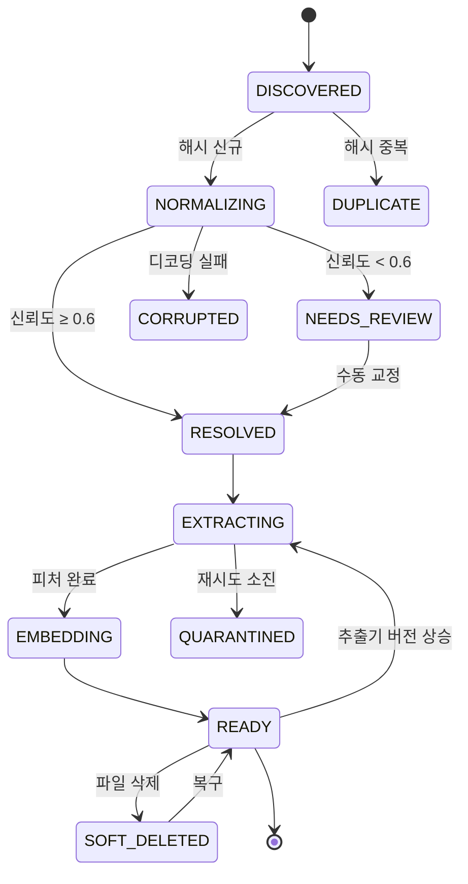
```mermaid
stateDiagram-v2
    [*] --> DISCOVERED
    DISCOVERED --> NORMALIZING : 해시 신규
    DISCOVERED --> DUPLICATE : 해시 중복
    NORMALIZING --> RESOLVED : 신뢰도 ≥ 0.6
    NORMALIZING --> NEEDS_REVIEW : 신뢰도 < 0.6
    NORMALIZING --> CORRUPTED : 디코딩 실패
    NEEDS_REVIEW --> RESOLVED : 수동 교정
    RESOLVED --> EXTRACTING
    EXTRACTING --> EMBEDDING : 피처 완료
    EXTRACTING --> QUARANTINED : 재시도 소진
    EMBEDDING --> READY
    READY --> EXTRACTING : 추출기 버전 상승
    READY --> SOFT_DELETED : 파일 삭제
    SOFT_DELETED --> READY : 복구
    READY --> [*]
```

### 1.9.2 생성 잡 상태

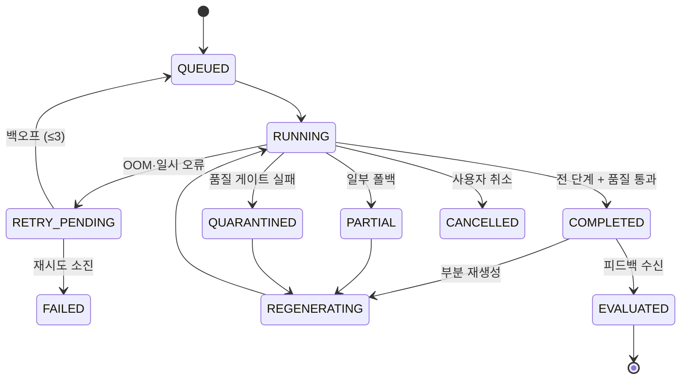
```mermaid
stateDiagram-v2
    [*] --> QUEUED
    QUEUED --> RUNNING
    RUNNING --> COMPLETED : 전 단계 + 품질 통과
    RUNNING --> PARTIAL : 일부 폴백
    RUNNING --> QUARANTINED : 품질 게이트 실패
    RUNNING --> RETRY_PENDING : OOM·일시 오류
    RETRY_PENDING --> QUEUED : 백오프 (≤3)
    RETRY_PENDING --> FAILED : 재시도 소진
    RUNNING --> CANCELLED : 사용자 취소
    COMPLETED --> REGENERATING : 부분 재생성
    PARTIAL --> REGENERATING
    QUARANTINED --> REGENERATING
    REGENERATING --> RUNNING
    COMPLETED --> EVALUATED : 피드백 수신
    EVALUATED --> [*]
```

**RUNNING 내부 단계 전이** (파이프-필터 순서)

```
STRUCTURING → HARMONIZING → MELODIZING → ARRANGING
→ LYRICIZING → VOCALIZING → RENDERING → MASTERING
→ ENGRAVING → EVALUATING
```

각 전이 시점에 `StageSnapshot`(Memento)을 저장한다. 부분 재생성은 해당 단계 스냅샷부터 재시작한다.

### 1.9.3 화자 프로파일 상태

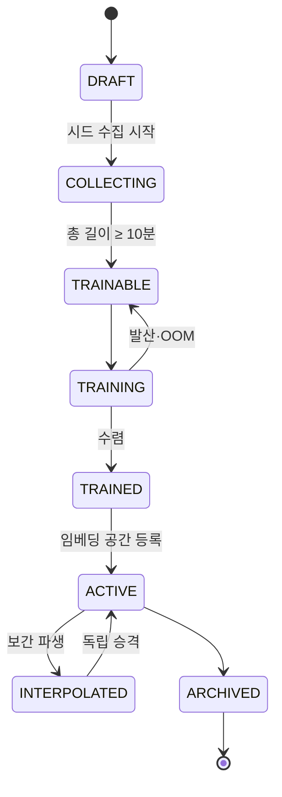
```mermaid
stateDiagram-v2
    [*] --> DRAFT
    DRAFT --> COLLECTING : 시드 수집 시작
    COLLECTING --> TRAINABLE : 총 길이 ≥ 10분
    TRAINABLE --> TRAINING
    TRAINING --> TRAINED : 수렴
    TRAINING --> TRAINABLE : 발산·OOM
    TRAINED --> ACTIVE : 임베딩 공간 등록
    ACTIVE --> INTERPOLATED : 보간 파생
    INTERPOLATED --> ACTIVE : 독립 승격
    ACTIVE --> ARCHIVED
    ARCHIVED --> [*]
```

## 1.10 화면 설계

### 1.10.1 화면 목록

| ID | 화면 | 핵심 요소 |
|---|---|---|
| SCR-01 | 로그인 | 이메일 + SSO 4종 버튼 |
| SCR-02 | 대시보드 (EDA) | 10종 위젯, 실시간 갱신, 인제스트 진행 배너 |
| SCR-03 | 취향 지도 | UMAP 산점도, MST 오버레이, 군집 카드, **밀도 경고 뱃지** |
| SCR-04 | 라이브러리 | 목록·필터·정렬, 신뢰도 표시, 검토 큐 |
| SCR-05 | 트랙 상세 | 피처 시각화, 스템 플레이어, 메타 교정 |
| SCR-06 | 생성 스튜디오 | 챗 + 스펙 프리뷰 + 제약 토글(기본 OFF) + 음색 슬라이더 |
| SCR-07 | 생성 진행 | 10단계 스테퍼, 단계별 미리듣기, 취소 |
| SCR-08 | 결과 플레이어 | 파형+섹션마커, 스템 믹서, **악보 뷰**, 가사 싱크 |
| SCR-09 | **생성 근거** | RAG 문서, 참조곡, 군집, 단계별 선택 이유 |
| SCR-10 | 평가 | 5점 + 섹션별 + A/B 비교 |
| SCR-11 | 음색 관리 | 시드 업로드, 보간 슬라이더, 미리듣기 |
| SCR-12 | 생성 이력 | 목록, A/B 재비교, 재생성 |

### 1.10.2 화면 흐름

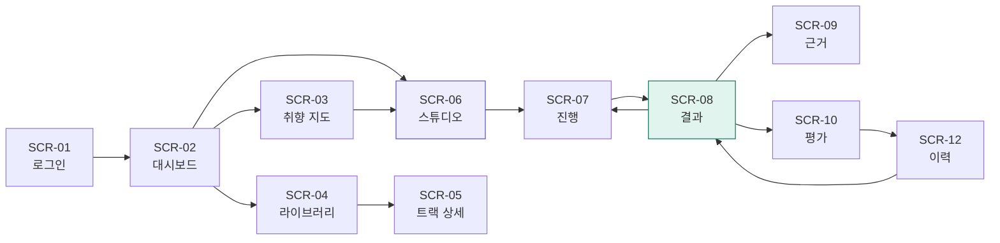
```mermaid
flowchart LR
    L["SCR-01<br/>로그인"] --> H["SCR-02<br/>대시보드"]
    H --> T["SCR-03<br/>취향 지도"]
    H --> LB["SCR-04<br/>라이브러리"]
    H --> ST["SCR-06<br/>스튜디오"]
    T --> ST
    LB --> TD["SCR-05<br/>트랙 상세"]
    ST --> PR["SCR-07<br/>진행"]
    PR --> RS["SCR-08<br/>결과"]
    RS --> RA["SCR-09<br/>근거"]
    RS --> EV["SCR-10<br/>평가"]
    RS --> PR
    EV --> HI["SCR-12<br/>이력"]
    HI --> RS

    style ST fill:#EEEDFE,stroke:#534AB7
    style RS fill:#E1F5EE,stroke:#0F6E56
```

### 1.10.3 SCR-08 결과 플레이어 상세

| # | 요소 | 동작 |
|---|---|---|
| 1 | 파형 + 섹션 마커 | 섹션 클릭 → 해당 위치 재생 |
| 2 | 스템 믹서 (4~6채널) | 볼륨·뮤트·솔로 실시간 |
| 3 | **악보 뷰 (Verovio SVG)** | 재생 위치에 따라 마디 하이라이트, 확대·스크롤 |
| 4 | 가사 싱크 | 현재 음절 강조 |
| 5 | 단계별 재생성 | 멜로디만 / 가사만 / 편곡만 / 보컬만 |
| 6 | 다운로드 | WAV·MP3·MIDI·스템 ZIP·MusicXML·PDF |
| 7 | 근거 보기 | SCR-09로 이동 |
| 8 | 평가 위젯 | SCR-10 인라인 |

### 1.10.4 SCR-03 취향 지도 상세

| # | 요소 | 동작 |
|---|---|---|
| 1 | UMAP 2D 산점도 | 군집별 색상, 줌·팬, 점 클릭 → 트랙 상세 |
| 2 | MST 간선 오버레이 | 토글. 군집 간 연결 구조 |
| 3 | 군집 카드 | LLM 서술 + 대표곡 3 + 통계 |
| 4 | **밀도 경고 뱃지** | 저밀도 군집에 표시. "데이터가 부족합니다" |
| 5 | **보완 버튼** | 클릭 시 외부 코퍼스 보완 트리거 (UC-06) |
| 6 | 보완 전후 비교 | 밀도 변화 시각화 |
| 7 | "이 군집으로 만들기" | 스튜디오로 `clusterHint` 전달 |
| 8 | 노이즈 토글 | HDBSCAN 미분류(-1) 표시 여부 |

4~6번이 이 프로젝트의 독창성을 사용자에게 직접 보여주는 화면이다.
---

# PART 2. 소프트웨어 개발

> 정보처리기사 2과목 체계: 데이터 입출력 구현 → 통합 구현 → 테스트 관리 → 패키징

## 2.1 자료구조 및 알고리즘

### 2.1.1 채택 알고리즘 카탈로그

| # | 알고리즘 | 사용처 | 복잡도 |
|---|---|---|---|
| **자료구조** | | | |
| 1 | 해시 테이블 | 지문 랜드마크 인덱스, 콘텐츠 해시 | O(1) 평균 |
| 2 | 블룸 필터 | 기처리 파일 1차 판별 | O(k) |
| 3 | 트라이 | 아티스트 별칭 사전 + 자동완성 | O(m) |
| 4 | **Union-Find** (경로압축+랭크) | 동일 녹음 클러스터 병합 | O(α(n)) |
| 5 | 이진 힙 (우선순위 큐) | Top-K 유사곡, A* open set | O(log n) |
| 6 | LRU 캐시 | 임베딩 메모리 캐시 | O(1) |
| 7 | HNSW 그래프 | pgvector ANN | O(log n) 근사 |
| 8 | B-Tree / GIN / GiST | RDB 인덱스 | O(log n) |
| 9 | 구간 트리 | 스템·파트 활성 구간 충돌 검사 | O(log n + k) |
| 10 | 원형 버퍼 | 스트리밍 오디오 청크 | O(1) |
| **문자열** | | | |
| 11 | 레벤슈타인 거리 | 제목·아티스트 퍼지 매칭 | O(mn) |
| 12 | Jaro-Winkler | 접두사 유사 이름 | O(mn) |
| 13 | 자모 분해 + 편집거리 | 한글 전용 매칭 | O(mn) |
| 14 | MinHash + LSH | 대량 근사 중복 탐지 | O(n) 근사 |
| 15 | Aho-Corasick | 가사 n-gram 다중 패턴 스캔 | O(n+m+z) |
| **정렬·선택** | | | |
| 16 | Introsort (퀵→힙 전환) | 일반 정렬 | O(n log n) |
| 17 | 힙 정렬 | Top-K 선택 | O(n log k) |
| 18 | 외부 합병 정렬 | 대용량 피처 병합 | O(n log n), I/O 최적 |
| 19 | Timsort | 부분 정렬 시계열 병합 | O(n) 최선 |
| 20 | Quickselect | 백분위·중앙값 | O(n) 평균 |
| **그래프** | | | |
| 21 | **A\* 탐색** | **코드 진행 생성** | O(b^d), 빔 제한 |
| 22 | 다익스트라 | 전조 최단 경로 | O(E log V) |
| 23 | **크루스칼 MST** | **취향 군집 지도** | O(E log E) |
| 24 | 프림 MST | 밀집 유사도 그래프 | O(V²) |
| 25 | 위상 정렬 | Prefect DAG 실행 순서 | O(V+E) |
| 26 | Tarjan SCC | 순환 의존 탐지 | O(V+E) |
| **동적계획법** | | | |
| 27 | **Viterbi** | **코드 추정 (HMM)** | O(T·S²) |
| 28 | DTW | 오디오-MIDI 정렬, 커버곡 매칭 | O(mn) |
| 29 | **Needleman-Wunsch** | **음절 ↔ 음표 전역 정렬** | O(mn) |
| 30 | 0/1 배낭 | 섹션별 마디 예산 배분 | O(nW) |
| 31 | LCS | 가사 표절 검사 | O(mn) |
| **탐색·최적화** | | | |
| 32 | 빔 서치 | LLM·MIDI 디코딩 | O(b·T·V) |
| 33 | 백트래킹 | 음절 제약 배치 | 지수(가지치기) |
| 34 | 시뮬레이티드 어닐링 | 편성 조합 최적화 | 조정 가능 |
| 35 | 베이지안 최적화 (TPE) | 하이퍼파라미터 (Optuna) | — |
| **확률·통계·ML** | | | |
| 36 | HDBSCAN | 취향 군집 발견 | O(n log n) |
| 37 | UMAP | 차원 축소 | O(n^1.14) |
| 38 | **Uncertainty Sampling** | **Active Learning 부족 감지** | O(n) |
| 39 | HyperLogLog | 고유 아티스트 근사 카운트 | O(1) 공간 |
| 40 | 저수지 샘플링 | 스트림 EDA 표본 | O(n) 1패스 |
| 41 | BPR | 암묵 피드백 순위 학습 | SGD |
| 42 | DPO | 선호 정렬 | — |
| 43 | EWC / Replay Buffer | **Continual Learning 망각 방지** | — |
| **신호처리** | | | |
| 44 | FFT / STFT | 스펙트로그램 | O(n log n) |
| 45 | Chromaprint | 오디오 지문 | O(n log n) |
| 46 | CQT | 음높이용 로그 주파수 스펙트럼 | O(n log n) |
| 47 | pYIN / CREPE | F0 추정 | — |
| 48 | HiFi-GAN | 보코더 | — |

### 2.1.2 A* 코드 진행 생성

**그래프 모델링**
- 노드: `(마디 인덱스, 현재 코드, 직전 2코드 히스토리)`
- 간선: 코드 전이
- 시작: `(0, 조성의 I도, ∅)` / 목표: `(N, 종지 후보, ·)`

**비용 함수**

```
g(n→m) = w₁·(−log P_taste(m|n))       취향 전이 통계
       + w₂·(−log P_theory(m|n))       RAG 이론 사전확률
       + w₃·voiceLeadingCost(n,m)      성부진행 반음 이동 총합
       + w₄·functionPenalty(n,m)       기능화성 위반 (V→IV 등)
       + w₅·repetitionPenalty(hist,m)  과도 반복 억제

h(n)  = α·(남은 마디)·(평균 전이 비용)
      + β·circleOfFifthsDistance(현재, 목표 종지)
```

`circleOfFifthsDistance`는 5도권 거리로, **실제 비용을 과대평가하지 않으므로 admissible**하다. A*의 최적해가 보장된다.

```python
import heapq
from dataclasses import dataclass, field

@dataclass(order=True)
class Node:
    f: float
    bar: int = field(compare=False)
    chord: str = field(compare=False)
    hist: tuple = field(compare=False)
    g: float = field(compare=False, default=0.0)
    parent: object = field(compare=False, default=None)

def astar_progression(form, key, taste_stats, theory_prior, w, beam=200):
    start = Node(f=0.0, bar=0, chord=key.tonic_chord(), hist=())
    open_set, best_g = [start], {(0, start.chord, ()): 0.0}

    while open_set:
        node = heapq.heappop(open_set)
        if node.bar == form.total_bars:
            return reconstruct(node)

        section = form.section_at(node.bar)
        for nxt in candidate_chords(node.chord, key, section):
            g = node.g + transition_cost(node, nxt, taste_stats, theory_prior, w)
            state = (node.bar + 1, nxt, (node.hist + (node.chord,))[-2:])
            if g < best_g.get(state, float("inf")):
                best_g[state] = g
                h = heuristic(state, form.total_bars, key, w)
                heapq.heappush(open_set,
                    Node(f=g + h, bar=state[0], chord=nxt,
                         hist=state[2], g=g, parent=node))

        if len(open_set) > beam:                 # 빔 제한: 메모리·시간 상한
            open_set = heapq.nsmallest(beam, open_set)
            heapq.heapify(open_set)
    raise NoProgressionFound
```

### 2.1.3 Union-Find 엔티티 해석

이행적 병합을 자동 처리한다. 지문으로 A≈B가, 태그로 B≈C가 각각 발견돼도 A·B·C가 한 클러스터가 된다.

```python
class EntityResolver:
    def __init__(self):
        self.parent: dict[str, str] = {}
        self.rank: dict[str, int] = {}
        self.evidence: dict[tuple, list] = {}

    def find(self, x: str) -> str:
        if x not in self.parent:
            self.parent[x], self.rank[x] = x, 0
            return x
        root = x
        while self.parent[root] != root:
            root = self.parent[root]
        while self.parent[x] != root:            # 경로 압축
            self.parent[x], x = root, self.parent[x]
        return root

    def union(self, a: str, b: str, reason: str, sim: float) -> bool:
        self.evidence.setdefault((min(a, b), max(a, b)), []).append(
            {"reason": reason, "similarity": sim})
        ra, rb = self.find(a), self.find(b)
        if ra == rb:
            return False
        if self.rank[ra] < self.rank[rb]:        # 랭크 합병
            ra, rb = rb, ra
        self.parent[rb] = ra
        if self.rank[ra] == self.rank[rb]:
            self.rank[ra] += 1
        return True
```

**병합 근거와 임계값**

| 근거 | 임계값 | 신뢰도 |
|---|---|---|
| 동일 ISRC | 완전 일치 | 1.00 |
| 동일 recording MBID | 완전 일치 | 0.95 |
| Chromaprint 유사도 | ≥ 0.92 (길이차 ±3초) | 0.90 |
| MERT 코사인 | ≥ 0.97 | 0.75 |
| 제목+아티스트 퍼지 (자모) | ≥ 0.93 | 0.65 |
| 사용자 수동 지정 | — | 1.00 (최우선) |

모든 병합은 `entity_merge_log`에 기록하여 되돌릴 수 있다 (FR-209).

### 2.1.4 Needleman-Wunsch 음절-음표 정렬

```
match(음절 s, 음표 n) = 2·durationFit(s,n)          긴 음표 ↔ 개모음
                      + 1·stressAlign(s,n)          어절 경계 ↔ 강박
                      + 1·phraseBoundary(s,n)       프레이즈 경계 일치
gap_syllable = −3    (가사가 남음)
gap_note     = −3    (멜리스마 필요)
```

정렬 결과에서 **gap이 발생한 마디만** 재생성 대상으로 표시한다. 수리 루프가 전체가 아닌 국소 재생성이 되는 근거다.

### 2.1.5 크루스칼 MST 취향 지도

군집 완전그래프는 시각적으로 읽을 수 없다. MST로 최소 연결 구조만 남긴다.

```python
def taste_map(clusters):
    edges = sorted(
        (cosine_distance(a.centroid, b.centroid), a.id, b.id)
        for a, b in itertools.combinations(clusters, 2))
    uf, mst = DisjointSet(), []
    for w, u, v in edges:
        if uf.union(u, v):
            mst.append((u, v, w))
            if len(mst) == len(clusters) - 1:
                break
    return mst
```

간선 가중치가 크면 두 취향 군집이 멀다는 뜻이다. "당신의 취향은 두 덩어리로 나뉘어 있고 이 곡이 그 사이를 잇는 다리다" — 사용자에게 실제로 흥미로운 서술이 나온다.

## 2.2 인제스트 — 파일 감시부터 엔티티 해석까지

### 2.2.1 이벤트 기반 인제스트 흐름

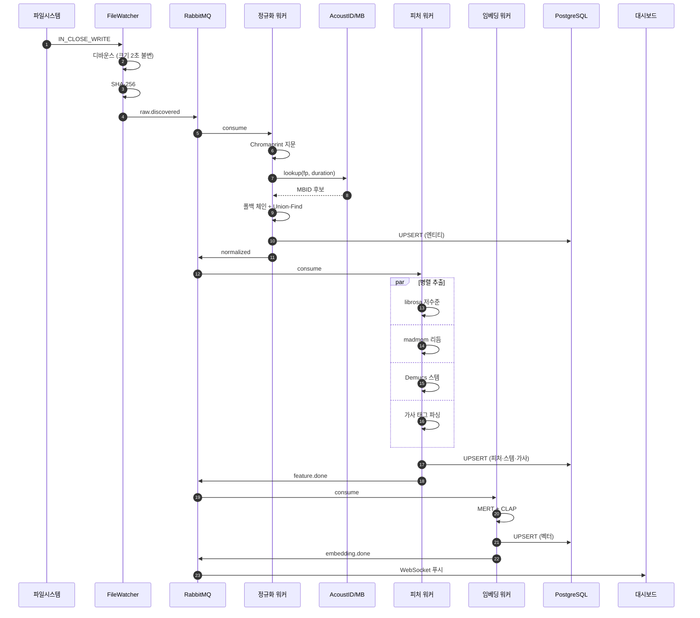
```mermaid
sequenceDiagram
    autonumber
    participant FS as 파일시스템
    participant W as FileWatcher
    participant MQ as RabbitMQ
    participant NW as 정규화 워커
    participant EX as AcoustID/MB
    participant FW as 피처 워커
    participant EW as 임베딩 워커
    participant DB as PostgreSQL
    participant UI as 대시보드

    FS->>W: IN_CLOSE_WRITE
    W->>W: 디바운스 (크기 2초 불변)
    W->>W: SHA-256
    W->>MQ: raw.discovered
    MQ->>NW: consume
    NW->>NW: Chromaprint 지문
    NW->>EX: lookup(fp, duration)
    EX-->>NW: MBID 후보
    NW->>NW: 폴백 체인 + Union-Find
    NW->>DB: UPSERT (엔티티)
    NW->>MQ: normalized
    MQ->>FW: consume
    par 병렬 추출
        FW->>FW: librosa 저수준
    and
        FW->>FW: madmom 리듬
    and
        FW->>FW: Demucs 스템
    and
        FW->>FW: 가사 태그 파싱
    end
    FW->>DB: UPSERT (피처·스템·가사)
    FW->>MQ: feature.done
    MQ->>EW: consume
    EW->>EW: MERT + CLAP
    EW->>DB: UPSERT (벡터)
    EW->>MQ: embedding.done
    MQ->>UI: WebSocket 푸시
```

### 2.2.2 멱등성 보장

멱등성은 **NFR-R1의 핵심**이며 세 겹으로 보장한다.

| 층 | 기법 | 효과 |
|---|---|---|
| 1 | 블룸 필터 (`bloom:ingested`) | 확실히 미처리인 것만 통과. FN 없음 |
| 2 | 분산 락 (`SET NX lock:ingest:{hash}`, TTL 300s) | 동시 처리 방지 |
| 3 | DB `INSERT … ON CONFLICT (content_hash) DO UPDATE` | 최종 방어선 |

**추가 규칙**
- 모든 메시지에 `idempotencyKey = content_hash` 포함
- 워커는 처리 완료 후 ack. 중간 실패 시 재전달되어도 결과 동일
- 손상 파일은 `CORRUPTED` 기록 후 **ack 처리** (무한 재시도 루프 방지)

### 2.2.3 가사 처리 — 태그 우선 전략

사용자 라이브러리는 **가사 태그를 전량 보유**하므로 전사(STT)가 아니라 **정렬** 문제로 축소된다.

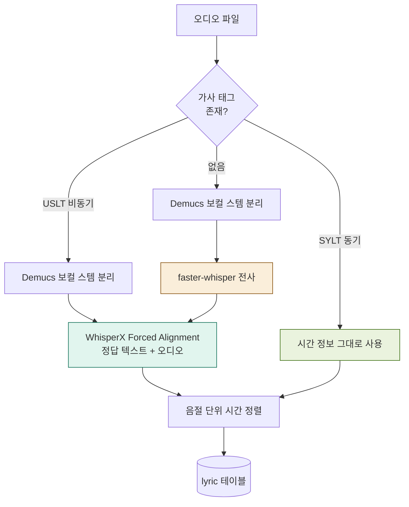
```mermaid
flowchart TD
    A["오디오 파일"] --> B{"가사 태그<br/>존재?"}
    B -->|SYLT 동기| C["시간 정보 그대로 사용"]
    B -->|USLT 비동기| D["Demucs 보컬 스템 분리"]
    B -->|없음| E["Demucs 보컬 스템 분리"]
    D --> F["WhisperX Forced Alignment<br/>정답 텍스트 + 오디오"]
    E --> G["faster-whisper 전사"]
    G --> F
    F --> H["음절 단위 시간 정렬"]
    C --> H
    H --> I[("lyric 테이블")]

    style C fill:#EAF3DE,stroke:#3B6D11
    style F fill:#E1F5EE,stroke:#0F6E56
    style G fill:#FAEEDA,stroke:#854F0B
```

| 경로 | 정확도 | 비고 |
|---|---|---|
| SYLT | 최상 | 그대로 사용 |
| **USLT + Forced Alignment** | **매우 높음** | **정답 텍스트 보유 = 전사 불필요.** 본 프로젝트 주 경로 |
| 전사 (원곡 그대로) | 낮음 (WER 40%+) | 반주 간섭. 사용 금지 |
| 전사 (보컬 스템) | 중간 (WER 20~30%) | 태그 없을 때만 |

**핵심**: Demucs 스템 분리는 편성 통계용으로 어차피 수행하므로, 가사 정렬 품질 향상이 **부수 효과로 공짜**다.

### 2.2.4 증분 집계

`REFRESH MATERIALIZED VIEW`는 전체 재계산이라 규모에 비례해 느려진다. **트리거 기반 증분 집계 테이블**을 쓴다.

```sql
CREATE TABLE agg_bpm_histogram (
    bucket      SMALLINT PRIMARY KEY,
    track_count INTEGER NOT NULL DEFAULT 0,
    updated_at  TIMESTAMPTZ NOT NULL DEFAULT now()
);

CREATE OR REPLACE FUNCTION fn_agg_bpm() RETURNS TRIGGER AS $$
DECLARE old_b SMALLINT; new_b SMALLINT;
BEGIN
    old_b := CASE WHEN TG_OP='UPDATE' AND OLD.bpm IS NOT NULL
                  THEN (OLD.bpm/10)::SMALLINT END;
    new_b := CASE WHEN NEW.bpm IS NOT NULL
                  THEN (NEW.bpm/10)::SMALLINT END;
    IF old_b IS DISTINCT FROM new_b THEN
        IF old_b IS NOT NULL THEN
            UPDATE agg_bpm_histogram
               SET track_count = track_count - 1, updated_at = now()
             WHERE bucket = old_b;
        END IF;
        IF new_b IS NOT NULL THEN
            INSERT INTO agg_bpm_histogram(bucket, track_count)
            VALUES (new_b, 1)
            ON CONFLICT (bucket) DO UPDATE
               SET track_count = agg_bpm_histogram.track_count + 1,
                   updated_at = now();
        END IF;
        PERFORM pg_notify('dashboard_dirty', 'bpm_histogram');
    END IF;
    RETURN NEW;
END; $$ LANGUAGE plpgsql;

CREATE TRIGGER trg_agg_bpm
AFTER INSERT OR UPDATE OF bpm ON feature_set
FOR EACH ROW EXECUTE FUNCTION fn_agg_bpm();
```

| 위젯 | 갱신 방식 | 캐시 |
|---|---|---|
| BPM 히스토그램 / 조성 분포 / 연도별 / 아티스트 Top20 / 라우드니스 추이 | 트리거 증분 | 60s |
| 스템 편성 비율 / 코드 진행 빈도 | 워커 증분 | 300s |
| **UMAP 산점도 / 군집 요약** | **배치 재계산** (신규 50곡마다) | 1h |

UMAP은 전역 알고리즘이라 증분이 불가하다. 신규 곡은 `transform()`으로 기존 공간에 투영해 즉시 표시하고, 50곡 누적 시 `fit_transform()` 재계산한다.

## 2.3 취향 — 개인 취향 잠재 표현

### 2.3.1 이중 트랙 구조

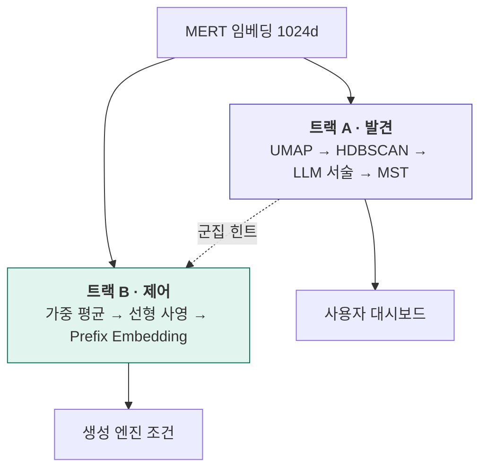
```mermaid
flowchart TB
    E["MERT 임베딩 1024d"]
    E --> A["<b>트랙 A · 발견</b><br/>UMAP → HDBSCAN → LLM 서술 → MST"]
    E --> B["<b>트랙 B · 제어</b><br/>가중 평균 → 선형 사영 → Prefix Embedding"]
    A --> U["사용자 대시보드"]
    A -.군집 힌트.-> B
    B --> G["생성 엔진 조건"]

    style A fill:#EEEDFE,stroke:#534AB7
    style B fill:#E1F5EE,stroke:#0F6E56
```

**FR-403 준수 원칙** — 두 트랙 어디에서도 사전 정의된 장르·무드 라벨로 축소하지 않는다. 축은 데이터가 만들고, 이름은 사후에 LLM이 붙인다. 사용자가 "내가 이런 취향이었나"를 발견할 여지가 여기서 나온다.

### 2.3.2 취향 벡터 산출

```
v_taste = Σᵢ wᵢ·êᵢ / ‖Σᵢ wᵢ·êᵢ‖₂

wᵢ = log(1 + play_countᵢ)
   × (1 − skip_rateᵢ)
   × exp(−days_since_lastᵢ / 180)          반감기 약 125일
   × (1 + min(repeatsᵢ/5, 1.0))
   × source_weightᵢ                         사용자 곡 1.0, 외부 참조 0.3
```

- `êᵢ`는 L2 정규화된 MERT 임베딩
- 상호작용 로그가 없는 초기에는 `wᵢ = source_weightᵢ`만 적용
- 군집 힌트가 주어지면 소속 확률로 추가 가중

### 2.3.3 조건 주입 — 축을 만들지 않는 방법

```python
import torch
import torch.nn as nn

class TasteConditioner(nn.Module):
    """취향 벡터를 해석 가능한 축으로 변환하지 않고
    모델의 임베딩 공간으로 직접 사영한다. (FR-407)"""

    def __init__(self, taste_dim=1024, model_dim=512, n_prefix=8):
        super().__init__()
        self.proj = nn.Sequential(
            nn.Linear(taste_dim, model_dim * 2),
            nn.GELU(),
            nn.Linear(model_dim * 2, model_dim * n_prefix),
        )
        self.n_prefix, self.model_dim = n_prefix, model_dim

    def forward(self, taste_vec, token_embeds):
        prefix = self.proj(taste_vec).view(-1, self.n_prefix, self.model_dim)
        return torch.cat([prefix, token_embeds], dim=1)
```

BPM·키 같은 해석 가능한 축은 **사용자가 명시적으로 지정했을 때만** control token으로 추가 주입한다. 지정하지 않으면 모델이 자유롭게 결정한다.

### 2.3.4 피처 6계층 47속성

| 계층 | 속성 | 정규화 규칙 |
|---|---|---|
| **L1 식별 (7)** | ISRC / recording MBID / release-group MBID / artist MBID / AcoustID / 콘텐츠 해시 / 지문 해시 | ISRC 12자 대문자, MBID는 UUID |
| **L2 서지 (11)** | 제목(원/정규/검색키) / 버전태그 / 아티스트(원/정규ID/참여) / 앨범(RG/Release) / 트랙·디스크 번호 / 발매일 / 레이블 | NFC 정규화, 괄호주석 분리, 자모+로마자 병기 |
| **L3 파일 (6)** | 포맷·코덱 / 비트레이트 / 샘플레이트 / 채널 / 길이 / 무손실여부 | — |
| **L4 음악 (10)** | BPM(배속보정) / 다운비트 / 박자표 / 키·모드·신뢰도 / 코드진행 / LUFS / 트루피크 / 다이내믹레인지 | Viterbi 코드 추정, ½·2배 검사 |
| **L5 의미 (8)** | 장르확률 / 무드확률 / 악기확률 / 스템에너지비 / 스템활성구간 / 보컬유무·비율 / 가사 / 가사언어 | **argmax 라벨 금지. 확률 분포 그대로** |
| **L6 잠재 (5)** | MERT 1024d / CLAP-audio 512d / CLAP-text 512d / 군집ID·확률 / UMAP 2D | L2 정규화 |

## 2.4 코퍼스 — 파운데이션 지식 구축과 증강

§0.5의 3계층 지식 구조를 구현하는 서브시스템이다. **두 개의 독립적 파이프라인**으로 구성된다.

| 파이프라인 | 목적 | 실행 | 대상 |
|---|---|---|---|
| **A. 상시 구축** | 범용 음악 지식 확장 | 주기 배치 (사용자 무관) | 공개 코퍼스 전체 |
| **B. 표적 보강** | 개인 취향 사각지대 보완 | 이벤트 (커버율 저하 시) | 특정 군집 근방 |

A가 광역이고 B가 표적이다. 둘 다 필요하며 역할이 다르다.

### 2.4.1 파이프라인 A — 상시 코퍼스 구축

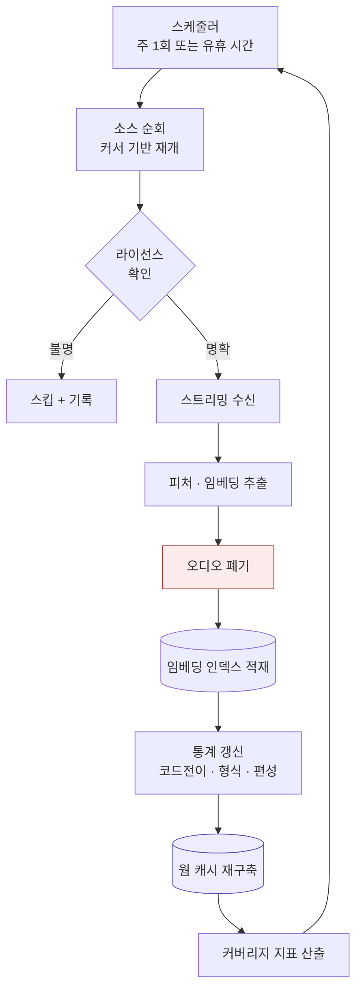
```mermaid
flowchart TD
    S["스케줄러<br/>주 1회 또는 유휴 시간"] --> P["소스 순회<br/>커서 기반 재개"]
    P --> L{"라이선스<br/>확인"}
    L -->|불명| SK["스킵 + 기록"]
    L -->|명확| ST["스트리밍 수신"]
    ST --> F["피처 · 임베딩 추출"]
    F --> DEL["오디오 폐기"]
    DEL --> IDX[("임베딩 인덱스 적재")]
    IDX --> AGG["통계 갱신<br/>코드전이 · 형식 · 편성"]
    AGG --> CACHE[("웜 캐시 재구축")]
    CACHE --> COV["커버리지 지표 산출"]
    COV --> S

    style CACHE fill:#EEEDFE,stroke:#534AB7
    style DEL fill:#FCEBEB,stroke:#A32D2D
```

**진행 관리** — 코퍼스 순회는 중단·재개가 가능해야 한다. 소스별 커서를 `corpus_cursor` 테이블에 저장하고, 배치가 중단돼도 다음 실행에서 이어받는다.

```python
@task(retries=3, tags=["corpus"])
def crawl_source_batch(source: str, batch_size: int = 500) -> BatchResult:
    cursor = repo.get_cursor(source)
    items = source_client(source).list_since(cursor, limit=batch_size)

    processed, skipped = 0, 0
    for item in items:
        if not is_license_clear(item):
            repo.log_skip(source, item.uid, "license_unknown")
            skipped += 1
            continue
        assert_safe_audio_url(item.stream_url)          # SSRF 방어 (§5.5.2)
        with stream_audio(item.stream_url) as buf:      # 메모리 버퍼
            feats = extract_features(buf)
            vecs = compute_embeddings(buf)
        # 버퍼는 컨텍스트 종료 시 해제. 디스크 기록 없음
        repo.upsert_corpus_entry(source, item, feats, vecs)
        processed += 1

    repo.set_cursor(source, items.next_cursor)
    return BatchResult(processed=processed, skipped=skipped)
```

### 2.4.2 웜 캐시 — 미리 계산해 두는 것

생성 요청 시점에 통계를 재계산하면 지연이 폭증한다. 배치에서 미리 만들어 둔다.

| 캐시 | 자료구조 | 갱신 조건 | 조회 지점 |
|---|---|---|---|
| 코드 전이 행렬 | `(조성, 장르) → 희소 행렬` | 신규 1000곡 누적 | A* 사전확률 (§2.1.2) |
| 형식 통계 | `장르 → 섹션시퀀스 빈도` | 동일 | 구조 생성 (§2.5.1) |
| 편성 통계 | `(장르, 섹션) → 악기 확률` | 동일 | 편곡 결정 (§2.7.1) |
| 멜로디 사전학습 체크포인트 | 모델 가중치 | 신규 1만곡 누적 | 멜로디 생성 |
| 임베딩 ANN 인덱스 | HNSW | 실시간 증분 | 유사곡·보강 검색 |
| 음악 이론 인덱스 | HNSW + BM25 | 문서 추가 시 | RAG 근거 |

**캐시 무효화** — 통계 캐시는 버전을 갖는다. 갱신 시 새 버전을 만들고 원자적으로 포인터를 교체한다. 생성 중인 잡은 시작 시점 버전을 계속 참조하므로 중간에 조건이 바뀌지 않는다 (재현성, GR-5.4).

### 2.4.3 파이프라인 B — 표적 보강 (Active Learning)

파운데이션 코퍼스가 아무리 넓어도 **개인 취향이 그 사각지대에 있을 수 있다.** 이때만 발동한다.

```python
def cluster_deficiency(cluster, corpus_index, config) -> Deficiency:
    """군집이 코퍼스에 의해 충분히 덮이는지 4개 지표로 판정."""
    members = cluster.member_embeddings

    size_score = min(len(members) / config.min_members, 1.0)

    knn = mean_knn_distance(members, k=5)
    density_score = 1.0 - min(knn / config.max_knn_dist, 1.0)

    probs = cluster.membership_probs
    entropy = -(probs * np.log(probs + 1e-9)).sum() / np.log(len(probs))
    certainty_score = 1.0 - entropy

    # 핵심 — 코퍼스가 이 군집 영역을 덮고 있는가
    neighbors = corpus_index.search(cluster.centroid, k=50)
    coverage_score = sum(1 for n in neighbors
                         if n.similarity >= config.coverage_sim) / 50

    sufficiency = (0.2 * size_score + 0.3 * density_score
                   + 0.1 * certainty_score + 0.4 * coverage_score)

    return Deficiency(
        cluster_id=cluster.id,
        sufficiency=sufficiency,
        deficient=sufficiency < config.threshold,      # 기본 0.55
        dominant_cause=argmin_component(...),          # 무엇이 부족한지 명시
    )
```

**coverage_score에 가장 큰 가중(0.4)을 준다.** 개인 곡 수가 적어도 코퍼스가 그 영역을 잘 덮고 있으면 보강이 필요 없다. 반대로 곡이 많아도 코퍼스 사각지대면 보강해야 한다.

보강 흐름은 파이프라인 A와 동일하되, **군집 중심 벡터를 쿼리로 후보를 좁힌다**는 점만 다르다.

### 2.4.4 오디오 미보존 — 설계와 강제

파이프라인 A·B 모두 **외부 오디오를 디스크에 기록하지 않는다.**

| 층 | 강제 수단 |
|---|---|
| 코드 | 스트리밍 컨텍스트 매니저. 파일 핸들 미생성 |
| 스키마 | `external_reference.audio_retained` CHECK = false (§3.3) |
| CI | 통합 테스트에서 배치 실행 후 임시 디렉토리 오디오 파일 0개 검증 |
| 운영 | 디스크 사용량 알람 |

**용어 정리**

| 개념 | 정식 용어 |
|---|---|
| 서버가 상시 음악을 공부해 캐시 | Continuous Corpus Curation / Warm Knowledge Cache |
| 흘려보내며 처리 | Streaming Ingestion |
| 파일 미보존, 특징만 | Feature-only Retention / Transient Processing |
| 부족을 스스로 판단 | Active Learning (uncertainty + coverage sampling) |
| 가중치 지속 갱신 | Continual Learning (Incremental Learning) |
| 외부 참조 인덱스 | Embedding-only Reference Index |
| 코퍼스와 개인 분포 혼합 | Interpolated Back-off / Bayesian Smoothing |

### 2.4.5 코퍼스 소스

| 소스 | 규모 | 형태 | 라이선스 | 파이프라인 |
|---|---|---|---|---|
| **Lakh MIDI (LMD-full)** | 176,000 | MIDI | CC BY 4.0 | A — **심볼릭 통계·사전학습의 주력** |
| MetaMIDI / GiantMIDI | 대량 | MIDI | 연구 목적 | A |
| **MTG-Jamendo** | 55,000 | 오디오 풀트랙 | CC | A — 오디오 임베딩 주력 |
| Free Music Archive | 100,000+ | 오디오 풀트랙 | CC / PD | A |
| Internet Archive Audio | 대량 | 오디오 | PD / CC | A |
| **Spotify 공식 프리뷰** | 카탈로그 대부분 | 30초 | 약관 준수 (P0 검증) | A·B — 커버리지 최대 |
| Hooktheory 코드 통계 | — | 심볼릭 통계 | API 약관 확인 | A — 이론 인덱스 |
| **YouTube** | — | — | **약관 위반. 금지** | ✗ |

**심볼릭이 오디오보다 중요하다.** 화성·형식·편성 문법은 MIDI에서 훨씬 정확하게 추출된다. Lakh MIDI 176k가 실질적 학습 주력이고, 오디오 코퍼스는 임베딩 검색과 편성 통계 보조 역할이다.

**30초 프리뷰로 충분한 이유** — MERT·CLAP 임베딩은 30초 구간에서 곡 전체와 코사인 유사도 0.9 이상이다. 취향 방향 파악에는 충분하며 저작권 위험이 0이다.

### 2.4.6 RAG 3중 인덱스

| # | 인덱스 | 임베딩 | 검색 | 용도 |
|---|---|---|---|---|
| 1 | 오디오 | MERT 1024d | HNSW 코사인 | 유사곡 참조, 편성 근거, 보강 후보 |
| 2 | 텍스트 | BGE-m3 1024d | 하이브리드 (BM25+벡터, RRF) | 가사 스타일, 메타 검색 |
| 3 | 음악이론 | BGE-m3 1024d | 하이브리드 | 도메인 지식 보완 |

RRF 융합: `score(d) = Σ_r 1/(k + rank_r(d))`, k=60

**3번 인덱스 수록 내용**

| 카테고리 | 문서 예시 |
|---|---|
| 화성 문법 | 조성별 다이어토닉, 대리화음, 세컨더리 도미넌트, 모달 인터체인지 |
| 진행 관용구 | 4536, 카논, 도리안 vamp, 락 클리셰, 재즈 II-V-I |
| 편성 관례 | 장르별 표준 편성, 악기 역할 분담 |
| 형식 | 팝 송폼, 프리코러스 기능, 브릿지 배치 |
| 믹싱 | 주파수 대역 배치, 사이드체인, 스테레오 이미징 |
| 한국어 가사 | 음절 배치 관례, 각운 패턴, 어미 처리 |
| 가창 표현 | 비브라토 관례, 프레이징, 호흡 위치 |
| **시각 문법** | **장르별 앨범 커버 관례, 색채·타이포 경향** |

RAG 응답에는 **근거 문서 ID를 반드시 함께 반환**하고 트레이스에 기록한다 (FR-503, FR-1107).

### 2.4.7 Continual Learning — 망각 방지

코퍼스 확장으로 모델을 갱신할 때 기존 지식을 잃으면 안 된다.

| 기법 | 적용 |
|---|---|
| **Replay Buffer** | 기존 코퍼스 표본을 배치에 일정 비율(≥30%) 유지 |
| **EWC** | 이전 학습에서 중요했던 가중치의 변경에 페널티 |
| 낮은 학습률 | 증분 학습 단계에서 lr을 1/10로 |
| 롤백 스냅샷 | 갱신 전 체크포인트 보존. 지표 악화 시 즉시 복원 |
| 홀드아웃 검증 | 고정 검증셋으로 갱신 전후 비교. 악화 시 자동 롤백 |

**개인 레이어는 별도다.** 사용자 취향은 모델 가중치를 바꾸지 않고 조건 벡터·LoRA 어댑터로만 개입하므로 코퍼스 갱신과 충돌하지 않는다. 이 분리가 §0.5 3계층 구조의 실질적 이득이다.

## 2.5 작곡 — 계층 생성

### 2.5.1 계층 생성

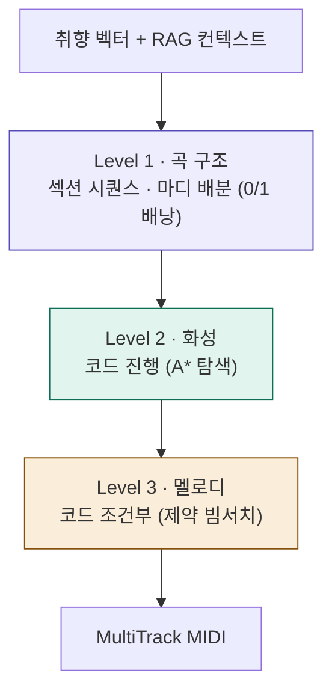
```mermaid
flowchart TD
    I["취향 벡터 + RAG 컨텍스트"] --> L1["Level 1 · 곡 구조<br/>섹션 시퀀스 · 마디 배분 (0/1 배낭)"]
    L1 --> L2["Level 2 · 화성<br/>코드 진행 (A* 탐색)"]
    L2 --> L3["Level 3 · 멜로디<br/>코드 조건부 (제약 빔서치)"]
    L3 --> O["MultiTrack MIDI"]

    style L1 fill:#EEEDFE,stroke:#534AB7
    style L2 fill:#E1F5EE,stroke:#0F6E56
    style L3 fill:#FAEEDA,stroke:#854F0B
```

한 번에 96마디를 자기회귀 생성하면 8마디쯤부터 구조가 붕괴한다. 계층으로 내려가면 각 레벨이 상위 제약 안에서만 움직이므로 장기 일관성이 유지된다.

### 2.5.2 토큰화 및 모델

| 항목 | 선택 | 사유 |
|---|---|---|
| 인코딩 | **REMI** (miditok) | 마디·박 위치가 명시적 |
| 어휘 | Pitch(88)+Velocity(32)+Duration(64)+Position(16)+Bar+Chord+Tempo ≈ 250 | — |
| 조건 | `<taste_prefix>` × 8 (연속 임베딩) | §2.3.3 |
| 최대 길이 | 2048 토큰 (약 32마디) | 섹션 단위 생성 후 접합 |

| 단계 | 1차 | 폴백 |
|---|---|---|
| 구조 | 룰 + 취향 통계 샘플링 | — |
| 화성 | A* 탐색 | 마르코프 체인 |
| 멜로디 | GPT-2 small급 REMI 파인튜닝 | 규칙 기반 아르페지오 + 경과음 |

### 2.5.3 멜로디 제약

| 제약 | 유형 | 값 |
|---|---|---|
| 음역 | 하드 | 화자 프로파일 음역 내 |
| 비화성음 비율 | 소프트 | 10~25% (너무 낮으면 지루) |
| 도약 후 순차진행 | 소프트 | 5도 이상 도약 후 반대 방향 순차 |
| 최대 도약 | 하드 | 옥타브 |
| 프레이즈 길이 | 소프트 | 2~4마디, 호흡 위치 확보 |
| 반복 모티프 | 소프트 | 섹션 내 최소 1회 변형 반복 |

## 2.6 작사 — 제약 기반 생성

### 2.6.1 생성-검증-수리 루프

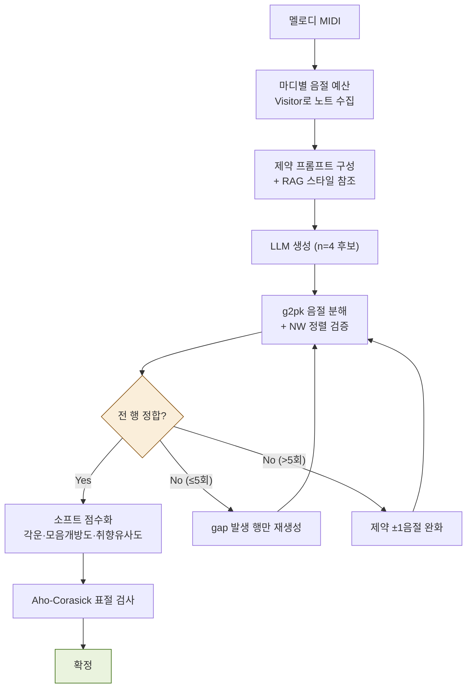
```mermaid
flowchart TD
    M["멜로디 MIDI"] --> B["마디별 음절 예산<br/>Visitor로 노트 수집"]
    B --> P["제약 프롬프트 구성<br/>+ RAG 스타일 참조"]
    P --> G["LLM 생성 (n=4 후보)"]
    G --> V["g2pk 음절 분해<br/>+ NW 정렬 검증"]
    V --> D{"전 행 정합?"}
    D -->|Yes| S["소프트 점수화<br/>각운·모음개방도·취향유사도"]
    S --> PL["Aho-Corasick 표절 검사"]
    PL --> OK["확정"]
    D -->|"No (≤5회)"| R["gap 발생 행만 재생성"]
    R --> V
    D -->|"No (>5회)"| RX["제약 ±1음절 완화"]
    RX --> V

    style OK fill:#EAF3DE,stroke:#3B6D11
    style D fill:#FAEEDA,stroke:#854F0B
```

### 2.6.2 constrained decoding을 쓰지 않는 이유

| 방식 | 문제 |
|---|---|
| Logits processor로 음절 강제 | 한국어 서브워드 토크나이저가 음절 경계와 불일치. "안녕하세요"가 `안/녕하/세요`로 쪼개지면 음절 카운터를 토큰 단위로 만들 수 없다 |
| 문자 단위 모델 | 한국어 문법·의미 일관성 급락 |
| **생성 → 검증 → 국소 수리 (채택)** | 토크나이저 무관. NW 정렬로 실패 위치를 정확히 특정. 디버깅 용이 |

### 2.6.3 모델 선택

| 용도 | 1차 | 폴백 |
|---|---|---|
| 작사 | 무료 티어 상용 API (품질 우선) | 로컬 한국어 LLM + QLoRA |
| 대화·의도 파악 | 로컬 7~8B 4bit | — |
| 군집 서술 | 로컬 | — |
| **임베딩** | **BGE-m3 (LLM 아님)** | — |

**중요** — 벡터라이징은 LLM이 아니라 전용 임베딩 모델이 한다. 작고 빠르며 로컬에서 항상 돌아간다. 작사만 품질 타협이 어려우므로 상용 API를 쓰되, 예산 0원을 유지하기 위해 무료 티어를 사용한다.

### 2.6.4 평가 지표

| 지표 | 목표 |
|---|---|
| 음절 정합률 | ≥ 97% |
| 평균 수리 반복 | ≤ 2회 |
| distinct-2 | ≥ 0.75 |
| 4-gram 중복률 (라이브러리 대비) | ≤ 3% |
| 각운 일치율 | ≥ 30% |
| CLAP 텍스트 유사도 (취향) | ≥ 0.55 |

## 2.7 편곡 — 데이터 주도 편성과 믹싱

### 2.7.1 데이터 주도 편성

도메인 지식 부족을 **라이브러리 통계로 대체**한다.

```
라이브러리 → Demucs 4스템 → 스템별 통계(에너지비·활성구간·대역분포)
          → 군집별 집계 → P(악기 | 군집, 섹션) → 편성 샘플링
                                    ↑
                          RAG 이론 인덱스(장르 관례)
```

### 2.7.2 파트 생성 규칙

| 파트 | 방식 | 조건 |
|---|---|---|
| 베이스 | 코드 근음 + 리듬 패턴 뱅크 | 군집별 슬랩/워킹/서스테인 비율 |
| 드럼 | 패턴 뱅크 샘플링 + 필인 | BPM 구간별. 섹션 전환 2마디 전 필인 |
| 패드·키보드 | 4성부 보이싱 (클로즈/오픈) | 성부진행 최소 이동 |
| 아르페지오 | 코드톤 순환 + 리듬 그리드 | 섹션 에너지로 밀도 조절 |
| 카운터 멜로디 | 주멜로디 휴지 구간 배치 | 구간 트리로 겹침 회피 |

**편곡에 딥러닝을 넣지 않는다.** 룰 + 패턴 뱅크로 충분히 그럴듯한 수준에 도달하며, 그 시간을 가창 품질에 쓰는 편이 결과물 체감 품질에 훨씬 크게 기여한다.

### 2.7.3 이펙트 체인 — Decorator 패턴

```python
from pedalboard import (Pedalboard, HighpassFilter, LowShelfFilter,
                        PeakFilter, Compressor, Reverb, Limiter, Chorus)

PART_CHAIN = {
    "vocals": Pedalboard([
        HighpassFilter(cutoff_frequency_hz=90),
        Compressor(threshold_db=-18, ratio=3.5, attack_ms=5, release_ms=120),
        PeakFilter(cutoff_frequency_hz=3000, gain_db=2.0, q=0.8),   # 명료도
        Reverb(room_size=0.28, wet_level=0.14, dry_level=0.86),
    ]),
    "bass": Pedalboard([
        HighpassFilter(cutoff_frequency_hz=35),
        Compressor(threshold_db=-14, ratio=4.0, attack_ms=12, release_ms=90),
    ]),
    "drums": Pedalboard([
        Compressor(threshold_db=-12, ratio=3.0, attack_ms=3, release_ms=60),
    ]),
    "pad": Pedalboard([
        HighpassFilter(cutoff_frequency_hz=140),   # 베이스 공간 확보
        Chorus(rate_hz=0.6, depth=0.2, mix=0.25),
        Reverb(room_size=0.55, wet_level=0.25),
    ]),
}

MASTER_CHAIN = Pedalboard([
    Compressor(threshold_db=-8, ratio=2.0, attack_ms=20, release_ms=200),
    Limiter(threshold_db=-1.0, release_ms=100),
])
```

마스터링은 `pyloudnorm`으로 **-14 LUFS ±0.5**, 트루피크 **-1.0 dBTP** 이하.

## 2.8 가창 — SVS·SVC 2단 합성

### 2.8.1 2단 파이프라인

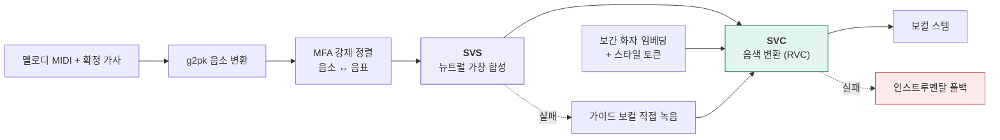
```mermaid
flowchart LR
    A["멜로디 MIDI + 확정 가사"] --> B["g2pk 음소 변환"]
    B --> C["MFA 강제 정렬<br/>음소 ↔ 음표"]
    C --> D["<b>SVS</b><br/>뉴트럴 가창 합성"]
    D --> E["<b>SVC</b><br/>음색 변환 (RVC)"]
    V["보간 화자 임베딩<br/>+ 스타일 토큰"] --> E
    E --> F["보컬 스템"]
    D -.실패.-> G["가이드 보컬 직접 녹음"]
    G --> E
    E -.실패.-> H["인스트루멘탈 폴백"]

    style D fill:#EEEDFE,stroke:#534AB7
    style E fill:#E1F5EE,stroke:#0F6E56
    style H fill:#FCEBEB,stroke:#A32D2D
```

**분리 이유** — SVS와 SVC는 난이도·데이터 요구량이 완전히 다르다. 한 모델로 묶으면 한쪽 실패가 전체를 죽인다.

| 단계 | 난이도 | 데이터 | 실패 시 |
|---|---|---|---|
| SVS (악보+가사 → 노래) | 높음 (한국어 음소 정렬) | 정렬 가창 DB 수 시간 | 가이드 보컬 직접 녹음 |
| SVC (음색 변환) | 낮음 | 화자당 10~30분 | 인스트루멘탈 폴백 |

### 2.8.2 음정 — 오토튠 없이 정확하되 기계적이지 않게

**오해 정정**: SVS는 MIDI 피치를 조건으로 받아 F0를 직접 생성한다. 오토튠은 사람 가창의 사후 보정인데, SVS는 **목표 F0가 사전에 주어진다.** 음정이 틀릴 구조적 여지가 없다.

**진짜 문제는 반대다 — 너무 정확해서 기계처럼 들린다.**

| 항목 | 목표 | 파라미터 |
|---|---|---|
| 노트 중심 F0 정확도 | RMSE ≤ 20 cent | — |
| 어택 스쿱 | 목표음 아래에서 진입 | depth 0~50 cent, 속도 |
| 비브라토 | rate 4.5~6.5Hz, depth 30~80 cent | 불규칙성 계수 |
| 프레이즈 릴리즈 | −10~30 cent 하강 | 하강량, 시작 시점 |
| 노트 전이 | 포르타멘토 정도 | 0(계단) ~ 1(슬라이드) |

`expressiveness` 슬라이더 하나로 위 미세 변동량을 일괄 조절한다 (FR-904).

### 2.8.3 발음 정밀도 제어

가수마다 발음이 다르다. 이를 3개 연속 파라미터로 모델링한다 (FR-905).

| 파라미터 | 뭉갬 (0.0) | 또렷 (1.0) |
|---|---|---|
| 자음 지속시간 배율 | 0.6× | 1.4× |
| 종성 강도 | 0.3 | 1.0 |
| 모음 중화도 | 슈와(ə)에 근접 | 원 모음 유지 |

`articulation` 단일 슬라이더로 3개를 연동 제어하되, 고급 모드에서 개별 조정 가능.

### 2.8.4 음색 임베딩 보간

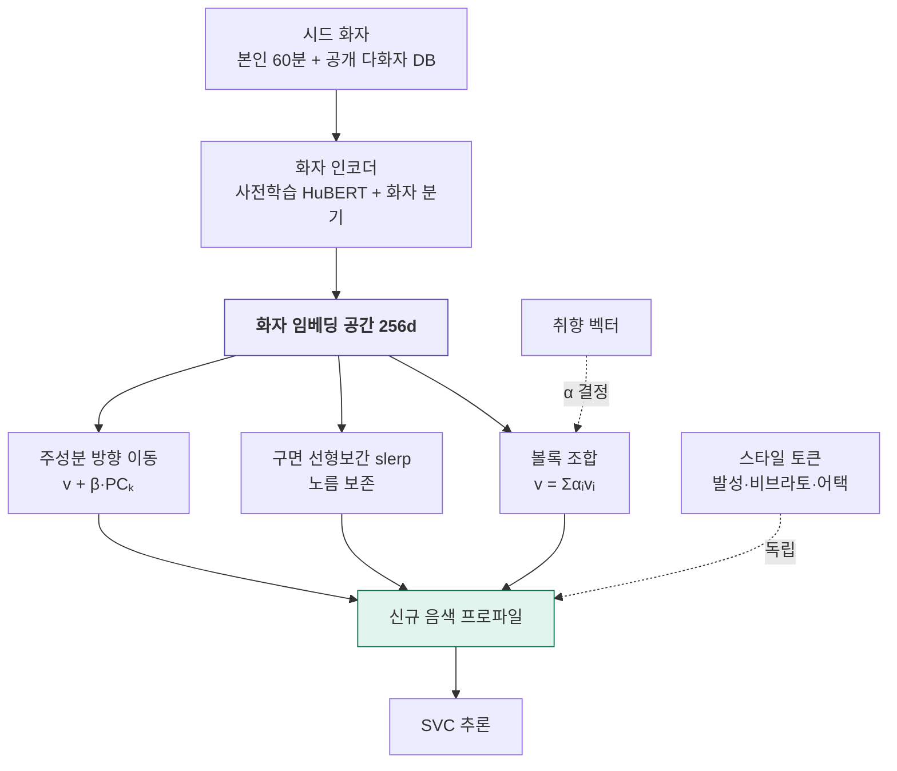
```mermaid
flowchart TB
    S["시드 화자<br/>본인 60분 + 공개 다화자 DB"] --> E["화자 인코더<br/>사전학습 HuBERT + 화자 분기"]
    E --> SP["<b>화자 임베딩 공간 256d</b>"]
    SP --> I1["볼록 조합<br/>v = Σαᵢvᵢ"]
    SP --> I2["구면 선형보간 slerp<br/>노름 보존"]
    SP --> I3["주성분 방향 이동<br/>v + β·PCₖ"]
    I1 & I2 & I3 --> N["신규 음색 프로파일"]
    T["스타일 토큰<br/>발성·비브라토·어택"] -.독립.-> N
    TV["취향 벡터"] -.α 결정.-> I1
    N --> SVC["SVC 추론"]

    style SP fill:#EEEDFE,stroke:#534AB7
    style N fill:#E1F5EE,stroke:#0F6E56
```

**취향이 음색을 결정하는 경로**

```
1. 라이브러리 보컬 스템 → 화자 인코더로 임베딩 추출
2. 취향 가중으로 "선호 음색 중심" 계산
3. 시드 화자 임베딩들 중 그 중심에 가까운 것들의 조합 계수 α 산출
4. slerp 보간 → 신규 화자 임베딩
5. 이 임베딩으로 SVC 추론
```

3단계 결과는 **원곡 가수의 임베딩이 아니라 시드 화자들의 조합 계수**다. 원곡 가수 음색은 "목표 방향"으로만 쓰이고 복제되지 않는다. 결과물은 시드 화자들의 혼합이며 어느 실존 인물과도 일치하지 않는다 (FR-907).

### 2.8.5 한국어 처리

| 처리 | 도구 |
|---|---|
| 자소 → 음소 (연음·경음화·비음화) | `g2pk` |
| 음소 → 시간 정렬 | Montreal Forced Aligner 한국어 모델 |
| 음절 분해 (초·중·종성) | `jamo` |
| 모음 개방도 사전 | 자체 (ㅏㅐㅗ 개방 / ㅣㅡ 폐쇄) |

## 2.9 악보 — 조판과 내보내기

MIDI 우선 설계(§2.5)의 직접적 이득이다. 오디오 직생성이었다면 원리적으로 불가능하다.

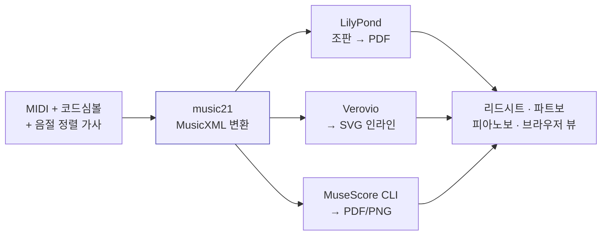
```mermaid
flowchart LR
    A["MIDI + 코드심볼<br/>+ 음절 정렬 가사"] --> B["music21<br/>MusicXML 변환"]
    B --> C1["LilyPond<br/>조판 → PDF"]
    B --> C2["Verovio<br/>→ SVG 인라인"]
    B --> C3["MuseScore CLI<br/>→ PDF/PNG"]
    C1 & C2 & C3 --> D["리드시트 · 파트보<br/>피아노보 · 브라우저 뷰"]

    style B fill:#EEEDFE,stroke:#534AB7
```

| 산출물 | 도구 | 용도 |
|---|---|---|
| **MusicXML** | music21 | 표준 교환 포맷. Sibelius·Finale·MuseScore 호환 |
| **리드시트 PDF** | LilyPond | 멜로디 + 코드심볼 + 가사. 최고 조판 품질 |
| **파트보 PDF** | LilyPond | 악기별 개별 악보 |
| **피아노 편곡보** | music21 축약 + LilyPond | 대보표 |
| **브라우저 SVG** | Verovio | 재생 위치 동기 하이라이트 |
| **MIDI** | 원본 | DAW 편집 |

**가사 배치 규칙** — 음절 단위로 음표에 정렬한다. 멜리스마(한 음절이 여러 음표)는 이음줄로, 한 음표에 여러 음절은 분할해서 표기한다. NW 정렬 결과를 그대로 사용한다.

**검증** — 생성된 MusicXML을 MuseScore CLI로 실제 열어 오류 없이 렌더되는지 CI에서 확인한다 (FR-1007).

## 2.10 아트워크 — 앨범 커버 생성

음원만 나오고 커버가 없으면 "곡"이지 "앨범"이 아니다. 결과물의 완성도를 체감하게 만드는 저비용·고효용 기능이다.

> **뮤직비디오·안무는 범위 밖이다.** 오디오 품질에 기여하지 않으면서 자원 소모가 극단적으로 크다. 커버는 단일 이미지 1장이라 비용이 수십 배 낮다.

### 2.10.1 조건 구성

커버는 **곡에서 이미 산출된 정보만으로** 조건을 만든다. 사용자에게 추가 입력을 요구하지 않는다.

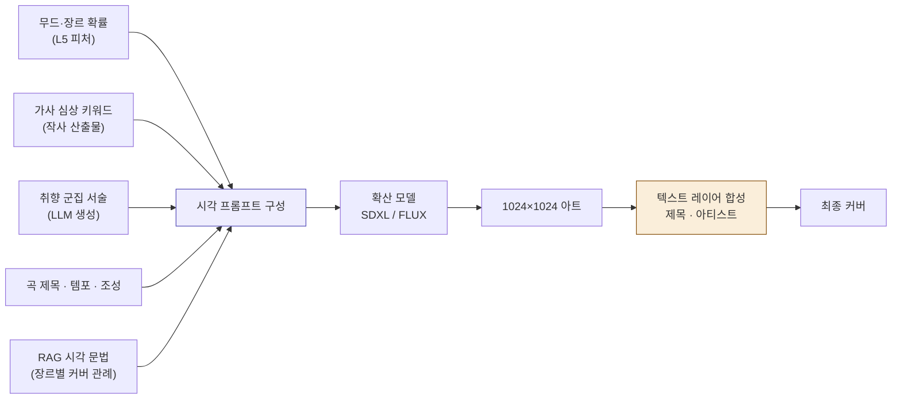
```mermaid
flowchart LR
    A["무드·장르 확률<br/>(L5 피처)"] --> P["시각 프롬프트 구성"]
    B["가사 심상 키워드<br/>(작사 산출물)"] --> P
    C["취향 군집 서술<br/>(LLM 생성)"] --> P
    D["곡 제목 · 템포 · 조성"] --> P
    E["RAG 시각 문법<br/>(장르별 커버 관례)"] --> P
    P --> M["확산 모델<br/>SDXL / FLUX"]
    M --> I["1024×1024 아트"]
    I --> T["텍스트 레이어 합성<br/>제목 · 아티스트"]
    T --> O["최종 커버"]

    style P fill:#EEEDFE,stroke:#534AB7
    style T fill:#FAEEDA,stroke:#854F0B
```

| 입력 | 출처 | 시각 요소로의 변환 |
|---|---|---|
| 무드 확률 분포 | `feature_set.mood_probs` | 색채 온도·채도·명도 |
| 장르 확률 분포 | `feature_set.genre_probs` | 구도·질감·시대적 스타일 |
| 가사 심상 키워드 | 작사 산출물에서 명사 추출 | 피사체·배경 |
| 취향 군집 서술 | 군집 LLM 서술 | 전반적 분위기 |
| 템포·조성 | 피처 | 동세(정적/동적), 밝기 |
| 장르 커버 관례 | RAG 인덱스 #3 | 레이아웃 관습 |

### 2.10.2 텍스트는 이미지 모델에 맡기지 않는다

확산 모델은 **한글 텍스트를 정확히 렌더하지 못한다.** 곡 제목을 프롬프트에 넣으면 깨진 글자가 그려진다.

```
확산 모델 → 순수 아트워크 (텍스트 없음)
           ↓
Pillow 합성 레이어 → 제목·아티스트 타이포그래피
           ↓
        최종 커버
```

타이포는 규칙 기반으로 배치한다. 폰트·크기·위치·정렬을 장르 프로파일에서 선택하고, 배경 밝기를 분석해 텍스트 색을 자동 결정한다(대비 4.5:1 이상 확보).

### 2.10.3 모델 선택과 자원

| 모델 | VRAM | 품질 | 판정 |
|---|---|---|---|
| SDXL (fp16 + attention slicing) | ~6GB | 높음 | **로컬 1660Ti 가능. 기본 경로** |
| SDXL Turbo | ~5GB | 중간, 매우 빠름 | 미리보기용 |
| FLUX schnell | 12GB+ | 매우 높음 | RunPod 배치 |

곡 생성 파이프라인의 마지막 단계에서 **비동기 병렬**로 실행한다. 커버 생성이 실패해도 음원 산출은 영향받지 않는다 (Graceful Degradation, GR-5.14).

### 2.10.4 금지 규칙

| 금지 | 이유 |
|---|---|
| 실존 인물 얼굴 생성 | 초상권 |
| 특정 아티스트 스타일 명시 프롬프트 | 저작권·퍼블리시티권 |
| 기존 앨범 커버 참조 이미지 투입 | 파생물 위험 |
| 브랜드·로고 요소 | 상표권 |

프롬프트 구성 단계에서 금지어 필터를 통과시키고, 위반 시 해당 키워드를 제거한 뒤 재생성한다.

### 2.10.5 산출물

| 파일 | 규격 | 용도 |
|---|---|---|
| `cover_master.png` | 3000×3000 | 원본 |
| `cover.jpg` | 1400×1400 | 배포 표준 |
| `cover_thumb.jpg` | 300×300 | 목록 표시 |
| `cover_art_only.png` | 3000×3000 | 텍스트 미포함 (재편집용) |
| `cover_prompt.json` | — | 재현용 프롬프트·시드 |

마지막 항목이 재현성 요건을 충족시킨다. 동일 시드·프롬프트로 같은 커버가 나와야 한다 (GR-5.4).

## 2.11 오케스트레이션 — 파이프라인 총괄

```python
class AbstractEngine(ABC):
    """Template Method: 검증-실행-계측 골격을 고정하고 실행부만 위임"""

    def run(self, ctx: GenerationContext) -> StageOutput:
        with mlflow.start_run(nested=True, run_name=self.name()):
            mlflow.log_params(self.params(ctx))
            self._validate_input(ctx)

            t0 = time.perf_counter()
            try:
                out = self._execute(ctx)                # 서브클래스 구현
            except torch.cuda.OutOfMemoryError:
                torch.cuda.empty_cache()
                raise RetryableStageError(self.stage())

            elapsed = time.perf_counter() - t0
            self._validate_output(out)

            metrics = self._compute_metrics(out) | {"elapsed_s": elapsed}
            mlflow.log_metrics(metrics)

            gate = 품질.evaluate(self.stage(), metrics)  # 품질 게이트
            if not gate.passed:
                raise QualityGateError(self.stage(), gate.violations)

            self._snapshot(ctx, out)                     # Memento
            self._emit_progress(ctx, out, metrics)
            return out
```

**부분 재생성** — 각 단계 종료 시 `StageSnapshot`을 저장한다. `POST /jobs/{id}/regenerate?stage=MELODIZING`은 해당 스냅샷을 복원한 뒤 그 단계부터 다시 실행한다. 앞 단계는 재실행하지 않는다.

## 2.12 테스트 관리 — V모델

```
요구사항 정의 ────────────────────► 인수 테스트
  시스템 설계 ──────────────────► 시스템 테스트
    아키텍처 설계 ──────────────► 통합 테스트
      상세 설계 ────────────────► 단위 테스트
                구현
```

| 테스트 | 대상 | 기법 | 도구 | 목표 |
|---|---|---|---|---|
| **단위** | 알고리즘, 파서, 변환 | 화이트박스 (분기 커버리지) | pytest | ≥ 75% |
| **속성 기반** | 정규화 멱등성, 전조 가역성 | 랜덤 입력 1000회 | hypothesis | 위반 0 |
| **통합** | 워커↔큐↔DB | 블랙박스 | testcontainers | 주요 경로 전량 |
| **계약** | REST 스키마 | OpenAPI 기반 자동 생성 | schemathesis | — |
| **성능** | C 커널, 벡터 검색 | 벤치마크 회귀 | pytest-benchmark | 회귀 감지 |
| **재현성** | 고정 시드 동일 출력 | 결정성 검증 | CI 전용 잡 | bit-exact |
| **데이터 품질** | 피처 분포 드리프트 | 기대값 검증 | Great Expectations | 일일 |
| **시스템** | 종단간 생성 | 시나리오 | pytest + 실제 스택 | 주 1회 |
| **인수** | 목표 G-1~G-10 | 지표 측정 | 수동 + 자동 | Phase 완료 조건 |

```python
from hypothesis import given, strategies as st

@given(st.integers(min_value=-24, max_value=24))
def test_transpose_is_reversible(semitones):
    """전조는 가역이어야 한다 (클리핑 미발생 음역)"""
    song = make_test_song(pitch_range=(48, 72))
    before = extract_pitches(song)
    song.accept(TransposeVisitor(semitones))
    song.accept(TransposeVisitor(-semitones))
    assert extract_pitches(song) == before

@given(st.lists(st.tuples(st.text(min_size=1), st.text(min_size=1)), min_size=1))
def test_union_find_transitivity(pairs):
    """A~B, B~C 이면 반드시 A~C"""
    uf = EntityResolver()
    for a, b in pairs:
        uf.union(a, b, "test", 1.0)
    for a, b in pairs:
        assert uf.find(a) == uf.find(b)

@given(st.floats(min_value=0.0, max_value=1.0))
def test_articulation_monotonic(level):
    """발음 정밀도가 높을수록 종성 강도가 단조 증가"""
    params = articulation_to_params(level)
    assert 0.0 <= params.coda_strength <= 1.0
    if level > 0.5:
        assert params.coda_strength > articulation_to_params(0.0).coda_strength
```
---

# PART 3. 데이터베이스 구축

> 정보처리기사 3과목 체계: 논리 DB 설계 → 물리 DB 설계 → SQL 응용 → 데이터 전환

## 3.1 데이터 모델링 3단계

| 단계 | 산출물 | 본 프로젝트 |
|---|---|---|
| **개념적 설계** | 엔티티·관계 식별, 개념 ERD | 12개 핵심 엔티티 도출 (§3.2) |
| **논리적 설계** | 정규화, 관계 스키마, 무결성 제약 | 3NF 기준, 선택적 반정규화 (§3.5) |
| **물리적 설계** | 테이블·인덱스·파티션·저장 구조 | PostgreSQL DDL, HNSW 인덱스 (§3.4) |

## 3.2 개념 ERD

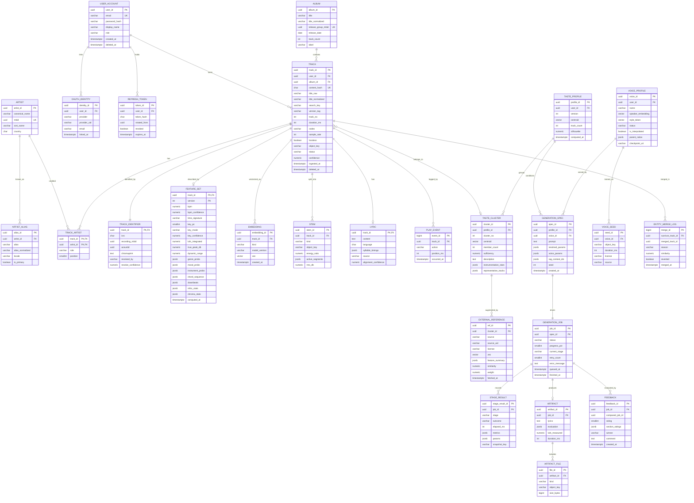
```mermaid
erDiagram
    USER_ACCOUNT ||--o{ TRACK : owns
    USER_ACCOUNT ||--o{ OAUTH_IDENTITY : links
    USER_ACCOUNT ||--o{ REFRESH_TOKEN : holds
    ARTIST ||--o{ ARTIST_ALIAS : known_as
    ARTIST ||--o{ TRACK_ARTIST : credited
    TRACK ||--o{ TRACK_ARTIST : has
    ALBUM ||--o{ TRACK : contains
    TRACK ||--|| TRACK_IDENTIFIER : identified_by
    TRACK ||--o| FEATURE_SET : described_by
    TRACK ||--o{ EMBEDDING : vectorized_as
    TRACK ||--o{ STEM : split_into
    TRACK ||--o| LYRIC : has
    TRACK ||--o{ PLAY_EVENT : logged_by
    TRACK }o--o| TASTE_CLUSTER : belongs_to
    TASTE_PROFILE ||--o{ TASTE_CLUSTER : groups
    TASTE_CLUSTER ||--o{ EXTERNAL_REFERENCE : augmented_by
    TASTE_PROFILE ||--o{ GENERATION_SPEC : conditions
    GENERATION_SPEC ||--|| GENERATION_JOB : drives
    GENERATION_JOB ||--o{ STAGE_RESULT : records
    GENERATION_JOB ||--o| ARTIFACT : produces
    GENERATION_JOB ||--o{ FEEDBACK : evaluated_by
    ARTIFACT ||--o{ ARTIFACT_FILE : includes
    VOICE_PROFILE ||--o{ GENERATION_SPEC : voiced_by
    VOICE_PROFILE ||--o{ VOICE_SEED : trained_on
    TRACK ||--o{ ENTITY_MERGE_LOG : merged_in

    USER_ACCOUNT {
        uuid user_id PK
        varchar email UK
        varchar password_hash
        varchar display_name
        varchar role
        timestamptz created_at
        timestamptz deleted_at
    }
    OAUTH_IDENTITY {
        uuid identity_id PK
        uuid user_id FK
        varchar provider
        varchar provider_uid
        varchar email
        timestamptz linked_at
    }
    REFRESH_TOKEN {
        uuid token_id PK
        uuid user_id FK
        char token_hash
        uuid rotated_from
        boolean revoked
        timestamptz expires_at
    }
    ARTIST {
        uuid artist_id PK
        varchar canonical_name
        uuid mbid UK
        varchar sort_name
        char country
    }
    ARTIST_ALIAS {
        uuid alias_id PK
        uuid artist_id FK
        varchar alias
        varchar alias_normalized
        varchar locale
        boolean is_primary
    }
    ALBUM {
        uuid album_id PK
        varchar title
        varchar title_normalized
        uuid release_group_mbid UK
        date release_date
        int track_count
        varchar label
    }
    TRACK {
        uuid track_id PK
        uuid user_id FK
        uuid album_id FK
        char content_hash UK
        varchar title_raw
        varchar title_normalized
        varchar search_key
        varchar version_tag
        int track_no
        int duration_ms
        varchar codec
        int sample_rate
        boolean lossless
        varchar object_key
        varchar status
        numeric confidence
        timestamptz ingested_at
        timestamptz deleted_at
    }
    TRACK_ARTIST {
        uuid track_id PK,FK
        uuid artist_id PK,FK
        varchar role
        smallint position
    }
    TRACK_IDENTIFIER {
        uuid track_id PK,FK
        char isrc
        uuid recording_mbid
        uuid acoustid
        text chromaprint
        varchar resolved_by
        numeric resolve_confidence
    }
    FEATURE_SET {
        uuid track_id PK,FK
        int version PK
        numeric bpm
        numeric bpm_confidence
        varchar time_signature
        smallint key_pc
        varchar key_mode
        numeric key_confidence
        numeric lufs_integrated
        numeric true_peak_db
        numeric dynamic_range
        jsonb genre_probs
        jsonb mood_probs
        jsonb instrument_probs
        jsonb chord_sequence
        jsonb downbeats
        jsonb mfcc_stats
        jsonb chroma_stats
        timestamptz computed_at
    }
    STEM {
        uuid stem_id PK
        uuid track_id FK
        varchar kind
        varchar object_key
        numeric energy_ratio
        jsonb active_segments
        numeric rms_db
    }
    EMBEDDING {
        uuid embedding_id PK
        uuid track_id FK
        varchar kind
        varchar model_version
        vector vec
        timestamptz created_at
    }
    LYRIC {
        uuid track_id PK,FK
        text content
        char language
        jsonb syllable_timings
        varchar source
        numeric alignment_confidence
    }
    PLAY_EVENT {
        bigint event_id PK
        uuid track_id FK
        varchar action
        int position_ms
        timestamptz occurred_at
    }
    TASTE_PROFILE {
        uuid profile_id PK
        uuid user_id FK
        int version
        vector centroid
        int track_count
        numeric silhouette
        timestamptz computed_at
    }
    TASTE_CLUSTER {
        uuid cluster_id PK
        uuid profile_id FK
        int cluster_no
        vector centroid
        int member_count
        numeric sufficiency
        text description
        jsonb instrumentation_stats
        jsonb representative_tracks
    }
    EXTERNAL_REFERENCE {
        uuid ref_id PK
        uuid cluster_id FK
        varchar source
        varchar source_uid
        varchar license
        vector vec
        jsonb feature_summary
        numeric similarity
        numeric weight
        timestamptz fetched_at
    }
    VOICE_PROFILE {
        uuid voice_id PK
        uuid user_id FK
        varchar name
        vector speaker_embedding
        vector style_token
        varchar status
        boolean is_interpolated
        jsonb parent_ratios
        varchar checkpoint_uri
    }
    VOICE_SEED {
        uuid seed_id PK
        uuid voice_id FK
        varchar object_key
        int duration_ms
        varchar license
        varchar source
    }
    GENERATION_SPEC {
        uuid spec_id PK
        uuid profile_id FK
        uuid voice_id FK
        text prompt
        jsonb resolved_params
        jsonb voice_params
        jsonb rag_context_ids
        int seed
        timestamptz created_at
    }
    GENERATION_JOB {
        uuid job_id PK
        uuid spec_id FK
        varchar status
        smallint progress_pct
        varchar current_stage
        smallint retry_count
        text error_message
        timestamptz queued_at
        timestamptz finished_at
    }
    STAGE_RESULT {
        uuid stage_result_id PK
        uuid job_id FK
        varchar stage
        varchar outcome
        int elapsed_ms
        jsonb metrics
        jsonb params
        varchar snapshot_key
    }
    ARTIFACT {
        uuid artifact_id PK
        uuid job_id FK
        text lyrics
        jsonb evaluation
        numeric lufs_measured
        int duration_ms
    }
    ARTIFACT_FILE {
        uuid file_id PK
        uuid artifact_id FK
        varchar kind
        varchar object_key
        bigint size_bytes
    }
    FEEDBACK {
        uuid feedback_id PK
        uuid job_id FK
        uuid compared_job_id
        smallint rating
        jsonb section_ratings
        varchar winner
        text comment
        timestamptz created_at
    }
    ENTITY_MERGE_LOG {
        bigint merge_id PK
        uuid survivor_track_id FK
        uuid merged_track_id
        varchar reason
        numeric similarity
        boolean reverted
        timestamptz merged_at
    }
```

## 3.3 데이터 사전

### TRACK

| No | 컬럼 | 논리명 | 타입 | 길이 | NULL | KEY | 기본값 | 비고 |
|---|---|---|---|---|---|---|---|---|
| 1 | track_id | 트랙 식별자 | UUID | — | N | PK | gen_random_uuid() | 대리키 |
| 2 | user_id | 소유자 | UUID | — | N | FK | — | 다중 사용자 대비 |
| 3 | album_id | 앨범 | UUID | — | Y | FK | NULL | — |
| 4 | content_hash | 콘텐츠 해시 | CHAR | 64 | N | UK | — | SHA-256. 멱등키 |
| 5 | title_raw | 원본 제목 | VARCHAR | 500 | N | — | — | 태그 원문 보존 |
| 6 | title_normalized | 정규 제목 | VARCHAR | 500 | N | IDX | — | NFC·소문자·주석제거 |
| 7 | search_key | 검색 키 | VARCHAR | 800 | N | GIN | — | 자모+로마자 병기 |
| 8 | version_tag | 버전 태그 | VARCHAR | 50 | Y | — | NULL | Live/Remaster/Inst |
| 9 | track_no | 트랙 번호 | SMALLINT | — | Y | — | NULL | — |
| 10 | disc_no | 디스크 번호 | SMALLINT | — | Y | — | 1 | — |
| 11 | duration_ms | 재생 길이 | INTEGER | — | N | — | — | 밀리초 |
| 12 | codec | 코덱 | VARCHAR | 20 | N | — | — | mp3/flac/aac/wav |
| 13 | bitrate | 비트레이트 | INTEGER | — | Y | — | NULL | kbps |
| 14 | sample_rate | 샘플레이트 | INTEGER | — | N | — | — | Hz |
| 15 | channels | 채널 수 | SMALLINT | — | N | — | 2 | — |
| 16 | lossless | 무손실 여부 | BOOLEAN | — | N | — | false | 파생 |
| 17 | object_key | 오브젝트 키 | VARCHAR | 1000 | N | — | — | R2/S3 경로 |
| 18 | status | 처리 상태 | VARCHAR | 20 | N | IDX | 'DISCOVERED' | §1.9.1 |
| 19 | confidence | 정규화 신뢰도 | NUMERIC(3,2) | — | N | — | 0.00 | 0.00~1.00 |
| 20 | ingested_at | 등록일시 | TIMESTAMPTZ | — | N | — | now() | — |
| 21 | updated_at | 갱신일시 | TIMESTAMPTZ | — | N | — | now() | 트리거 |
| 22 | deleted_at | 삭제일시 | TIMESTAMPTZ | — | Y | — | NULL | 소프트 삭제 |

### EXTERNAL_REFERENCE (외부 참조 — 오디오 미보유)

| No | 컬럼 | 논리명 | 타입 | NULL | 비고 |
|---|---|---|---|---|---|
| 1 | ref_id | 참조 식별자 | UUID | N | PK |
| 2 | cluster_id | 보완 대상 군집 | UUID | N | FK |
| 3 | source | 출처 | VARCHAR(30) | N | spotify_preview / jamendo / fma / archive |
| 4 | source_uid | 출처 내 식별자 | VARCHAR(200) | N | UK(source, source_uid) |
| 5 | **license** | **라이선스** | VARCHAR(100) | **N** | **NOT NULL 강제. 불명 데이터 차단 (FR-508)** |
| 6 | vec | MERT 임베딩 | VECTOR(1024) | N | HNSW |
| 7 | feature_summary | 피처 요약 | JSONB | Y | BPM·키·에너지 등 최소 집합 |
| 8 | similarity | 군집 중심 유사도 | NUMERIC(4,3) | N | — |
| 9 | weight | 취향 가중치 | NUMERIC(3,2) | N | 기본 0.30 (FR-509) |
| 10 | audio_retained | 오디오 보존 여부 | BOOLEAN | N | **항상 false. CHECK 제약** |
| 11 | fetched_at | 수집일시 | TIMESTAMPTZ | N | — |

```sql
ALTER TABLE external_reference
  ADD CONSTRAINT ck_no_audio_retention CHECK (audio_retained = false);
```

이 CHECK 제약이 **FR-506(오디오 폐기)을 DB 레벨에서 강제**한다. 설계 의도를 스키마에 새겨 넣는다.

### EMBEDDING

| No | 컬럼 | 타입 | NULL | KEY | 비고 |
|---|---|---|---|---|---|
| 1 | embedding_id | UUID | N | PK | — |
| 2 | track_id | UUID | N | FK, UK(1/3) | CASCADE |
| 3 | kind | VARCHAR(20) | N | UK(2/3) | MERT / CLAP_AUDIO / CLAP_TEXT |
| 4 | model_version | VARCHAR(50) | N | UK(3/3) | 예: MERT-v1-330M |
| 5 | vec | VECTOR | N | HNSW | kind별 차원 상이 → 파티션 |
| 6 | created_at | TIMESTAMPTZ | N | — | — |

### FEATURE_SET (주요 컬럼)

| 컬럼 | 타입 | 비고 |
|---|---|---|
| track_id / version | UUID / INTEGER | 복합 PK. 추출기 갱신 시 version 증가 |
| bpm / bpm_confidence | NUMERIC(6,2) / NUMERIC(3,2) | 배속 오류 보정 후 |
| key_pc / key_mode / key_confidence | SMALLINT / VARCHAR(10) / NUMERIC(3,2) | 0=C … 11=B |
| lufs_integrated / true_peak_db / dynamic_range | NUMERIC(6,2) | — |
| **genre_probs / mood_probs / instrument_probs** | **JSONB** | **라벨 아님. 확률 분포 (FR-304)** |
| chord_sequence | JSONB | `[{t, chord, conf}, …]` |
| downbeats | JSONB | float 배열 |
| mfcc_stats / chroma_stats | JSONB | 통계 요약 |

### GENERATION_JOB

| 컬럼 | 타입 | 비고 |
|---|---|---|
| job_id / spec_id | UUID | PK / FK |
| status | VARCHAR(20) | §1.9.2 enum |
| progress_pct | SMALLINT | 0~100 |
| current_stage | VARCHAR(20) | STRUCTURING … EVALUATING |
| retry_count | SMALLINT | 최대 3 |
| error_message | TEXT | — |
| queued_at / started_at / finished_at | TIMESTAMPTZ | 소요 = finished − started |

## 3.4 물리 설계 — 인덱스

```sql
-- TRACK
CREATE UNIQUE INDEX ux_track_hash   ON track(content_hash);
CREATE INDEX ix_track_status        ON track(status) WHERE deleted_at IS NULL;
CREATE INDEX ix_track_title_trgm    ON track USING gin(title_normalized gin_trgm_ops);
CREATE INDEX ix_track_searchkey     ON track USING gin(to_tsvector('simple', search_key));
CREATE INDEX ix_track_user_status   ON track(user_id, status) WHERE deleted_at IS NULL;

-- EMBEDDING (kind별 리스트 파티션 + 차원별 HNSW)
CREATE TABLE embedding (…) PARTITION BY LIST (kind);
CREATE TABLE embedding_mert  PARTITION OF embedding FOR VALUES IN ('MERT');
CREATE TABLE embedding_clap  PARTITION OF embedding FOR VALUES IN ('CLAP_AUDIO','CLAP_TEXT');

CREATE INDEX ix_emb_mert_hnsw ON embedding_mert
  USING hnsw (vec vector_cosine_ops) WITH (m = 16, ef_construction = 64);
CREATE INDEX ix_emb_clap_hnsw ON embedding_clap
  USING hnsw (vec vector_cosine_ops) WITH (m = 16, ef_construction = 64);

-- EXTERNAL_REFERENCE
CREATE UNIQUE INDEX ux_extref_source ON external_reference(source, source_uid);
CREATE INDEX ix_extref_hnsw ON external_reference
  USING hnsw (vec vector_cosine_ops) WITH (m = 16, ef_construction = 64);
CREATE INDEX ix_extref_cluster ON external_reference(cluster_id);

-- PLAY_EVENT (시계열 → 월 단위 레인지 파티션)
CREATE TABLE play_event (…) PARTITION BY RANGE (occurred_at);
CREATE INDEX ix_play_track_time ON play_event(track_id, occurred_at DESC);

-- 인증
CREATE UNIQUE INDEX ux_oauth_provider ON oauth_identity(provider, provider_uid);
CREATE INDEX ix_refresh_user ON refresh_token(user_id) WHERE revoked = false;
```

**파티션 근거**
- `embedding` — kind별 차원이 다르므로(MERT 1024, CLAP 512) 논리적으로는 한 테이블이지만 물리적으로 분리해야 HNSW 인덱스 차원 불일치를 원천 차단할 수 있다
- `play_event` — 시계열 대량 데이터. 오래된 파티션 분리 보관·삭제가 쉽다

## 3.5 정규화 및 반정규화

### 정규화 수준

| 테이블 | 정규형 | 근거 |
|---|---|---|
| USER_ACCOUNT | BCNF | 모든 결정자가 후보키 |
| ARTIST / ALBUM | 3NF | 이행 종속 제거 |
| TRACK | 3NF | — |
| TRACK_ARTIST | BCNF | 다대다 해소 교차 테이블 |
| TRACK_IDENTIFIER | BCNF | TRACK과 1:1 분리 — 식별자 컬럼이 대부분 NULL이므로 분리가 유리 |
| FEATURE_SET | 2NF (JSONB 부분) | 확률 분포는 스키마 유동적 |
| GENERATION_JOB | 3NF | — |

### 의도적 반정규화

| 테이블 | 항목 | 사유 | 일관성 보장 |
|---|---|---|---|
| TRACK | `title_normalized`, `search_key` | 검색 성능. 매 조회 시 정규화 재계산 불가 | BEFORE INSERT/UPDATE 트리거 |
| TASTE_CLUSTER | `instrumentation_stats`, `member_count` | 집계 캐시. 매번 재계산 시 대시보드 응답 불가 | 배치 재계산 시 갱신 |
| GENERATION_JOB | `progress_pct` | 실시간 조회 빈도 극대 | 워커가 단계 종료 시 갱신 |
| ARTIFACT | `evaluation` (JSONB) | STAGE_RESULT 집계 결과 캐시 | 잡 완료 시 1회 계산 |

**JSONB 사용 원칙** — (1) 모델 버전에 따라 스키마가 바뀌는 것, (2) 검색 조건으로 쓰이지 않는 것만 JSONB. 검색 조건이 되는 순간 컬럼으로 승격한다.

### 무결성 제약

| 유형 | 적용 |
|---|---|
| 개체 무결성 | 모든 테이블 PK NOT NULL |
| 참조 무결성 | FK ON DELETE CASCADE (파생 데이터) / RESTRICT (마스터) |
| 도메인 무결성 | CHECK — `confidence BETWEEN 0 AND 1`, `progress_pct BETWEEN 0 AND 100`, `rating BETWEEN 1 AND 5` |
| 사용자 정의 | `ck_no_audio_retention` (외부 오디오 미보존), `ck_weight_range` (외부 가중치 ≤ 사용자 가중치) |

## 3.6 트랜잭션 설계

| 연산 | 격리 수준 | 근거 |
|---|---|---|
| 인제스트 업서트 | READ COMMITTED + advisory lock | 동일 해시 동시 처리 방지 |
| 엔티티 병합 | REPEATABLE READ | 병합 중 클러스터 변경 방지 |
| 취향 프로파일 재계산 | READ COMMITTED, 신규 version INSERT | 기존 version 불변 → 읽기 차단 없음 |
| 잡 상태 전이 | READ COMMITTED + `SELECT FOR UPDATE` | 동시 전이 방지 |
| 피드백 저장 | READ COMMITTED | 충돌 없음 |

**ACID 보장 지점**
- **원자성** — 트랙·피처·스템·임베딩 업서트를 단일 트랜잭션으로 묶는다. 일부만 저장되는 상태를 허용하지 않는다
- **일관성** — CHECK·FK 제약으로 스키마 레벨 보장
- **격리성** — advisory lock으로 워커 간 경합 제어
- **지속성** — WAL. 일 1회 논리 백업

## 3.7 폴리글랏 저장소

### MongoDB

| 컬렉션 | 용도 | 인덱스 |
|---|---|---|
| `raw_metadata` | 인제스트 시점 원본 태그·API 응답 전문 | `trackId`, `capturedAt` |
| `generation_traces` | 단계별 프롬프트·후보·선택 근거 | `jobId+stage`, TTL 180일 |
| `chat_sessions` | 대화 이력 + RAG 검색 로그 | `sessionId`, `updatedAt` |
| `augment_traces` | **외부 보완 이력 (군집·후보·채택·기각 사유)** | `clusterId`, `fetchedAt` |

### Redis

| 키 패턴 | 자료구조 | TTL | 용도 |
|---|---|---|---|
| `job:{id}:progress` | Hash | 24h | 진행률·단계·ETA |
| `job:{id}:events` | Stream | 24h | WebSocket 재연결 리플레이 |
| `taste:{userId}:current` | String | — | 취향 벡터 캐시 |
| `emb:lru:{trackId}:{kind}` | String | 6h | 임베딩 LRU |
| `agg:widget:{name}` | String | 60s | 대시보드 집계 캐시 |
| `bloom:ingested` | Bitmap (RedisBloom) | — | 기처리 해시 필터 |
| `lock:ingest:{hash}` | String (SET NX) | 300s | 분산 락 |
| `rate:{api}:{window}` | String (INCR) | 1s~1m | 외부 API 레이트 리밋 |
| `session:{jti}` | String | 15m | JWT 블랙리스트 |

### 오브젝트 스토리지 (R2 / MinIO)

```
hathor-{env}/
├── source/{userId}/{trackId}/original.{ext}
├── stems/{trackId}/{vocals|drums|bass|other}.wav
├── artifacts/{jobId}/
│   ├── master.wav  master.mp3
│   ├── score.mid
│   ├── score.musicxml           ← 악보
│   ├── leadsheet.pdf            ← 악보
│   ├── parts/{instrument}.pdf   ← 악보
│   ├── stems/{part}.wav
│   └── spec.json                ← 재현용 전체 스펙
├── snapshots/{jobId}/{stage}.json   ← Memento (부분 재생성)
├── voice/{voiceId}/seeds/ · checkpoint/
└── models/{name}/{version}/

수명주기:
  source/     : 30일 후 저빈도 계층
  stems/      : 90일 후 아카이브
  artifacts/  : 영구 표준 계층
  snapshots/  : 30일 후 삭제
```

**외부 오디오는 어떤 경로에도 저장되지 않는다** (FR-506).

---

# PART 4. 프로그래밍 언어 활용

> 정보처리기사 4과목 체계: 서버 프로그램 구현 → 프로그래밍 언어 활용 → 응용 SW 기초 기술

## 4.1 언어별 배치와 선정 근거

| 언어 | 배치 | 선정 근거 |
|---|---|---|
| **Python 3.12** | ML 엔진 전체, 워커, FastAPI | 오디오·ML 생태계가 사실상 Python 독점 |
| **Java 21** | Spring Boot — 인증·계정·라이브러리 CRUD | 트랜잭션 중심 도메인. JPA + QueryDSL의 타입 안전성 |
| **TypeScript** | Next.js 웹, Node BFF | 프론트-백 타입 공유. 컴파일 타임 계약 검증 |
| **Dart** | Flutter 모바일 | 단일 코드베이스 iOS·Android |
| **C** | 오디오 DSP 커널 (§4.3) | 실측 병목 지점 최적화 |
| **SQL** | 스키마·집계·트리거 | 선언적 집계가 애플리케이션 루프보다 압도적으로 빠름 |
| **Lua** | (선택) REAPER 검수 스크립트 | 결과물 수동 검수 자동화 |

**왜 Python 단일로 안 가는가** — 인증·계정은 트랜잭션 무결성과 도메인 규칙이 핵심이고, JPA의 영속성 컨텍스트와 QueryDSL의 컴파일 타임 쿼리 검증이 실질적 이득을 준다. ML 서빙과 요구 특성이 달라 분리하는 것이 응집도 측면에서도 옳다.

## 4.2 기술 스택 전면

### 백엔드

| 영역 | 채택 | 비고 |
|---|---|---|
| ML API | FastAPI + Pydantic v2 + Uvicorn | 비동기, OpenAPI 자동 생성 |
| 도메인 API | Spring Boot 3 + Spring Security 6 + JPA + QueryDSL | 인증·CRUD |
| BFF·WebSocket | Node.js + Fastify + ws | 다수 동시 연결 |
| 태스크 큐 | Celery + RabbitMQ | 워커 분산 |
| 워크플로 | **Prefect 3** | DAG, 재시도, 태그 동시성 제어 |
| 캐시·락 | Redis Stack (RedisBloom, Streams) | — |
| DB 마이그레이션 | Alembic (Python) / Flyway (Java) | — |

### ML·오디오

| 영역 | 채택 |
|---|---|
| 딥러닝 | PyTorch 2.x + torchaudio |
| 전통 ML | scikit-learn, umap-learn, hdbscan, implicit |
| 오디오 분석 | librosa, Essentia, madmom, pyloudnorm, soundfile |
| 스템 분리 | Demucs v4 (htdemucs) |
| 지문 | Chromaprint (fpcalc), pyacoustid |
| 임베딩 | MERT, CLAP (LAION), BGE-m3 |
| STT·정렬 | faster-whisper, WhisperX, Montreal Forced Aligner |
| MIDI | miditok, mido, pretty_midi, music21 |
| 렌더링 | FluidSynth, sfizz, pedalboard |
| 가창 | RVC v2, so-vits-svc, DiffSinger, NNSVS |
| 악보 | music21, LilyPond, Verovio, MuseScore CLI |
| **이미지 생성** | **diffusers (SDXL), Pillow, opencv-python** |
| 한국어 | g2pk, jamo, hangul-romanize, kiwipiepy |
| 정렬 최적화 | trl (DPO), peft (LoRA), bitsandbytes |

### 프론트엔드

| 영역 | 채택 |
|---|---|
| 웹 | Next.js 15 (App Router) + React 19 + TypeScript |
| 상태 | TanStack Query + Zustand |
| 스타일 | Tailwind CSS + shadcn/ui |
| 시각화 | Recharts (통계), D3 (UMAP 산점도·MST), WaveSurfer.js (파형) |
| **악보 렌더** | **Verovio (MusicXML → SVG)** |
| 오디오 | Web Audio API + Tone.js (스템 믹서) |
| 모바일 | Flutter 3 + Riverpod + just_audio |

### 인프라·운영

| 영역 | 채택 |
|---|---|
| 컨테이너 | Docker + Compose (개발) |
| IaC | Terraform (AWS 학습 환경), OCI CLI 스크립트 (운영) |
| CI/CD | GitHub Actions + GHCR |
| 실험 관리 | **MLflow 3** (Tracking + Model Registry) |
| 데이터 버저닝 | **DVC** |
| 모니터링 | Prometheus + Grafana Cloud + `nvidia_gpu_exporter` |
| 오류 추적 | Sentry |
| 데이터 품질 | Great Expectations |
| 하이퍼파라미터 | Optuna (TPE) |
| 라벨링 | Label Studio |
| 터널 | Cloudflare Tunnel |

### 품질 도구

| 영역 | 채택 |
|---|---|
| Python 린트·포맷 | Ruff |
| Python 타입 | mypy --strict |
| 아키텍처 경계 | **import-linter** |
| Java | Checkstyle + SpotBugs |
| TS | ESLint + Prettier + tsc --noEmit |
| 테스트 | pytest, hypothesis, pytest-benchmark, testcontainers, schemathesis |
| 보안 | gitleaks, Trivy, OWASP Dependency-Check, bandit |

### 의존성 관리 정책

| 계층 | 정책 |
|---|---|
| 핵심 경로 (인제스트·API·DB) | **안정 최신 버전 고정.** lock 파일 커밋 |
| 실험 경로 (모델·연구 코드) | 최신 추종 허용. 별도 extras로 분리 |
| 보안 패치 | Dependabot 자동 PR. CI 통과 시 즉시 병합 |
| 버전 명시 | `pyproject.toml`에 하한·상한 범위 명시. `uv.lock` 커밋 |

```toml
[project]
name = "hathor"
requires-python = ">=3.12"
dependencies = [
  "fastapi>=0.115,<1.0",
  "pydantic>=2.9,<3.0",
  "sqlalchemy>=2.0,<3.0",
  "pgvector>=0.3",
  "celery>=5.4",
  "prefect>=3.0",
  "mlflow>=3.0",
]

[project.optional-dependencies]
ml    = ["torch>=2.5", "torchaudio", "transformers", "peft", "trl", "bitsandbytes"]
audio = ["librosa", "essentia-tensorflow", "madmom", "demucs", "pedalboard",
         "pyloudnorm", "pyacoustid", "mutagen"]
music = ["miditok", "mido", "pretty_midi", "music21"]
ko    = ["g2pk", "jamo", "hangul-romanize", "kiwipiepy"]
dev   = ["pytest", "pytest-cov", "pytest-benchmark", "hypothesis",
         "testcontainers", "ruff", "mypy", "import-linter"]
```

## 4.3 C 언어 — 실측 병목 최적화

억지로 끼워넣지 않는다. **벤치마크로 병목이 확인된 지점**에만 적용한다.

| 대상 | 현행 | C 최적화 | 목표 |
|---|---|---|---|
| 슬라이딩 RMS·피크 | numpy | 증분 누적 + SIMD | 3~5× |
| 크로마 지문 랜드마크 페어링 | Python 루프 | C 해시 테이블 | 10×+ |
| MIDI 노트 겹침 검사 | Python 구간 트리 | C 구현 | 5× |
| 대량 파일 해시 | hashlib 순차 | pthread + mmap | 2~3× |

```c
/* hathor/native/rms.c — 증분 슬라이딩 RMS. O(n) 유지 */
#include <math.h>
#include <stddef.h>

void sliding_rms(const float *x, size_t n, size_t win, size_t hop, float *out) {
    double acc = 0.0;
    for (size_t i = 0; i < win && i < n; ++i)
        acc += (double)x[i] * x[i];

    size_t oi = 0;
    out[oi++] = (float)sqrt(acc / (double)win);

    for (size_t s = hop; s + win <= n; s += hop) {
        for (size_t k = s - hop; k < s; ++k)
            acc -= (double)x[k] * x[k];              /* 나가는 샘플 */
        for (size_t k = s + win - hop; k < s + win; ++k)
            acc += (double)x[k] * x[k];              /* 들어오는 샘플 */
        out[oi++] = (float)sqrt(acc / (double)win);
    }
}
```

```python
import ctypes, numpy as np

_lib = ctypes.CDLL("./hathor/native/librms.so")
_lib.sliding_rms.argtypes = [
    np.ctypeslib.ndpointer(np.float32), ctypes.c_size_t,
    ctypes.c_size_t, ctypes.c_size_t,
    np.ctypeslib.ndpointer(np.float32)]

def sliding_rms(x: np.ndarray, win: int = 2048, hop: int = 512) -> np.ndarray:
    x = np.ascontiguousarray(x, dtype=np.float32)
    n_out = (len(x) - win) // hop + 1
    out = np.empty(n_out, dtype=np.float32)
    _lib.sliding_rms(x, len(x), win, hop, out)
    return out
```

**반드시 벤치마크를 함께 남긴다.** `pytest-benchmark`로 측정하고 MLflow에 기록한다. "1004곡 전처리에서 이 함수가 전체 시간의 N%를 차지했고 C 커널로 M배 단축했다"는 실측 수치가 없으면 C는 장식일 뿐이다.

## 4.4 런타임 환경

| 항목 | 개발 | 운영 |
|---|---|---|
| OS | Windows + WSL2 Ubuntu 24.04 | Ubuntu 24.04 (OCI ARM) |
| 에디터 | VS Code 단일 (Dev Containers) | — |
| 터미널 | Git Bash 단일 (Windows) | — |
| Python 환경 | `uv` (venv + lock) | 컨테이너 |
| 컨테이너 | Docker Compose | Docker Compose / systemd |
| 아키텍처 | x86_64 | **ARM64** (OCI Always Free) |

**멀티아키 빌드 필수** — 운영이 ARM이므로 `docker buildx build --platform linux/amd64,linux/arm64`로 양쪽 이미지를 만든다 (NFR-T3).

```yaml
# docker-compose.yml (개발, 요약)
services:
  postgres:    { image: pgvector/pgvector:pg17,          ports: ["5432:5432"] }
  mongo:       { image: mongo:8,                          ports: ["27017:27017"] }
  redis:       { image: redis/redis-stack:latest,         ports: ["6379:6379","8001:8001"] }
  rabbitmq:    { image: rabbitmq:4-management,            ports: ["5672:5672","15672:15672"] }
  minio:       { image: minio/minio,                      ports: ["9000:9000","9001:9001"] }
  mlflow:      { build: ./docker/mlflow,                  ports: ["5000:5000"] }
  prefect:     { image: prefecthq/prefect:3-latest,       ports: ["4200:4200"] }
  labelstudio: { image: heartexlabs/label-studio,         ports: ["8080:8080"] }
  grafana:     { image: grafana/grafana,                  ports: ["3001:3000"] }
  prometheus:  { image: prom/prometheus,                  ports: ["9090:9090"] }
```

`docker compose up -d` 한 줄로 인프라 전체가 뜬다. 이것이 도구 일원화의 실질이다.
---

# PART 5. 정보시스템 구축관리

> 정보처리기사 5과목 체계: SW 개발방법론 → 프로젝트 관리 → SW 개발보안 → 시스템 보안 → 신기술 동향

## 5.1 개발방법론

| 방법론 | 채택 여부 | 근거 |
|---|---|---|
| 폭포수 | ✗ | 요구사항이 실험 결과에 따라 변한다 |
| 프로토타입 | 부분 채택 | 각 엔진의 최소 동작 버전을 먼저 만들고 품질을 올린다 |
| 나선형 | 부분 채택 | Phase마다 리스크 평가 → 개발 → 검증 사이클 |
| **애자일 (칸반)** | **채택** | 1인 프로젝트. 스프린트 세리머니 없이 WIP 제한만 |
| XP 실천법 | 부분 채택 | TDD(핵심 알고리즘), 지속적 통합, 리팩터링 |

### 실제 운영 방식

**칸반 보드 (GitHub Projects)**

```
Backlog → Ready → In Progress (WIP ≤ 2) → Review → Done
```

- **WIP 제한 2** — 1인이므로 동시 진행을 2개로 제한. 컨텍스트 스위칭 비용이 크다
- Phase 완료 조건을 만족해야 다음 Phase 카드를 Ready로 올린다
- 실험성 작업은 별도 `Spike` 레인. 타임박스를 정하고 초과하면 중단

**TDD 적용 범위** — 전부 TDD로 하지 않는다. 입출력이 명확한 것만.

| 대상 | TDD | 근거 |
|---|---|---|
| A*, Union-Find, NW 정렬, 음절 검증 | ✅ | 입출력 명확, 회귀 위험 큼 |
| 정규화 폴백 체인 | ✅ | 분기가 많고 경계 조건이 중요 |
| API 엔드포인트 | ✅ | 계약 우선 |
| 모델 학습 코드 | ❌ | 결과가 확률적. 대신 지표 회귀 테스트 |
| 프론트엔드 | ❌ | 시각 검수 + E2E |

## 5.2 형상관리

정보처리기사 형상관리 4활동을 그대로 적용한다.

| 활동 | 도구 | 실행 |
|---|---|---|
| **형상 식별** | Git + DVC + MLflow | 코드=Git, 데이터=DVC, 모델=MLflow Registry |
| **형상 통제** | PR + CI 게이트 | main 직접 push 금지. 리뷰 없이 병합 불가 (self-approve 허용) |
| **형상 감사** | CI 검증 잡 | 아키텍처 경계, 재현성, 라이선스 감사 |
| **형상 기록** | Conventional Commits + 태그 | 커밋 히스토리가 곧 기록 |

### 브랜치 전략

> 상세 규칙은 **GR-4.2**를 따른다. 이 절은 형상관리 관점의 요약이다.

```
main ──────────────●───────────●──────────●────►
                  ╱           ╱          ╱
      feat/ingest-ingest   feat/taste-cluster   fix/lyric-align
```

| 브랜치 | 용도 | 규칙 |
|---|---|---|
| `main` | 항상 배포 가능 | 직접 push 금지. CI 전부 통과해야 병합 |
| `feat/{subsystem}-{topic}` | 기능 개발 | 서브시스템 코드명 사용 (ingest, taste, compose …) |
| `fix/{topic}` | 버그 수정 | — |
| `spike/{topic}` | 실험 | 병합하지 않고 폐기 가능. 결과만 문서에 기록 |
| `hotfix/{topic}` | 긴급 수정 | main에서 분기 → fast-forward 병합 |

**커밋 컨벤션** — GR-4.1 참조. `type(scope): subject`

```
feat(ingest): 지문 기반 정규화 폴백 체인 구현
fix(lyrics): 음절 수리 루프 무한반복 방지
perf(native): 슬라이딩 RMS C 커널로 4.2배 단축
docs(master): Active Learning 설계 절 추가
refactor(taste): 취향 벡터 계산을 도메인 서비스로 분리
test(compose): A* 휴리스틱 admissible 속성 테스트 추가
chore(deps): torch 2.5.1로 갱신
```

### 버전 관리

| 대상 | 방식 |
|---|---|
| 애플리케이션 | SemVer + Git 태그 (`v0.3.0`) |
| 컨테이너 이미지 | `{git-sha-7}` + `latest` |
| 모델 | MLflow Model Registry 버전 + 별칭 (`champion` / `challenger`) |
| 데이터셋 | DVC 해시 + Git 태그 연동 |
| 피처 스키마 | `feature_set.version` 정수 증가 |

## 5.3 CI/CD

인공지능사관학교 실습 커리큘럼(ch02-1 ~ ch04-1)의 구조를 그대로 이식한다.

### 5.3.1 파이프라인 전경

```mermaid
flowchart LR
    PR["Pull Request"] --> Q["품질 게이트<br/>lint · type · test · secret"]
    Q --> A["아키텍처 감사<br/>import-linter"]
    A --> R["재현성 검증<br/>고정 시드 동일 출력"]
    R --> M["모델 검증<br/>품질 임계값"]
    M --> G{"전부 통과?"}
    G -->|No| PR
    G -->|Yes| MG["main 병합"]
    MG --> B["멀티아키 빌드<br/>amd64 + arm64"]
    B --> S["Trivy 스캔"]
    S --> P["GHCR 푸시"]
    P --> D["배포<br/>OCI · Cloudflare"]
    D --> SM["스모크 테스트"]
    SM -->|실패| RB["이전 태그 롤백"]

    style G fill:#FAEEDA,stroke:#854F0B
    style M fill:#EEEDFE,stroke:#534AB7
    style RB fill:#FCEBEB,stroke:#A32D2D
```

### 5.3.2 워크플로 구성

실습의 4단계 구조 — **CI(ch02-1) → Docker(ch02-2) → 배포(ch02-3) → ML 게이트(ch03-1) → 모델 배포(ch03-3) → 모니터링(ch04-1)** — 를 6개 워크플로로 옮긴다.

| 워크플로 | 트리거 | 잡 | 실습 대응 |
|---|---|---|---|
| `ci.yml` | PR, push | lint / typecheck / test / secret-scan / arch-audit | ch02-1 |
| `docker.yml` | main push | 멀티아키 빌드 → Trivy → GHCR | ch02-2 |
| `deploy.yml` | docker.yml 성공 | OCI 배포 + Cloudflare Pages | ch02-3 |
| `ml-validate.yml` | PR (ml 경로) | 모델 학습 → **품질 임계값 검증** → 미달 시 차단 | ch03-1 |
| `model-deploy.yml` | 수동 (champion 입력) | Registry 조회 → 서빙 갱신 | ch03-3 |
| `nightly.yml` | 스케줄 03:00 | 지표 산출 · 백업 · 비용 리포트 | ch04-1 |

### 5.3.3 CI 워크플로

```yaml
name: ci
on:
  pull_request:
  push:
    branches: [main]

env:
  PYTHON_VERSION: "3.12"

jobs:
  quality:
    runs-on: ubuntu-latest
    steps:
      - uses: actions/checkout@v4
      - uses: astral-sh/setup-uv@v3
      - run: uv sync --all-extras --dev

      - name: Lint & format
        run: |
          uv run ruff check .
          uv run ruff format --check .

      - name: Type check
        run: uv run mypy hathor --strict

      - name: Architecture boundary
        run: uv run lint-imports        # domain → infra import 시 실패

      - name: Test
        run: uv run pytest --cov=hathor --cov-fail-under=75 -q

      - name: Secret scan
        uses: gitleaks/gitleaks-action@v2

      - name: Dependency vulnerabilities
        run: uv run pip-audit

  reproducibility:
    runs-on: ubuntu-latest
    steps:
      - uses: actions/checkout@v4
      - uses: astral-sh/setup-uv@v3
      - run: uv sync --extra music --dev
      - name: Deterministic generation check
        run: |
          uv run python -m hathor.cli generate \
            --seed 42 --dry-run --stages structure,harmony --out /tmp/a.json
          uv run python -m hathor.cli generate \
            --seed 42 --dry-run --stages structure,harmony --out /tmp/b.json
          diff /tmp/a.json /tmp/b.json      # 불일치 시 실패 (NFR-M6)

  score-validity:
    runs-on: ubuntu-latest
    steps:
      - uses: actions/checkout@v4
      - name: Install MuseScore
        run: sudo apt-get update && sudo apt-get install -y musescore3 lilypond
      - name: Render sample score
        run: |
          uv run python -m hathor.score.cli --input tests/fixtures/sample.mid \
                                             --out /tmp/score
          mscore3 -o /tmp/out.pdf /tmp/score.musicxml   # 열리지 않으면 실패
```

`score-validity` 잡이 **FR-1007(악보 호환성)을 CI에서 자동 검증**한다. 악보가 깨진 채로 병합되는 것을 원천 차단한다.

### 5.3.4 ML 검증 게이트 — 품질

실습 ch03-1의 "모델 정확도 미달 시 배포 차단" 구조를 그대로 옮긴다.

```yaml
name: ml-validate
on:
  pull_request:
    paths: ["hathor/compose/**", "hathor/lyrics/**", "hathor/vocal/**", "models/**"]

jobs:
  validate:
    runs-on: ubuntu-latest
    steps:
      - uses: actions/checkout@v4
      - uses: astral-sh/setup-uv@v3
      - run: uv sync --all-extras

      - name: 품질 quality gate
        env:
          SYLLABLE_MATCH_THRESHOLD: "0.97"
          TASTE_COSINE_DELTA_MIN: "0.15"
          F0_RMSE_MAX_CENT: "20"
          LUFS_TOLERANCE: "0.5"
        run: uv run pytest tests/quality -v

  docker-build:
    needs: validate            # 검증 실패 시 실행되지 않음 (Skipped)
    runs-on: ubuntu-latest
    steps: [...]

  deploy:
    needs: docker-build
    environment: production    # Required reviewers 승인 게이트
    runs-on: ubuntu-latest
    steps: [...]
```

```python
# tests/quality/test_quality_gate.py
import os
import pytest

def test_syllable_match_meets_threshold(generated_lyrics, melody):
    threshold = float(os.getenv("SYLLABLE_MATCH_THRESHOLD", "0.97"))
    rate = syllable_match_rate(generated_lyrics, melody)
    assert rate >= threshold, (
        f"음절 정합률 {rate:.3f}이 임계값 {threshold} 미만이다. "
        f"배포를 진행하면 안 되는 상태이다.")

def test_taste_conditioning_improves_similarity(baseline_run, conditioned_run):
    delta_min = float(os.getenv("TASTE_COSINE_DELTA_MIN", "0.15"))
    delta = conditioned_run.taste_cosine - baseline_run.taste_cosine
    assert delta >= delta_min, (
        f"취향 조건화 개선폭 {delta:.3f}이 목표 {delta_min} 미만이다.")

def test_f0_accuracy(synthesized_vocal, target_melody):
    max_cent = float(os.getenv("F0_RMSE_MAX_CENT", "20"))
    rmse = f0_rmse_cent(synthesized_vocal, target_melody)
    assert rmse <= max_cent, f"F0 RMSE {rmse:.1f} cent가 허용치 {max_cent}를 초과했다."
```

**실패 메시지에 실제값과 임계값을 함께 표시**한다. 실습에서 배운 그대로다.

### 5.3.5 배포 워크플로

```yaml
name: deploy
on:
  workflow_run:
    workflows: [docker]
    types: [completed]

jobs:
  deploy-api:
    if: github.event.workflow_run.conclusion == 'success'
    runs-on: ubuntu-latest
    environment: production
    steps:
      - uses: actions/checkout@v4
      - name: Deploy to Oracle Cloud
        env:
          OCI_HOST: ${{ secrets.OCI_HOST }}
          OCI_KEY:  ${{ secrets.OCI_SSH_KEY }}
        run: |
          echo "$OCI_KEY" > /tmp/key && chmod 600 /tmp/key
          ssh -i /tmp/key -o StrictHostKeyChecking=accept-new \
              ubuntu@$OCI_HOST \
              "cd /opt/hathor && \
               docker compose pull && \
               docker compose up -d --remove-orphans && \
               docker image prune -f"
      - name: Smoke test
        run: ./scripts/smoke.sh || ./scripts/rollback.sh

  deploy-web:
    runs-on: ubuntu-latest
    steps:
      - uses: actions/checkout@v4
      - run: npm ci && npm run build
      - uses: cloudflare/wrangler-action@v3
        with:
          apiToken: ${{ secrets.CF_API_TOKEN }}
          command: pages deploy ./out --project-name=hathor
```

**AWS 학습 환경 병행** — 실습에서 구축한 ECR/ECS/OIDC 경로는 별도 워크플로(`aws-deploy.yml`)로 보존한다. 프리티어 기간 내에 실제 동작 스크린샷과 CloudWatch 로그를 확보해 포트폴리오 증빙으로 삼되, 상시 운영은 OCI로 한다. OIDC 방식(장기 키 미사용)은 그대로 유지한다.

### 5.3.6 Secrets 관리

| Secret | 용도 | 범위 |
|---|---|---|
| `OCI_HOST`, `OCI_SSH_KEY` | 배포 대상 | production 환경 |
| `CF_API_TOKEN` | Cloudflare Pages·R2 | production 환경 |
| `AWS_ROLE_ARN`, `AWS_REGION` | OIDC 역할 (학습 환경) | production 환경 |
| `NEON_DATABASE_URL` | 운영 DB | production 환경 |
| `OAUTH_{PROVIDER}_SECRET` | SSO 4종 | production 환경 |
| `JWT_SIGNING_KEY` | 토큰 서명 | production 환경 |
| `SPOTIFY_CLIENT_SECRET` | 외부 코퍼스 | production 환경 |

**원칙** — 저장소 시크릿이 아니라 **Environment 시크릿**을 쓴다. Required reviewers와 결합해 승인 없이는 시크릿에 접근할 수 없다. 로컬은 `.env`(gitignore) + `direnv`.

## 5.4 MLOps

### 5.4.1 MLflow

| Experiment | 비교 대상 | 핵심 지표 |
|---|---|---|
| `ingest-normalization` | 폴백 임계값 조합 | 정규화 성공률, 오탐률 |
| `taste-clustering` | UMAP·HDBSCAN 하이퍼파라미터 | 실루엣, 군집 수, 노이즈 비율 |
| `corpus-curation` | 코퍼스 규모·소스 조합 | 커버리지 4지표, 캐시 품질 |
| `corpus-augmentation` | 부족 임계값, 외부 가중치, λ 평활상수 | 커버율 개선, 취향 안정성 |
| `artwork-generation` | 프롬프트 전략·모델·스텝 | 무드 일치도, 생성 시간 |
| `compose-harmony` | A* / 마르코프 / 트랜스포머 | 취향 유사도, 탐색 시간, 이론 위반율 |
| `compose-melody` | 모델·토크나이저·prefix 길이 | val NLL, 비화성음 비율 |
| `lyrics-lyrics` | LLM·프롬프트·수리 전략 | 음절 정합률, 수리 횟수, distinct-2 |
| `vocal-voice` | RVC 설정·보간 방식 | MOS, F0 RMSE, CER |
| `e2e-preference` | 취향조건 vs 프롬프트전용 | **블라인드 선호율 (G-9)** |

**필수 규칙**
1. `mlflow.set_tag("git_commit", sha)` — 코드 버전 없는 run은 재현 불가
2. 시드는 반드시 파라미터로 기록. `seed=None`이면 생성 후 그 값을 기록
3. 좋은 결과는 즉시 `mlflow.set_tag("keep", "true")`
4. **생성 오디오·MIDI·악보를 아티팩트로 첨부.** 지표만으로는 실제 소리를 판단할 수 없다
5. 모델 승격은 별칭으로 — `challenger` → 검증 → `champion` (실습 ch03-2 구조)

### 5.4.2 Prefect

```python
from prefect import flow, task
from prefect.tasks import task_input_hash
from datetime import timedelta

@task(retries=3, retry_delay_seconds=[10, 60, 300], tags=["io"])
def fingerprint(path: str) -> str:
    return chromaprint(path)

@task(retries=5, retry_delay_seconds=30, tags=["external-api"],
      cache_key_fn=task_input_hash, cache_expiration=timedelta(days=30))
def lookup_acoustid(fp: str, duration: int) -> dict:
    """캐시 덕분에 동일 지문 재조회 시 API를 때리지 않는다 = 레이트 리밋 회피"""
    return acoustid_client.lookup(fp, duration)

@task(retries=2, tags=["gpu"])
def separate_stems(path: str) -> dict[str, str]:
    return demucs_separate(path)

@task(retries=2, tags=["gpu"])
def compute_embeddings(path: str) -> dict:
    return {"mert": mert(path), "clap": clap(path)}

@flow(name="ingest-ingest", log_prints=True)
def ingest_flow(path: str, track_id: str):
    fp = fingerprint(path)
    meta = lookup_acoustid(fp, get_duration(path))
    if not meta.get("results"):
        meta = fallback_chain(path)          # 평범한 Python if. Prefect의 장점

    stems = separate_stems.submit(path)      # 병렬
    embs  = compute_embeddings.submit(path)
    upsert_all(track_id, meta, stems.result(), embs.result())
```

**태그 동시성 제어 — GPU 보호의 핵심**

```bash
prefect concurrency-limit create gpu 1            # GPU 태스크 동시 1개
prefect concurrency-limit create external-api 3   # 외부 API 동시 3개
prefect concurrency-limit create runpod 1         # RunPod 파드 동시 1개
```

이 설정이 없으면 워커 여러 개가 동시에 Demucs를 돌려 6GB VRAM이 즉사한다.

**정기 플로우**

| 플로우 | 스케줄 | 내용 |
|---|---|---|
| `ingest-ingest` | 이벤트 | 단일 곡 인제스트 |
| `taste-refresh-profile` | 신규 50곡 누적 | UMAP 재계산 + HDBSCAN + 서술 생성 |
| `corpus-crawl` | **주 1회 (또는 유휴)** | **파운데이션 코퍼스 순회 → 임베딩 → 통계 갱신** |
| `corpus-cache-rebuild` | 신규 1000곡 누적 | 웜 캐시 재구축 + 원자적 교체 |
| `corpus-augment` | 프로파일 갱신 후 | 커버율 낮은 군집 표적 보강 |
| `quality-nightly-eval` | 03:00 | 당일 생성물 지표 산출 → MLflow |
| `backup` | 04:00 | pg_dump + DVC push → R2 |
| `runpod-teardown` | 잡 종료 시 | **파드 강제 종료** (비용 방어) |
| `cost-report` | 주 1회 | 클라우드 지출 집계 → 문서 갱신 알림 |

### 5.4.3 DVC

```bash
dvc init
dvc remote add -d r2 s3://hathor-dvc \
    --endpoint-url https://{account}.r2.cloudflarestorage.com
dvc add data/features_v3.parquet data/voice_seed/ data/soundfonts/
git add data/*.dvc .dvc/config && git commit -m "data: feature schema v3"
dvc push
```

| 버저닝 대상 | 근거 |
|---|---|
| 피처 파케이 스냅샷 | 추출기 변경 시 이전 실험 재현 |
| 보컬 시드 데이터셋 | 학습 재현 |
| 취향 프로파일 버전 | 생성 조건의 시점 고정 |
| **사운드폰트** | **버전이 다르면 소리가 다르다.** 렌더링 재현의 필수 조건 |
| 외부 참조 임베딩 인덱스 | 보완 실험 재현 |

## 5.5 소프트웨어 개발 보안

### 5.5.1 인증·인가 설계

```mermaid
sequenceDiagram
    autonumber
    actor U as 사용자
    participant W as 웹
    participant A as Spring Security
    participant P as OAuth Provider
    participant D as DB

    U->>W: 소셜 로그인 클릭
    W->>A: GET /auth/oauth/kakao
    A->>A: state 생성 + PKCE challenge
    A-->>U: Provider 인가 페이지로 리다이렉트
    U->>P: 동의
    P-->>A: GET /callback?code&state
    A->>A: state 검증 (CSRF 방어)
    A->>P: code + verifier → 토큰 교환
    P-->>A: access_token + id_token
    A->>P: 사용자 정보 조회
    A->>D: oauth_identity UPSERT + user_account 연결
    A->>A: Access JWT(15분) + Refresh(14일) 발급
    A-->>W: Access는 응답 본문, Refresh는 httpOnly Secure 쿠키
    W-->>U: 로그인 완료
```

| 항목 | 정책 |
|---|---|
| Access Token | JWT, 15분, 메모리 보관 (localStorage 금지) |
| Refresh Token | 랜덤 문자열, 14일, **httpOnly + Secure + SameSite=Strict 쿠키** |
| **Rotation** | 갱신 시마다 새 Refresh 발급, 이전 것 즉시 무효화 |
| **재사용 감지** | 무효화된 Refresh 사용 시 **해당 사용자 전체 세션 강제 종료** |
| 서명 알고리즘 | RS256 (비대칭). 공개키만 검증 측에 배포 |
| 저장 | Refresh는 해시(SHA-256)로만 저장. 평문 미보관 |
| 로그아웃 | Refresh 폐기 + Access `jti`를 Redis 블랙리스트에 남은 TTL만큼 등록 |
| SSO Provider | Google, Kakao, Naver, GitHub |
| 계정 연결 | 동일 이메일이면 기존 계정에 identity 추가. 다르면 신규 |

### 5.5.2 OWASP Top 10 대응

| # | 위협 | 대응 |
|---|---|---|
| A01 | 접근 통제 실패 | 모든 리소스 조회 시 `user_id` 소유권 검증. Spring `@PreAuthorize` + 서비스 레벨 이중 확인 |
| A02 | 암호학적 실패 | TLS 1.3, 비밀번호 Argon2id, Refresh 해시 저장, 개인정보 컬럼 암호화 |
| A03 | 인젝션 | JPA·SQLAlchemy 파라미터 바인딩. 동적 SQL 금지. 파일명 화이트리스트 |
| A04 | 안전하지 않은 설계 | 위협 모델링(§5.5.3), Rate Limit, 잡 생성 쿼터 |
| A05 | 보안 설정 오류 | 기본 계정 제거, 디버그 모드 차단, CSP·HSTS·X-Frame-Options 헤더 |
| A06 | 취약 컴포넌트 | Dependabot + pip-audit + Trivy CI 게이트 |
| A07 | 인증 실패 | Rotation + 재사용 감지, 로그인 5회 실패 시 지수 백오프, 소셜 계정 이메일 검증 |
| A08 | 무결성 실패 | 이미지 서명 검증, lock 파일 커밋, CI에서만 배포 |
| A09 | 로깅·모니터링 실패 | 인증 이벤트 전량 기록, Sentry, Grafana 알람 |
| A10 | SSRF | 외부 URL 화이트리스트(허용 도메인만), 내부 IP 대역 차단, 리다이렉트 미추종 |

**A10이 특히 중요하다** — 외부 코퍼스 스트리밍(§2.4.3)이 임의 URL을 가져오는 구조이므로 SSRF 표면이 열린다. 허용 도메인 화이트리스트를 코드에 고정하고, DNS 리바인딩 방어를 위해 해석된 IP가 사설 대역인지 재확인한다.

```python
ALLOWED_AUDIO_HOSTS = frozenset({
    "p.scdn.co",                    # Spotify preview CDN
    "prod-1.storage.jamendo.com",
    "files.freemusicarchive.org",
    "archive.org",
})

PRIVATE_NETS = [ipaddress.ip_network(n) for n in
                ("10.0.0.0/8", "172.16.0.0/12", "192.168.0.0/16",
                 "127.0.0.0/8", "169.254.0.0/16", "::1/128", "fc00::/7")]

def assert_safe_audio_url(url: str) -> None:
    p = urlparse(url)
    if p.scheme != "https":
        raise UnsafeUrlError("HTTPS만 허용한다")
    if p.hostname not in ALLOWED_AUDIO_HOSTS:
        raise UnsafeUrlError(f"허용되지 않은 호스트: {p.hostname}")
    for info in socket.getaddrinfo(p.hostname, 443):
        ip = ipaddress.ip_address(info[4][0])
        if any(ip in net for net in PRIVATE_NETS):
            raise UnsafeUrlError("사설 대역 해석 차단 (DNS 리바인딩 방어)")
```

### 5.5.3 위협 모델링 (STRIDE)

| 위협 | 시나리오 | 대응 |
|---|---|---|
| **S**poofing | 탈취된 Refresh로 위장 | Rotation + 재사용 감지 → 전체 세션 종료 |
| **T**ampering | 생성 잡 파라미터 변조 | 서버 측 스펙 재검증. 클라이언트 값 신뢰 안 함 |
| **R**epudiation | 생성 이력 부인 | 잡·피드백 전량 append-only 로깅 |
| **I**nformation Disclosure | 타인 음원 URL 접근 | 프리사인 5분 + 소유권 검증 |
| **D**enial of Service | 생성 잡 대량 요청 | 사용자당 동시 잡 2개, 일 20개 쿼터 |
| **E**levation of Privilege | 일반 → 관리자 | RBAC. 역할은 서버 측에서만 결정, JWT 클레임 재검증 |

### 5.5.4 시큐어 코딩 규칙

| 규칙 | 강제 방법 |
|---|---|
| 하드코딩 비밀정보 금지 | gitleaks CI |
| SQL 문자열 결합 금지 | 코드 리뷰 + bandit |
| 역직렬화 시 임의 클래스 허용 금지 | `pickle` 대신 `safetensors`·JSON |
| 파일 경로 조작 방지 | `Path.resolve()` 후 기준 디렉토리 하위인지 확인 |
| 로그에 개인정보·토큰 미출력 | 로그 마스킹 필터 |
| 예외 메시지에 내부 구조 미노출 | 에러 코드 체계 + 사용자용 메시지 분리 |

### 5.5.5 개인정보 처리

| 데이터 | 처리 |
|---|---|
| 이메일 | 암호화 저장. 필요 시에만 복호화 |
| 비밀번호 | Argon2id 해시. 평문 미보관 |
| OAuth provider UID | 해시 저장 |
| 음원 파일 | 사용자 격리. 프리사인 URL만 노출 |
| 재생 로그 | 사용자 삭제 시 함께 삭제 |
| 계정 삭제 | **파생 데이터 전량 CASCADE 삭제.** 30일 유예 후 물리 삭제 |

## 5.6 시스템 운영·모니터링

실습 ch04-1의 로그·모니터링 구조를 이식한다.

| 계층 | 도구 | 메트릭 |
|---|---|---|
| 시스템 | node_exporter | CPU, RAM, 디스크, 네트워크 |
| **GPU** | `nvidia_gpu_exporter` | **VRAM 사용률, 온도, 전력** |
| 큐 | rabbitmq_exporter | 큐 깊이, 소비율, unacked, DLQ 적재 |
| DB | postgres_exporter | 커넥션, 슬로우쿼리, 인덱스 히트율, 테이블 팽창 |
| 앱 | 커스텀 `/metrics` | 인제스트 처리량, 단계별 소요시간·실패율, 잡 대기 시간 |
| 비즈니스 | 커스텀 | 일 생성 건수, 품질 통과율, 평균 평점, 보완 트리거 횟수 |
| 로그 | Grafana Loki | 구조화 JSON 로그 |
| 추적 | OpenTelemetry | 잡 전체 트레이스 (단계별 span) |
| 오류 | Sentry | 예외 스택트레이스 |

### 추론 로깅

실습 ch04-1 Step 4의 추론 로깅 패턴을 그대로 적용한다.

```python
import logging
logger = logging.getLogger("hathor.inference")

@router.post("/jobs")
async def create_job(req: JobRequest, user: User = Depends(current_user)):
    job = await orchestrator.enqueue(req, user)
    logger.info(
        "job_created job_id=%s user=%s cluster_hint=%s seed=%s outputs=%s",
        job.id, user.id, req.cluster_hint, job.spec.seed, req.outputs)
    return JobResponse.from_domain(job)
```

**구조화 로깅 필드** — `timestamp`, `level`, `service`, `job_id`, `user_id`, `stage`, `elapsed_ms`, `outcome`. Loki에서 라벨로 필터 가능하게 한다.

### 알람 규칙

| 조건 | 심각도 | 조치 |
|---|---|---|
| VRAM > 95% 5분 지속 | 경고 | GPU 동시성 한도 하향 |
| 큐 깊이 > 500 | 경고 | 워커 증설 |
| 잡 실패율 > 20% (1시간) | 위험 | 자동 중단 + 알림 |
| 품질 통과율 < 70% (1일) | 위험 | 모델 회귀 조사 |
| RunPod 파드 2시간 이상 가동 | 위험 | **강제 종료** (비용 방어) |
| 디스크 여유 < 10% | 위험 | 오래된 스냅샷 정리 |
| 인증 실패 급증 | 위험 | 계정 잠금 검토 |

### 운영 점검 체크리스트

| 주기 | 항목 |
|---|---|
| 일 | 잡 실패 로그, 품질 통과율, 큐 적재 |
| 주 | 클라우드 지출, 디스크 사용량, 의존성 취약점 |
| 월 | 백업 복원 테스트, 인증서 만료 확인, 모델 성능 회귀 |
| 분기 | 아키텍처 부채 정리, 의존성 메이저 업그레이드 |

## 5.7 클라우드 인프라

### 운영 구성 (고정비 0원)

```mermaid
flowchart LR
    U(("사용자")) --> CF["Cloudflare<br/>Pages + CDN"]
    CF --> API["Oracle Always Free<br/>ARM 4 OCPU / 24GB<br/>Spring + FastAPI + Node"]
    API --> NE[("Neon<br/>Postgres + pgvector")]
    API --> UP[("Upstash Redis")]
    API --> R2[("Cloudflare R2<br/>이그레스 무료")]
    API --> TN["Cloudflare Tunnel"]
    TN --> GPU["로컬 GPU 노드<br/>추론 서빙"]

    style API fill:#E1F5EE,stroke:#0F6E56
    style GPU fill:#FAEEDA,stroke:#854F0B
```

| 항목 | 서비스 | 한도 | 비용 |
|---|---|---|---|
| 웹 호스팅 | Cloudflare Pages | 무제한 대역폭 | 0 |
| API 서버 | Oracle Always Free | ARM 4 OCPU / 24GB / 200GB | 0 |
| RDB | Neon | 무료 티어 (pgvector 지원) | 0 |
| Redis | Upstash | 무료 티어 | 0 |
| 오브젝트 | Cloudflare R2 | 10GB + 이그레스 무료 | 0 |
| GPU 서빙 | 로컬 + Tunnel | — | 0 (전기료) |
| 레지스트리 | GHCR | public 무제한 | 0 |
| CI | GitHub Actions | public 무제한 | 0 |
| 모니터링 | Grafana Cloud | 무료 티어 | 0 |
| 도메인 | 선택 | — | 연 1~2만원 |

**Cloudflare Tunnel 구성**

```yaml
# ~/.cloudflared/config.yml (GPU 노드)
tunnel: hathor-gpu
credentials-file: /home/user/.cloudflared/hathor-gpu.json
ingress:
  - hostname: gpu.hathor.example
    service: http://localhost:8100
    originRequest:
      connectTimeout: 30s
      noTLSVerify: false
  - service: http_status:404
```

API 서버는 `https://gpu.hathor.example`로 추론을 요청한다. 공인 IP·포트개방·인증서가 전부 불필요하며, Cloudflare Access로 토큰 인증을 추가할 수 있다.

### 학습 환경 (AWS, 프리티어 기간 한정)

실습 커리큘럼 재현 및 포트폴리오 증빙용.

| 항목 | 구성 |
|---|---|
| 인증 | OIDC Provider + IAM Role (장기 키 미사용) |
| 레지스트리 | ECR |
| 컨테이너 | ECS Fargate + ALB + Target Group |
| 로그 | CloudWatch Logs `/ecs/hathor-api` |
| 배포 | GitHub Actions → ECR push → ECS 서비스 갱신 |
| 롤백 | 이전 태스크 정의 리비전 |
| 비용 방어 | Budgets 3단계 알람, 미사용 시 `desired-count 0` |

**IAM Deny 정책** — 과거 비용 사고 방지를 위해 특정 서비스를 계정 레벨에서 차단한다.

```json
{
  "Version": "2012-10-17",
  "Statement": [{
    "Effect": "Deny",
    "Action": [
      "translate:*", "transcribe:*", "polly:*",
      "comprehend:*", "sagemaker:CreateTrainingJob",
      "rekognition:*"
    ],
    "Resource": "*"
  }]
}
```

### RunPod 학습 환경

| 항목 | 구성 |
|---|---|
| GPU | RTX 4090 (기본) / A6000 48GB (SVS 학습) |
| 템플릿 | 자체 Docker 이미지 (GHCR pull) |
| 데이터 | R2에서 다운로드 → 학습 → 체크포인트 R2 업로드 |
| 실험 기록 | MLflow (인프라 노드로 원격 트래킹) |
| **종료** | **Prefect 플로우 마지막 태스크로 파드 강제 종료** |

```python
@task(tags=["runpod"])
def teardown_pod(pod_id: str) -> None:
    """비용 방어: 잡 종료 시 파드를 반드시 종료한다."""
    runpod.terminate_pod(pod_id)
    logger.info("runpod_terminated pod_id=%s", pod_id)

@flow(name="train-on-runpod")
def train_flow(config: TrainConfig):
    pod = create_pod(config.gpu_type)
    try:
        run_training(pod, config)
        upload_checkpoint(pod)
    finally:
        teardown_pod(pod.id)      # 예외가 나도 반드시 실행
```

## 5.8 신기술 동향 반영

| 영역 | 채택 기술 | 판단 |
|---|---|---|
| 음악 표현 학습 | MERT (음악 특화 SSL) | 범용 오디오 인코더보다 음악 태스크 우위 |
| 텍스트-오디오 정렬 | CLAP | 자연어 검색을 임베딩 공간에서 직접 해결 |
| 스템 분리 | Demucs v4 | 현시점 오픈소스 최고 성능 |
| 경량 파인튜닝 | LoRA / QLoRA | 소규모 데이터에서 full FT보다 우월 |
| 선호 정렬 | DPO | 보상 모델 없이 선호쌍 직접 최적화 |
| 벡터 검색 | pgvector + HNSW | 별도 벡터 DB 없이 관계 무결성과 공존 |
| 도구 연동 | MCP | LLM 클라이언트에서 직접 파이프라인 제어 |
| 지속 학습 | EWC + Replay | 외부 데이터 학습 시 망각 방지 |
| 능동 학습 | Uncertainty Sampling | 데이터 부족 영역 자동 식별 |

**기술 채택 원칙**
1. **각 분야 최고 성능의 상용·오픈소스를 우선 쓴다.** 전문가가 이미 구현한 것을 능가하려 하지 않는다
2. **커스터마이징은 조합 지점과 도메인 특화 지점에만 한다.** 예: 취향 조건 주입 레이어, 음절 정합 수리 루프, Active Learning 트리거
3. **의존성을 아끼지 않되 최신 안정 버전을 쓴다.** 핵심 경로는 lock, 실험 경로는 최신 추종

---

# 부록

## 부록 A. 학습 실행 전략 — 무엇이 되고 무엇이 안 되는가

### A.1 메모리 절감 기법

| 기법 | 절감 | 대가 |
|---|---|---|
| batch 1 + gradient accumulation | activation 선형 감소 | 시간만 증가 |
| gradient checkpointing | activation 60~70% | 연산 30% 증가 |
| fp16 / bf16 mixed precision | weight·grad 절반 | 거의 없음 |
| 8-bit optimizer (bitsandbytes) | optimizer state 4× | 미미 |
| LoRA / QLoRA | 학습 파라미터 99% 제거 | 표현력 소폭 |
| CPU/NVMe offload (ZeRO) | 사실상 무제한 | **10~50× 느려짐** |

**절벽** — Adam full fine-tuning은 파라미터당 약 16바이트가 필요하다. 1B 모델 = 16GB. 배치를 줄여도 이 부분은 안 줄어든다.

### A.2 GTX 1660Ti 6GB 실행 가능성

| 작업 | 판정 | 조건 |
|---|---|---|
| Demucs 스템 분리 | ✅ | `--segment 7`, 곡당 2~4분 |
| MERT-330M 추론 | ✅ | fp16, 배치 1 |
| CLAP 추론 | ✅ | 여유 |
| faster-whisper large-v3 | ✅ | CTranslate2 int8 (~3GB) |
| **RVC v2 학습** | ✅ | batch 1~2, fp16. 느리지만 동작 |
| MIDI Transformer (GPT-2 small급) | ✅ | grad ckpt + accumulation |
| 한국어 LLM 7~8B 추론 | ✅ | 4bit ~5GB, 컨텍스트 제한 |
| 한국어 LLM QLoRA | ⚠️ | 컨텍스트 2048 이하 |
| DiffSinger 파인튜닝 | ⚠️ | 사전학습 체크포인트에서만 |
| **7B full fine-tuning** | ❌ | **유일한 진짜 불가. 그리고 필요 없음** |

**7B full FT가 필요 없는 이유** — 가사 1004곡 규모로 full FT하면 catastrophic forgetting으로 한국어 문법 능력을 잃는다. 데이터가 적을 때 LoRA는 차선책이 아니라 **정답**이다.

### A.3 3계층 컴퓨팅 운용

```
[인프라 노드] 13코어 무GPU · 24시간
  Docker 전부 / CPU 워커 / 프론트 개발 / MLflow · Prefect 서버

[개발 노드] 1660Ti 6GB · 필요 시
  코드 검증 / 로컬 추론 / 소규모 실험 / Cloudflare Tunnel GPU 서빙

[학습 노드] RunPod · 잡 단위
  실학습 / 대량 배치 / 하이퍼파라미터 병렬 탐색 → 종료
```

**노트북 구매 재검토 근거** — 500만원이면 RunPod 4090을 약 14,700시간(1.7년 24시간) 쓸 수 있다. 게다가 필요 시 A100·H100으로 갈아탈 수 있고 4대 병렬 탐색이 가능하다. 단, 인터넷 의존과 데이터 왕복 비용이 있으므로 **오프라인 작업 비중이 높아지면 재평가**한다.

## 부록 B. 데이터 출처 및 라이선스

| 데이터 | 용도 | 라이선스 | 규모 | 상태 |
|---|---|---|---|---|
| 사용자 보유 음원 | 취향 학습, 편성 통계 | 개인 소장 (분석 전용, 미배포) | 1,004곡 | ✅ 보유 (가사 태그 전량) |
| 사용자 보컬 녹음 | 가창 시드 화자 | 본인 저작 | 60분 목표 | 진행 |
| **Spotify 30초 프리뷰** | 외부 코퍼스 임베딩 | 공식 API 약관 | 카탈로그 대부분 | **P0 검증 필요** |
| MTG-Jamendo | 외부 코퍼스, 임베딩 검증 | CC (트랙별 상이) | 55,000 | 대기 |
| Free Music Archive | 외부 코퍼스 | CC / PD | 100,000+ | 대기 |
| Internet Archive Audio | 외부 코퍼스 | PD / CC | 대량 | 대기 |
| Lakh MIDI (LMD-full) | 작곡 모델 사전학습 | CC BY 4.0 | 176k MIDI | 대기 |
| POP909 | 멜로디+코드+반주 정렬 | 연구 목적 (조건 확인) | 909곡 | 대기 |
| MUSDB18-HQ | 스템 분리 검증 | 비상업 연구 | 150곡 | 대기 |
| 공개 다화자 가창 DB | 화자 임베딩 공간 | 데이터셋별 확인 | TBD | 조사 |
| Hooktheory 코드 통계 | RAG 이론 인덱스 | API 약관 확인 | — | 조사 |
| **YouTube** | — | **약관 위반. 사용 금지** | — | ✗ |

**기록 원칙** — 새 데이터 도입 시 이 표에 행을 추가한다. **출처 또는 라이선스가 불명한 데이터는 투입하지 않는다.** `external_reference.license`가 NOT NULL인 이유다.

## 부록 C. 평가 지표 체계

### C.1 파이프라인 자동 지표 (품질)

| 단계 | 지표 | 목표 |
|---|---|---|
| 구조 | 섹션 균형도, 반복 패턴 엔트로피 | 범위 내 |
| 화성 | 이론 위반율 / 취향 전이 로그우도 / 탐색 노드 수 | ≤ 10% |
| 멜로디 | 비화성음 비율 / 음역 초과율 / 취향 코사인 | 10~25% / 0% / +0.15 |
| 편곡 | 편성 KL 발산 / 주파수 대역 충돌 지수 | 낮을수록 |
| 작사 | 음절 정합률 / 수리 횟수 / distinct-2 / 4-gram 중복 | ≥97% / ≤2 / ≥0.75 / ≤3% |
| 가창 | **F0 RMSE / CER / 화자 유사도 / 표현 변동량** | ≤20cent / ≤15% / — |
| 믹싱 | LUFS 오차 / 트루피크 / 위상 상관 | ±0.5 / ≤−1.0dBTP |
| 악보 | MusicXML 유효성 / 렌더 성공 / 가사 정렬 정확도 | 100% |
| **종합** | **FAD (vs 사용자 라이브러리)** | 기준선 대비 −20% |

### C.2 사용자 응답 지표

| 시점 | 형식 | 활용 |
|---|---|---|
| 생성 직후 | 5점 척도 전체 | 추세 |
| 생성 직후 | 섹션별 5점 | 약한 구간 진단 |
| A/B 제시 | 승자 선택 | **DPO 선호쌍** |
| 재생 중 | 스킵 위치·완주 여부 | 암묵 피드백 |
| 부분 재생성 | 어느 단계를 다시 돌렸는가 | 단계별 약점 |
| 자유 코멘트 | 텍스트 | 정성 분석 |

### C.3 G-9 검증 실험 설계

| 항목 | 내용 |
|---|---|
| 가설 H₁ | 취향 벡터 조건부 생성이 프롬프트 전용보다 선호된다 |
| 귀무가설 H₀ | 선호율에 차이 없음 (p = 0.5) |
| 표본 | 서로 다른 프롬프트 40개 × 2조건 = 80곡 |
| 절차 | 무작위 좌우 배치, 조건 은닉, 순서 무작위화, 1주 후 재평가 |
| 검정 | 이항검정 양측, α = 0.05. n=40에서 65% 시 p ≈ 0.04 |
| 보조 지표 | FAD 차이, 취향 코사인 차이, 완주율 차이 |
| **한계** | **평가자가 개발자 1인이므로 확증편향 가능.** 조건 은닉·재평가 일관성으로 완화하되 **한계로 명시 보고** |

한계를 숨기지 않는다. 스스로 밝히는 편이 신뢰도를 높인다.

## 부록 D. 포트폴리오 구성안

발표는 없으므로 **읽히는 형태**로 만든다.

| # | 산출물 | 형식 | 내용 |
|---|---|---|---|
| 1 | GitHub README | Markdown | 한 줄 정의 · 데모 GIF · 아키텍처 1장 · 기술스택 배지 · 빠른 실행 |
| 2 | **케이스 스터디** | 별도 문서 / 노션 | 문제 → 가설 → 설계 → 구현 → 검증 → **실패와 배움** |
| 3 | 라이브 데모 | 공개 URL | 로그인 → 취향 지도 → 생성 → 결과 |
| 4 | 데모 영상 | 3분 | 자막. 소리가 나야 하므로 영상 필수 |
| 5 | 생성물 샘플 | 오디오 + 악보 PDF | 5곡. 근거 패널 스크린샷 포함 |
| 6 | 기술 블로그 | 3~5편 | A* 화성 탐색 / 음절 정합 수리 / Active Learning 보완 / C 커널 최적화 |
| 7 | 이 마스터 문서 | Markdown | 설계 역량 증빙 |
| 8 | AWS 배포 증빙 | 스크린샷 | ECS 콘솔, CloudWatch 로그, Actions 성공 이력 |

### 예상 질문 대비

| 질문 | 답변 요지 |
|---|---|
| Suno와 뭐가 다른가 | 조건 입력 경로가 다르다. 프롬프트 vs 잠재 벡터. 그리고 중간 표현(MIDI·스템·악보)이 편집 가능하다 |
| 데이터가 1004곡뿐인데 | **그래서 Active Learning으로 부족 영역을 스스로 찾아 외부 코퍼스로 보완하는 구조를 만들었다.** 이게 이 프로젝트의 핵심 기여다 |
| 저작권은 | 배포하지 않는 개인 연구. 실존 화자 복제 미구현. 외부 데이터는 약관 준수 소스만. `license` 컬럼 NOT NULL로 스키마 강제 |
| 평가자가 본인 1명인데 | 확증편향은 실재하는 한계다. 조건 은닉·순서 무작위화·재평가 일관성으로 완화했고, 한계로 명시 보고했다 |
| 왜 자체 모델을 안 만들었나 | 만들 수 있었지만 오픈소스 품질에 못 미쳤을 것이다. 기여점은 개인화 조건화 구조와 파이프라인 설계다 |
| GPU 하나로 어떻게 | 3계층 분리 + Prefect 태그 동시성 제한 + RunPod 잡 단위. 부록 A에 작업별 VRAM 산정이 있다 |
| C는 왜 썼나 | 실측 병목 N배 개선. 벤치마크 기록이 MLflow에 있다 |
| 악보까지 만든 이유 | MIDI 우선 설계의 직접적 이득이다. 오디오 직생성이었으면 원리적으로 불가능하다 |

## 부록 E. 즉시 실행 체크리스트

### P0에서 반드시 검증할 것

1. **Spotify API 프리뷰 URL 제공 여부** — 외부 코퍼스 설계의 전제. 실패 시 Jamendo·FMA로 대체 (R-1)
2. **1660Ti에서 RVC 학습 실제 동작 확인** — batch 1, fp16으로 1 epoch 완주 여부
3. **Demucs `--segment` 값별 VRAM 실측** — 안전 상한 결정
4. **가사 태그 파싱 커버리지** — 1004곡 중 USLT/SYLT 실제 보유율
5. **MuseScore CLI + LilyPond 렌더 파이프라인 동작** — 악보 생성 가능성 조기 확인
6. **Oracle Always Free 인스턴스 확보** — 가용성이 지역·시점에 따라 다름

### 착수 순서

| 순번 | 작업 |
|---|---|
| 1 | GitHub 저장소 생성, 이 문서를 `docs/MASTER.md`로 커밋 |
| 2 | `docker-compose.yml` 작성 → 전 서비스 기동 확인 |
| 3 | `ci.yml` 스켈레톤 → PR 흐름 1회 검증 |
| 4 | **보컬 시드 녹음 시작** (하루 10분 × 6일) — 크리티컬 패스 |
| 5 | 라이브러리 1004곡 정리, 포맷·태그 분포 조사 |
| 6 | AcoustID API 키 발급, MusicBrainz 약관 확인 |
| 7 | 위 검증 항목 1~6 실행 후 결과를 이 문서에 반영 |
| 8 | 인제스트 인제스트 파이프라인 착수 (P1) |

---

**문서 끝.** 갱신 요청 시 해당 절만 수정한다.
